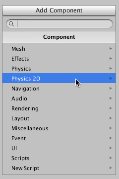
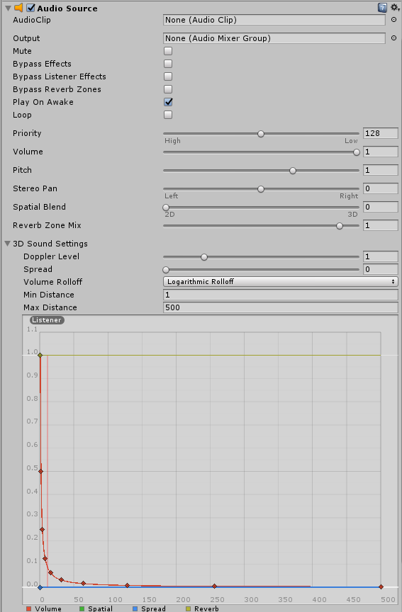
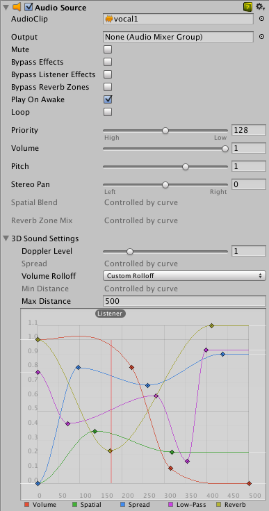
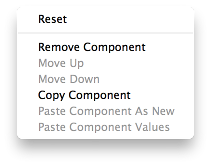

Using Components
================

__Components__ are the nuts & bolts of objects and behaviors in a game. They are the functional pieces of every __GameObject__. If you don't yet understand the relationship between Components and GameObjects, read the [GameObjects](GameObjects) page before going any further.

A GameObject is a container for many different Components. By default, all GameObjects automatically have a __Transform__ Component. This is because the Transform dictates where the GameObject is located, and how it is rotated and scaled. Without a Transform Component, the GameObject wouldn't have a location in the world. Try creating an empty GameObject now as an example. Click the __GameObject-&gt;Create Empty__ menu item. Select the new GameObject, and look at the __Inspector__.

 

Remember that you can always use the Inspector to see which Components are attached to the selected GameObject. As Components are added and removed, the Inspector will always show you which ones are currently attached. You will use the Inspector to change all the properties of any Component (including scripts).

Adding Components
-----------------

You can add Components to the selected GameObject through the Components menu. We'll try this now by adding a __Rigidbody__ to the empty GameObject we just created. Select it and choose __Component-&gt;Physics-&gt;Rigidbody__ from the menu. When you do, you will see the Rigidbody's properties appear in the Inspector. If you press __Play__ while the empty GameObject is still selected, you might get a little surprise. Try it and notice how the Rigidbody has added functionality to the otherwise empty GameObject. (The Y position of the GameObject's transform starts to decrease. This is because the physics engine in Unity is causing the GameObject to fall under gravity.)

 

Another option is to use the __Component Browser__, which can be activated with the __Add Component__ button in the object's inspector.

 

The browser lets you navigate the components conveniently by category and also has a search box that you can use to locate components by name.

You can attach any number or combination of Components to a single GameObject. Some Components work best in combination with others. For example, the Rigidbody works with any Collider. The Rigidbody controls the Transform through the __NVIDIA PhysX__ physics engine, and the Collider allows the Rigidbody to collide and interact with other Colliders.

If you want to know more about using a particular Component, you can read about any of them in the relevant Component Reference page. You can also access the reference page for a Component from Unity by clicking on the small **?** on the Component's header in the Inspector.

Editing Components
------------------

One of the great aspects of Components is flexibility. When you attach a Component to a GameObject, there are different values or 
__Properties__ in the Component that can be adjusted in the editor while building a game, or by scripts when running the game. There are two main types of Properties: __Values__ and __References__.

Look at the image below. It is an empty GameObject with an __Audio Source__ Component. All the values of the __Audio Source__ in the Inspector are the default values.

 

This Component contains a single Reference property, and seven Value properties. __Audio Clip__ is the Reference property. When this Audio Source begins playing, it will attempt to play the audio file that is referenced in the __Audio Clip__ property. If no reference is made, an error will occur because there is no audio to be played. You must reference the file within the Inspector. This is as easy as dragging an audio file from the Project View onto the Reference Property or using the Object Selector.

 

Components can include references to any other type of Component, GameObjects, or Assets. You can read more about assigning references on the page about [Editing Properties](EditingValueProperties).

The remaining properties on the Audio Clip are all Value properties. These can be adjusted directly in the Inspector. The Value properties on the Audio Clip are all toggles, numeric values, drop-down fields, but value properties can also be text strings, colors, curves, and other types. You can read more about these and about editing value properties on the page about [editing value properties](EditingValueProperties).

##Component Context Menu commands

The context menu for a component has a number of useful commands. 

The same commands are also available from the "gear" icon in the extreme top-right of the component's panel in the inspector.

###Reset
This command restores the values the component's properties had before the most recent editing session.

###Remove
A __Remove Component__ command is available for cases where you no longer need the component attached to the GameObject. Note that there are some combinations of components that depend on each other (eg, [Hinge Joint](class-HingeJoint) only works when a [Rigidbody](class-Rigidbody) is also attached); you will see a warning message if you try to remove components that others depend on.

###Move Up/Down

Use the __Move Up__ and __Move Down__ commands to rearrange the order of components of a GameObject in the Inspector.

**Tip**: Alternatively, click and drag the component’s name up or down in the Inspector window, and then drop it. 

###Copy/Paste
The __Copy Component__ command stores the type and current property settings of a component. These can then be pasted into another component of the same type with __Paste Component Values__. You can also create a new component with the copied values on an object by using __Paste Component As New__

Testing out Properties
----------------------

While your game is in __Play Mode__, you are free to change properties in any GameObject's Inspector. For example, you might want to experiment with different heights of jumping. If you create a __Jump Height__ property in a script, you can enter Play Mode, change the value, and press the jump button to see what happens. Then without exiting Play Mode you can change it again and see the results within seconds. When you exit Play Mode, your properties will revert to their pre-Play Mode values, so you don't lose any work. This workflow gives you incredible power to experiment, adjust, and refine your gameplay without investing a lot of time in iteration cycles. Try it out with any property in Play Mode. We think you'll be impressed.

---
*  2018-09-18  <!-- include IncludeTextAmendPageSomeEdit -->
  
* Ability to drag and drop components in Inspector window added in 5.6
