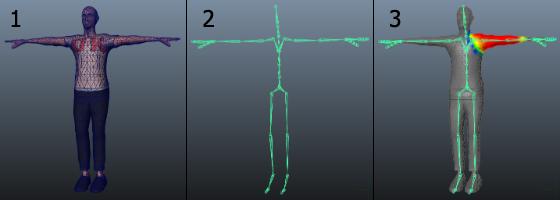
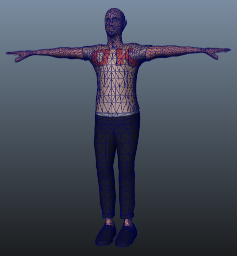
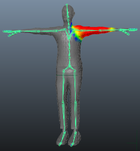

# Humanoid Asset preparation

In order to take full advantage of Unity's humanoid animation system and retargeting, you need to have a __rigged__ and __skinned__ humanoid type mesh.

1. A character __Model__ generally consists of polygons in 3D modeling software or converted to polygon or triangulated mesh, from a more complex mesh type before export.

2. In order to control the movement of a character, you must create a __joint hierarchy__ or __skeleton__ which defines the bones inside the Mesh and their movement in relation to one another. The process for creating such a joint hierarchy is known as __rigging__.

3. You must then connect the mesh or _skin_ to the joint hierarchy. This defines which parts of the character mesh move when a given joint is animated. The process of connecting the skeleton to the mesh is known as __skinning__.

 

## How to obtain humanoid models

There are three main ways to obtain humanoid models to use in the Unity Animation system:

* Use a procedural character system or character generator such as _Poser_, _Makehuman_ or [_Mixamo_](http://www.mixamo.com/). Some of these systems can rig and skin your mesh (like Mixamo) while others cannot. Furthermore, if you use these methods, you may need to reduce the number of polygons in your original mesh to make it suitable for use in Unity.

* Purchase demo examples and character content from the [Unity Asset Store](http://unity3d.com/unity/asset-store/).

* You can also prepare your own character from scratch by following three steps: [modeling](#Modeling), [rigging](#Rigging) and [skinning](#Skinning).

### Modeling

This is the process of creating your own humanoid [Mesh](class-Mesh) in 3D modeling software (such as Autodesk® 3ds Max®, Autodesk® Maya®, or Blender). Although this is a whole subject in its own right, there are a few guidelines you can follow to ensure a Model works well with animation in a Unity Project:

* Use a topology with a __well-formed structure__. The exact nature of a "well-formed" structure for your Mesh is rather subtle but generally, you should bear in mind how the vertices and triangles of the model are distorted as it is animated. A poor topology does not allow the Model to move without distorting the Mesh. Study existing 3D character Meshes to see how the topology is arranged and why.

* Check the __scale__ of your mesh. Do a test import and compare the size of your imported Model with a "meter cube". The standard Unity cube primitive has a side length of one unit, so it can be taken as a 1m cube for most purposes. Check the units your 3D modeling software uses and adjust the export settings so that the size of the Model is in correct proportion to the cube. It is easy to create models without any notion of their scale and consequently end up with a set of objects that are disproportionate in size when you imported them into Unity.

* Arrange the mesh so that the character's feet are standing on the local origin or "anchor point" of the model. Since a character typically walks upright on a floor, it is much easier to handle if its anchor point (that is, its transform position) is directly on that floor.

* Model in a __T-pose__ if possible. This gives you space to refine polygon detail where you need it (such as the underarms). This also makes it easier to position your rig inside the Mesh.

* While you are building, __clean up your Model__. Where possible, cap holes, weld verts, and remove hidden faces. This helps with skinning, especially automated skinning processes.

 

### Rigging

This is the process of creating a skeleton of joints to control the movements of your Model.

3D modeling software provides a number of ways to create joints for your humanoid rig. These range from ready-made biped skeletons that you can scale to fit your Mesh, right through to tools for individual bone creation and parenting to create your own bone structure. To work with animation in Unity, make sure they are the root element of the bone hierarchy. A minimum of fifteen bones are required in the skeleton.

Your skeleton needs to have at least the required bones in place for Unity to [produce a valid match](class-Avatar). In order to improve your chances for finding a match to the Avatar, name your bones in a way that reflects the body parts they represent. For example, "LeftArm" and "RightForearm" make it clear what these bones control. 

The joint/bone hierachy should follow a natural structure for the character you are creating. Given that arms and legs come in pairs, you should use a consistent convention for naming them (for example, "arm_L" for the left arm, "arm_R" for the right arm). Possible structures for the hierarchy include:

    * HIPS - spine - chest - shoulders - arm - forearm - hand
    * HIPS - spine - chest - neck - head
    * HIPS - UpLeg - Leg - foot - toe - toe_end

 

### Skinning

This is the process of attaching the Mesh to the skeleton.

Skinning involves binding vertices in your Mesh to bones, either directly (rigid bind) or with blended influence to a number of bones (soft bind). Different 3D modeling software uses different methods. for example, you can assign individual vertices and paint the weighting of influence per bone onto the Mesh. The initial setup is typically automated, say by finding the nearest influence or using "heatmaps". Skinning usually requires a fair amount of work and testing with animations in order to ensure satisfactory results for the skin deformation. Some general guidelines for this process include:

* Use an automated process initially to set up some of the skinning (see the skinning tutorials available for your 3D modeling software).

* Create a simple animation for your rig or import some animation data to act as a test for the skinning. This should give you a quick way to evaluate whether or not the skinning looks good in motion.

* Incrementally edit and refine your skinning solution.

* Limit the number of influences when using a soft bind to a maximum of four, since this is the maximum number that Unity supports. If your Mesh uses more than four influences, then you lose some information when playing the animation in Unity.

 

## Export and verify

Unity imports a number of different generic and native 3D file formats. FBX is the recommended format for exporting and verifying your Model since you can use it to:

* Export the Mesh with the skeleton hierarchy, normals, textures and animation.
* Re-import the Mesh into your 3D modeling software to verify your animated Model looks as expected.
* Export animations without the Mesh.

---

*  2018-04-25  <!-- include IncludeTextAmendPageSomeEdit -->
