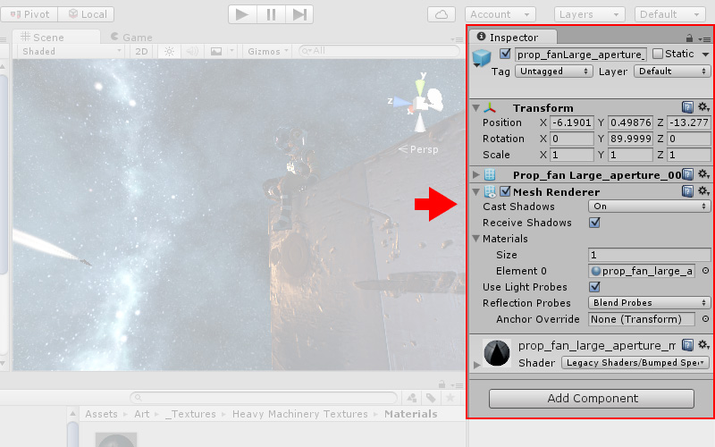
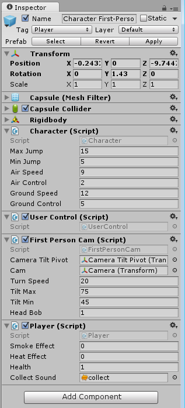
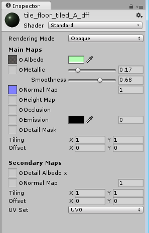
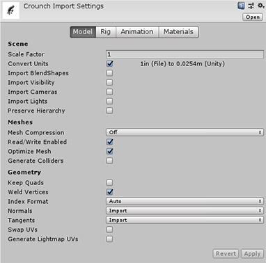
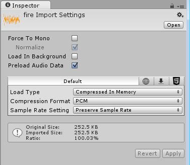
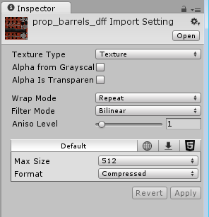

#The Inspector window

Projects in the Unity Editor are made up of multiple [GameObjects](GameObjects) that contain scripts, sounds, Meshes, and other graphical elements such as Lights. The Inspector window (sometimes referred to as "the Inspector") displays detailed information about the currently selected GameObject, including all attached [components](Components) and their properties, and allows you to modify the functionality of GameObjects in your Scene.

##Inspecting GameObjects

Use the Inspector to view and edit the properties and settings of almost everything in the Unity Editor, including physical game items such as GameObjects, Assets, and Materials, as well as in-Editor settings and preferences.

When you select a GameObject in either the [Hierarchy](Hierarchy) or [Scene view](UsingTheSceneView), the Inspector shows the properties of all components and Materials of that GameObject. Use the Inspector to edit the settings of these components and Materials.

The image above shows the Inspector with the Main Camera GameObject selected. In addition to the GameObject's Position, Rotation, and Scale values, all the properties of the Main Camera are available to edit.

##Inspecting script variables

When GameObjects have custom script components attached, the Inspector displays the public variables of that script. You can edit these variables as settings in the same way you can edit the settings of the Editor’s built-in components. This means that you can set parameters and default values in your scripts easily without modifying the code. 

##Inspecting Assets

When an [Asset](AssetWorkflow) is selected in your [Project window](ProjectView), the Inspector shows you the settings related to how that Asset is imported and used at run time (when your game is running either in the Editor or your published build). 

Each type of Asset has a different selection of settings. The images below demonstrate some examples of the Inspector displaying the import settings for other Asset types:

The [Model tab](FBXImporter-Model) of the [Model Import Settings](class-FBXImporter) window:

The [Audio Clip Import Settings](class-AudioClip) window:

The [Texture Import Setting](class-TextureImporter) window:

##Prefabs

If you have a Prefab selected, some additional options are available in the Inspector window.

For more information, see documentation on [Prefabs](Prefabs).

##Project settings

When you select any of the Project Settings categories (menu: __Editor__ > __Project Settings__), these settings are displayed in the Inspector window. For more information, see documentation on [Project Settings](comp-ManagerGroup).

##Icons and labels

You can assign custom icons to GameObjects and scripts. These display in the Scene view along with built-in icons for GameObjects such as Lights and Cameras.

For more about icons and labels, see Unity documentation on [assigning icons](AssigningIcons).

##Re-ordering components

To reorder components in the Inspector window, drag-and-drop their headers from one position to another. When you drag a component header, a blue insertion marker appears. This shows you where the component should go when you drop the header:

You can only reorder components on a GameObject. You can't move components between different GameObjects.

You can also drag and drop script Assets directly into the position you want them to appear.

When you select multiple GameObjects, the Inspector displays all of the components that the selected GameObjects have in common. To reorder all of these common components at once, multi-select the GameObjects, then drag-and-drop the components into a new position in the Inspector.

The order you give to components in the Inspector window is the order you need to use when querying components in your user scripts. If you query the components programmatically, you'll get the order you see in the Inspector.

---

* 2018-04-23 <!-- include IncludeTextAmendPageSomeEdit -->

* Component drag and drop added in Unity 5.6

