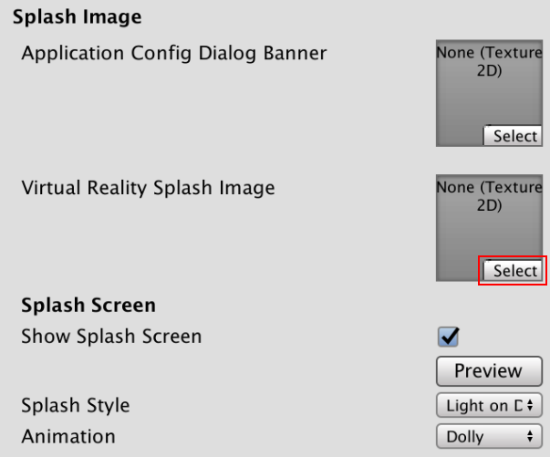
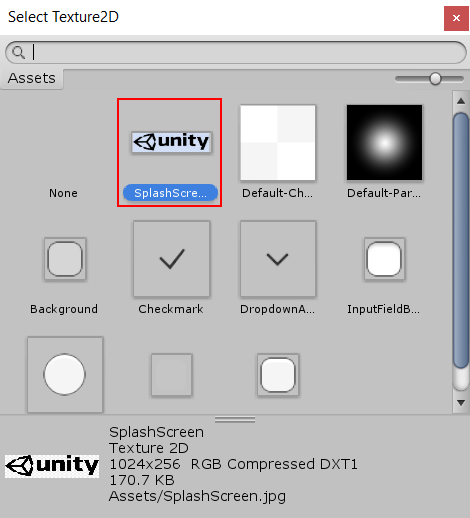

# Splash Screen in VR and AR

Virtual and augmented reality applications use a 3D scene to render a [Splash Screen](class-PlayerSettingsSplashScreen) image in [single-pass ](SinglePassStereoRendering)[stereo](SinglePassStereoRendering). The splash image is a 2D Texture that either follows the orientation of the head-mounted display, or remains static in the world based on the initial orientation of the head-mounted display.

By default, Unity displays the stock Unity splash image. However, you can override this through the Player Settings with a custom image. To do this, go to the __Player__ settings (menu: __Edit &gt; Project Settings__, then select the __Player__ category), select __Splash Image__, and on the square icon next to __Virtual Reality Splash Image__, click __Select__. 

Unity opens a window which displays all of the compatible Splash Screen images in your Project. Click on your custom image in the window to select it.

While Unity displays the Splash Screen, it loads the first Scene in the background. The Splash Screen appears for at least 4.5 seconds, and remains until the first Scene has finished loading.

If you are a Unity Plus or Pro user, you can remove the Splash Screen completely. However, if you do this in a VR application, the headset displays a black screen for a long period of time while loading the first Scene of the application. This can be disorienting for some players. For this reason, it’s good practice to always include a Splash Screen on VR applications.

For more information, see the [Unity Splash Screen](class-PlayerSettingsSplashScreen) documentation.

---

*  2018-09-18  <!-- include IncludeTextNewPageYesEdit -->