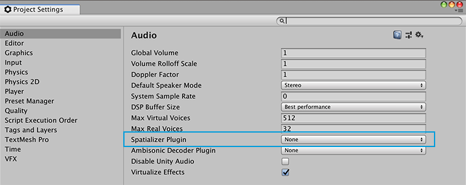

#VR Audio Spatializers

Unity natively supports [Audio Spatializers](AudioSpatializerSDK) for virtual reality (VR) projects. Audio Spatializers change the way audio is transmitted from an audio source into the surrounding space: the plugin takes the source and regulates the gains of the left and right ear contributions based on the distance and angle between the [AudioListener](class-AudioListener) and the [AudioSource](class-AudioSource).

Enable these plugins through the Audio settings (menu: __Edit &gt; Project Settings__, then select the __Audio__ category) using the __Spatializer Plugin__ dropdown menu. The native plugins can be used with or without VR mode enabled.

The spatializer plugins only work on the platforms that a VR device is supported on. If a device is not supported for a build target, Unity displays a warning that the plugin will not be included in the built application.

Every plugin works in the Editor for testing purposes.

Natively included Spatializer plugins:

* Oculus Spatializer (supports Android, OSX, and PC)
* Microsoft HRTF Spatializer (supports UWP and PC running Windows 10)