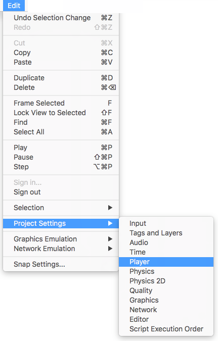
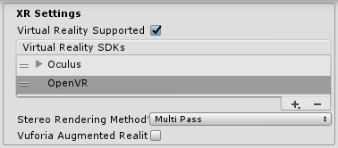

VR overview
===========
<!-- https://trello.com/c/Qw7imxOL -->

Unity VR lets you target virtual reality devices directly from Unity, without any external plug-ins in projects. It provides a base API and feature set with compatibility for multiple devices. It has been designed to provide forward compatibility for future devices and software.

*Note: **XR is an umbrella term which encompassess virtual reality (VR), augmented reality (AR), and Mixed Reality (MR). We are in the process of updating our XR documentation, but for now this documentation refers mainly to just VR.***

**Unity's XR API has been updated to reflect the broader umbrella term "XR" but much of the documentation currently still uses the term "VR". The XR API surface is minimal by design, but will expand as XR continues to grow.**

By using the native VR support in Unity, you gain:

* Stable versions of each VR device
* A single API interface to interact with different VR devices
* A clean project folder with no external plugin for each device
* The ability to include and switch between multiple devices in your applications
* Increased performance (Lower-level Unity engine optimizations are possible for native devices)
ot

##Enabling Unity VR support

To enable native VR support for your game builds and the Editor, open the [Player](class-PlayerSettings) settings (menu: __Edit__ > __Project Settings__, then select the __Player__ category). Open the __XR Settings__ panel and enable the __Virtual Reality Supported__ property. Set this for each build target. Enabling virtual reality support in a standalone build does not also enable the support for Android (and vice-versa).

Use the __Virtual Reality SDKs__ list displayed below the checkbox to add and remove VR devices for each build target. The order of the list is the order that Unity tries to enable VR devices at runtime. The first device that initializes properly is the one enabled. This list order is the same in the built player.

##Built applications: Choosing startup device

Your built application initializes and enables devices in the same order as the __Virtual Reality SDKs__ list in __XR Settings__ (see [Enabling VR Support](#EnablingVRSupport), above).  Devices not present in the list at build time are not available in the final build. Device __None__ is equivalent to a non-VR application (that is, a normal Unity application) and can be switched to during runtime without including it in the list; the exception to this is __None__.

Including __None__ as a device in the list allows you to default to a non-VR application before attempting a VR device’s initialization. If you place __None__ at the top of the list, the application starts with VR disabled. Then, you can then enable and disable VR devices that are present in your list through script using [XR.XRSettings.LoadDeviceByName](ScriptRef:XR.XRSettings.LoadDeviceByName).

If initialization of the device you attempt to switch to fails, Unity disables VR with that device still set as the active VR device. When you switch devices ([XRSettings.LoadDeviceByName](ScriptRef:XR.XRSettings.LoadDeviceByName)) or enable XR ([XR.XRSettings-enabled](ScriptRef:XR.XRSettings-enabled.html)), the built application attempts to initialize again.

The command line argument used to launch a specific device is:

``-vrmode DEVICETYPE``

where __DEVICETYPE__ is one of the names from the supported [XR supported devices list](ScriptRef:XR.XRSettings-supportedDevices.html). 

Example: ``MyGame.exe -vrmode oculus``

##What happens when VR is enabled

When VR is enabled in Unity, a few things happen automatically:

###Automatic rendering to a head-mounted display

All Cameras in your Scene are able to render directly to the head-mounted display (HMD). View and Projection matrices are automatically adjusted to account for head tracking, positional tracking and field of view. 

It is possible to disable rendering to the HMD using the Camera component's __stereoTargetEye__ property. Alternatively, you can set the Camera to render to a Render Texture using the __Target Texture__ property.

* Use the stereoTargetEye property to set the Camera to only render a specific eye to the HMD. This is useful for special effects such as a sniper scope or stereoscopic videos. To achieve this, add two Cameras to the Scene: one targeting the left eye, the other targeting the right eye. Set layer masks to configure what is sent to each eye.

###Automatic head-tracked input

Head tracking and the appropriate field of view (FOV) is automatically applied to the Camera if your device is head-mounted. You can manually set the FOV to a specific value, but you cannot set the Camera's transform values directly. See the section below on [Understanding the Camera](#UnderstandingTheCamera) to learn more.

Head tracking and positional tracking are automatically applied, so that the position and orientation most closely matches the user's position and orientation before the frame is rendered. This gives a good VR experience, and prevents the user from experiencing nausea.

###Understanding the camera

The Camera Transform is overridden with the head-tracked pose. To move or rotate the Camera, attach it as a child of another GameObject. This makes it so that all Transform changes to the parent of the Camera affect the Camera itself. This also applies to moving or rotating the camera using a script.

Think of the Camera's position and orientation as where the user is looking in their neutral position.

There are differences between seated and room-scale VR experiences:

* If your device supports a room-scale experience, the Camera's starting position is the center of the user's play space.
* Using the seated experience, you can reset Cameras to the neutral position using [XR.InputTracking.Recenter()](ScriptRef:XR.InputTracking.Recenter.html).

Each Camera that is rendering to the device automatically replaces the FOV of the Camera with the FOV that the user input in the software settings for each VR SDK. The user cannot change the field of view during runtime, because this behaviour is known to induce motion sickness.

##Editor Mode

If your VR device supports Unity Editor mode, press Play in the Editor to test directly on your device.

The left eye is rendered to the Game View window if you have __stereoTargetEye__ set to left or both. The right eye is rendered if you have __stereoTargetEye__ set to right. 

There is no automatic side-by-side view of the left and right eyes. To see a side-by-side view in the Game View, create two Cameras, set one to the left and one to the right eye, and set the viewport of display them side by side.

Note that there is overhead to running in the Editor, because Unity IDE needs to render each window, so you may experience lag or judder. To reduce editor rendering overhead, open the Game View and enable __Maximize on Play__.

The Unity Profiler is a helpful tool to get an idea of what your performance will be like when running outside of the Editor. However, the profiler itself also has overhead. The best way to review game performance is to create a build on your target platform and run it directly. You can see the best performance when running a non-development build, but development builds allow you to connect the Unity profiler for better performance profiling.

##Hardware and software recommendations for VR development in Unity

###Hardware

Achieving a frame rate similar to your target HMD is essential for a good VR experience. This must match the refresh rate of the display used in the HMD. If the frame rate drops below the HMD's refresh rate, it is particularly noticeable and often leads to nausea for the player.

The table below lists the device refresh rates for common VR headsets:

|**_VR Device_** |**_Refresh Rate_** |
|:---|:---|
|Gear VR| 60hz|
|Oculus Rift|90hz|
|Vive|90hz|

###Software

* **Windows**: Windows 7, 8, 8.1, and Windows 10 are all compatible.

* **Android**: Android OS Lollipop 5.1 or higher.

* **OS X**: OSX 10.9+ with the Oculus 0.5.0.1 runtime. However, Oculus have [paused development](https://www.oculus.com/en-us/blog/powering-the-rift/) for OS X, so use Windows for native VR functionality in Unity.

* **Graphics card drivers**: Make sure your drivers are up to date. Every device is keeping up with the newest drivers, so older drivers may not be supported.

##Device runtime requirements
Each VR device requires that you have appropriate runtime installed on your machine. For example, to develop and run Oculus within Unity, you need to have the Oculus runtime (also known as Oculus Home)  installed on your machine. For Vive, you need to have Steam and SteamVR installed.

Depending on what version of Unity you are using, the runtime versions for each specific device that is supported by Unity may differ. You can find runtime versions in the release notes of each major and minor Unity release.

With some version updates, previous runtime versions are no longer supported. This means that native Unity VR support does not work with earlier runtime versions, but continues to work with new runtime versions.

Unity native VR support does not read plug-ins from within your project’s folder, so including earlier versions of the plug-in with native support will fail if you have VR support enabled. If you wish to use an earlier version with a release of Unity that no longer supports that version,  disable __Native VR Support__ (go to __XR Settings__ and uncheck  __Virtual Reality Supported__). You can then access the plug-in like any other 3rd party plugin. See the section above on [Enabling Unity VR Support](#EnablingVRSupport) for more details.

