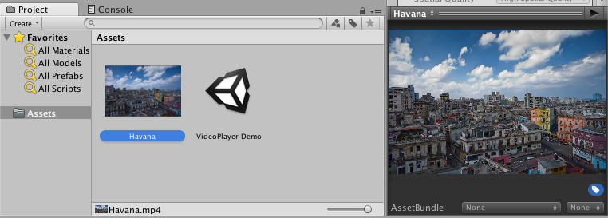
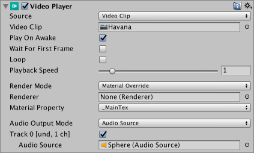
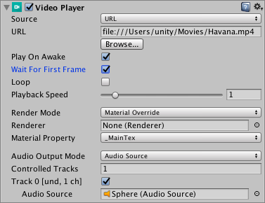

# Video sources

The [Video Player component](class-VideoPlayer) can play content imported from a variety of sources.

## Video Clip

To create and use a Video Clip Asset, you must first import a video file.

Dragging and dropping a video file into the Project window creates a Video Clip.

Another way to create a Video Clip is to navigate to __Assets__ > __Import New Asset...__ to import a video file. 

Once imported, the newly created Video Clip can be selected in the Video Player component using either the __Select VideoClip__ window (accessible by clicking the circle select button to the right of the Video Clip field) or by dragging and dropping the Video Clip Asset into the corresponding Video Player component field.

## URLs

Use the drop-down __Source__ menu to set the video source to __URL__ (this property is set to __Video Clip__ by default). Setting __Source__ to __URL__ makes it possible to directly use files in the filesystem, with or without a *file://* prefix. 

The __URL__ source option bypasses Asset management, meaning you must manually ensure that the source video can be found by Unity. For example, a web URL needs a web server to host the source video, while a normal file must be located somewhere where Unity can find it, indicated with scripting. However, this can be useful for situations where the content is not under Unity’s direct control, or if you want to avoid storing large video files locally.

Setting the Video Player component source to __URL__ can also be used to read videos from web sources via *http://* and *https://*. In these cases, Unity performs the necessary pre-buffering and error management.

## Asset Bundles

Video Clips can also be read from [Asset Bundles](AssetBundlesIntro). 

Once imported, these Video Clips can be used by assigning it to the Video Player component’s __Video Clip__ field. 

## Streaming Assets

Files placed in Unity’s [StreamingAssets](StreamingAssets) folder can be used via the Video Player component’s __URL__ option (see above), or by using the platform-specific path (*Application.streamingAssetsPath*).

---

* 2017-06-15 <!-- include IncludeTextNewPageSomeEdit -->

* New feature in Unity 5.6