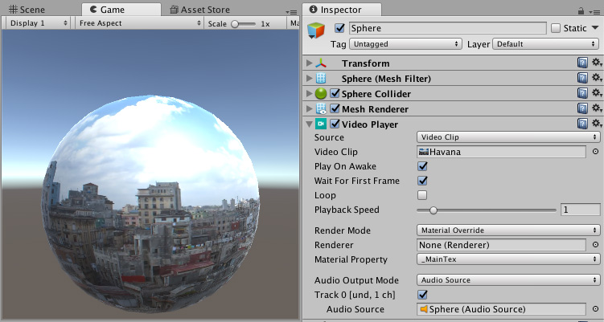

# Video overview

Use Unity’s video system to integrate video into your game. Video footage can add realism, save on rendering complexity, or help you integrate content available externally.

To use video in Unity, import [Video Clips](class-VideoClip) and configure them using the [Video Player component](class-VideoPlayer). The system allows you to feed video footage directly into the __Texture__ parameter of any [component](UsingComponents) that has one. Unity then plays the Video on that Texture at run time.

Unity’s video features include the hardware-accelerated and software decoding of [Video files](VideoSources-VideoFiles), [transparency support](VideoTransparency), multiple audio tracks, and network streaming.

**Note:** The Video Player component and Video Clip asset, introduced in Unity 5.6, supersede the earlier [Movie Textures](class-MovieTexture) feature.

---

* 2017-06-15 <!-- include IncludeTextNewPageSomeEdit -->

* Video player support for PS4 added in [2017.1](../Manual/30_search.html?q=newin20171) NewIn20171

* New feature in Unity 5.6