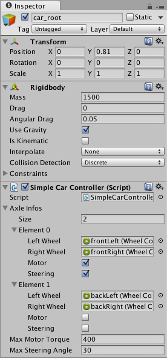

#Wheel Collider Tutorial
 
The Wheel Collider component is powered by the PhysX 3 Vehicles SDK.

This tutorial takes you through the process of creating a basic functioning car.

To start, select __GameObject__ &gt; __3D Object__ &gt; __Plane__. This is the ground the car is going to drive on. To keep it simple, make sure the ground has a Transform of __0__ (on the Transform component in the Inspector Window, click the Settings cog and click __Reset__). Increase the Transform's Scale fields to __100__ to make the Plane bigger.

## Create a basic car skeleton

1. First, add a GameObject to act as the car root GameObject. To do this, go to __GameObject__ > __Create Empty__. Change the GameObject's name to `car_root`.
1. Add a Physics 3D Rigidbody component to `car_root`. The default mass of 1kg is too light for the default suspension settings; change it to 1500kg to make it much heavier.
1. Next, create the car body Collider. Go to __GameObject__ &gt; __3D Object__ &gt; __Cube__. Make this cube a child GameObject under `car_root`. Reset the Transform to __0__ to make it perfectly aligned in local space. The car is oriented along the Z axis, so set the Transform's __Z__ __Scale__ to __3__.
1. Add the wheels root. Select `car_root` and __GameObject__ &gt; __Create Empty Child__. Change the name to `wheels`. Reset the Transform on it. This GameObject is not mandatory, but it is useful for tuning and debugging later. 
1. To create the first wheel, select the `wheels` GameObject, go to __GameObject__ &gt; __Create Empty Child__, and name it `frontLeft`. Reset the Transform, then set the Transform __Position__ __X__ to -1, __Y__ to 0, and __Z__ to  1. To add a Collider to the wheel, go to __Add component__ &gt; __Physics__ &gt; __Wheel Collider__.
1. Duplicate the `frontLeft` GameObject. Change the __Transform__'s __X__ position to 1. Change the name to `frontRight`.
1. Select both the `frontLeft` and `frontRight` GameObjects. Duplicate them. Change the __Transform__'s __Z__ position of both GameObjects to -1. Change the names to `rearLeft` and `rearRight` respectively.
1. Finally, select the `car_root` GameObject and use the Move Tool to raise it slightly above the ground.

Now you should be able to see something like this:

 
     
To make this car actually drivable, you need to write a controller for it. The following code sample works as a controller:

```
using UnityEngine;
using System.Collections;
using System.Collections.Generic;
	
public class SimpleCarController : MonoBehaviour {
	public List<AxleInfo> axleInfos; // the information about each individual axle
	public float maxMotorTorque; // maximum torque the motor can apply to wheel
	public float maxSteeringAngle; // maximum steer angle the wheel can have
		
	public void FixedUpdate()
	{
		float motor = maxMotorTorque * Input.GetAxis("Vertical");
		float steering = maxSteeringAngle * Input.GetAxis("Horizontal");
			
		foreach (AxleInfo axleInfo in axleInfos) {
			if (axleInfo.steering) {
				axleInfo.leftWheel.steerAngle = steering;
				axleInfo.rightWheel.steerAngle = steering;
			}
			if (axleInfo.motor) {
				axleInfo.leftWheel.motorTorque = motor;
				axleInfo.rightWheel.motorTorque = motor;
			}
		}
	}
}
	
[System.Serializable]
public class AxleInfo {
	public WheelCollider leftWheel;
	public WheelCollider rightWheel;
	public bool motor; // is this wheel attached to motor?
	public bool steering; // does this wheel apply steer angle?
}
```

Create a new C# script (__Add Component__ &gt; __New Script__), on the `car_root` GameObject, copy this sample into the script file and save it. You can tune the script parameters as shown below; experiment with the settings and enter Play Mode to test the results. 

The following settings are very effective as a car controller:

 

You can have up to 20 wheels on a single vehicle instance, with each of them applying steering, motor or braking torque.

Next, move on to visual wheels. As you can see, a Wheel Collider doesn't apply the simulated wheel position and rotation back to the Wheel Collider's Transform, so adding visual wheel requires some tricks. 

You need some wheel geometry here. You can make a simple wheel shape out of a cylinder. There could be several approaches to adding visual wheels: making it so that you have to assign visual wheels manually in script properties, or writing some logic to find the corresponding visual wheel automatically. This tutorial follows the second approach. Attach the visual wheels to the Wheel Collider GameObjects.

Next, change the controller script:

```
using UnityEngine;
using System.Collections;
using System.Collections.Generic;

[System.Serializable]
public class AxleInfo {
	public WheelCollider leftWheel;
	public WheelCollider rightWheel;
	public bool motor;
	public bool steering;
}
	 
public class SimpleCarController : MonoBehaviour {
	public List<AxleInfo> axleInfos; 
	public float maxMotorTorque;
	public float maxSteeringAngle;
	 
	// finds the corresponding visual wheel
	// correctly applies the transform
	public void ApplyLocalPositionToVisuals(WheelCollider collider)
	{
		if (collider.transform.childCount == 0) {
			return;
		}
	 
		Transform visualWheel = collider.transform.GetChild(0);
	 
		Vector3 position;
		Quaternion rotation;
		collider.GetWorldPose(out position, out rotation);
	 
		visualWheel.transform.position = position;
		visualWheel.transform.rotation = rotation;
	}
	 
	public void FixedUpdate()
	{
		float motor = maxMotorTorque * Input.GetAxis("Vertical");
		float steering = maxSteeringAngle * Input.GetAxis("Horizontal");
	 
		foreach (AxleInfo axleInfo in axleInfos) {
			if (axleInfo.steering) {
				axleInfo.leftWheel.steerAngle = steering;
				axleInfo.rightWheel.steerAngle = steering;
			}
			if (axleInfo.motor) {
				axleInfo.leftWheel.motorTorque = motor;
				axleInfo.rightWheel.motorTorque = motor;
			}
			ApplyLocalPositionToVisuals(axleInfo.leftWheel);
			ApplyLocalPositionToVisuals(axleInfo.rightWheel);
		}
	}
}
```

One important parameter of the Wheel Collider component is __Force App Point Distance__. This is the distance from the base of the resting wheel to the point where the wheel forces are applied. The default value is 0, which means to apply the forces at the base of the resting wheel, but actually, it is wise to have this point located somewhere slightly below the car's centre of mass.

**Note**: To see the Wheel Collider in action, download the [Vehicle Tools](https://www.assetstore.unity3d.com/en/#!/content/83660) package, which includes tools to rig wheeled vehicles and create suspension for wheel colliders.

---

* <span class="page-edit">2017-11-24  <!-- include IncludeTextAmendPageSomeEdit --></span>
