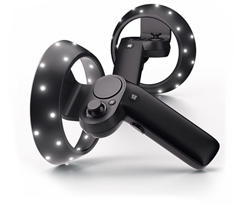

# Input for Windows Mixed Reality

Windows Mixed Reality motion controllers allow users to interact in Mixed Reality applications, allowing precise, low latency tracking of movement within the field of view (FOV) of their Windows Mixed Reality headset. This is achieved using the sensors built into the headset.

To allow native Unity Editor support for Windows Mixed Reality input hardware, the Unity VR subsystem presents three inputs as separate joysticks. Use the [UnityEngine.Input](ScriptRef:Input.html) class to read the axis and button values of these inputs.

## Controller naming conventions and detection

When properly configured and connected to your computer, the motion controllers appear in the list returned by [UnityEngine.Input.GetJoystickNames()](ScriptRef:Input.GetJoystickNames.html) as __Spatial Controller - Left__ and __Spatial Controller - Right__. For information on correctly configuring and connecting the motion controllers, see the [Windows Developer Center documentation](https://developer.microsoft.com/en-us/windows/mixed-reality/motion_controllers).

In Unity you can check the availability of the controllers through script by periodically checking for their presence in the list of joystick names. When the controllers are turned off, or their batteries are removed, an empty string replaces their name in the list returned by [UnityEngine.Input.GetJoystickNames()](ScriptRef:Input.GetJoystickNames.html). When the controllers are turned back on, their name re-appears in the list.

## Unity Input system mappings

The image below shows the buttons available on your Windows Mixed Reality controller.

The table below shows the interaction types, button IDs, axis and value ranges for each input provided by the controller in Unity.

| __Hardware Feature__| __Interaction Type__ | __Unity Button ID__ | __Unity Axis ID__ | __Unity Axis Value Range__ |
|:---|:---|:---|:---|:---| 
| Touchpad| Touch | Left: 18 Right: 19 | - | - |
| Touchpad| Press | Left: 16 Right: 17 | - | - |
| Touchpad| Horizontal Movement | - | Left: 17 Right: 19 | -1.0 to 1.0 |
| Touchpad| Vertical Movement | - | Left: 18 Right: 20 | -1.0 to 1.0 |
| Thumbstick| Press | Left: 8 Right: 9 | - | - |
| Thumbstick| Horizontal Movement | - | Left: 1 Right: 4 | -1.0 to 1.0 |
| Thumbstick| Vertical Movement | - | Left: 2 Right: 5 | -1.0 to 1.0 |
| Select Trigger| Press | Left: 14 Right: 15 | - | - |
| Select Trigger| Squeeze | - | Left: 9 Right: 10 | 0.0 to 1.0 |
| Grip button| Press | Left: 4 Right: 5 | - | - |
| Grip button| Squeeze | - | Left: 11 Right: 12 | 0.0 and 1.0* |
| Menu button| Press | Left: 6 Right: 7 | - | - |

Windows Mixed Reality controller input details for Unity

*The Grip squeeze axis is a binary control, so it only reports values of 0 or 1, with no values in between.

The table below lists the different axes available when using Window Mixed Reality controller inputs, along with the positive and negative directions for each axis.

| __Axis__| __Positive Direction__ | __Negative Direction__ |
|:---|:---|:---| 
| Horizontal| Left | Right |
| Vertical| Up | Down |

For more information on using the Windows MR motion controllers with Unity, visit the Windows Developer Center documentation on [Motion Controllers in Unity](https://developer.microsoft.com/en-us/windows/mixed-reality/gestures_and_motion_controllers_in_unity).

---
* 2017-11-21 <!-- include IncludeTextNewPageYesEdit -->

* New functionality in 2017.2

