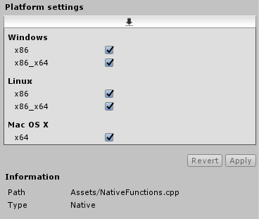

# Windows Player: C++ source code plugins for IL2CPP

You can add C++ (.cpp) code files directly into a Unity Project when using the [IL2CPP](IL2CPP) scripting backend. These C++ files will act as plugins within the Plugin Inspector. If you configure the C++ files to be compatible with Windows Player, Unity compiles them together with C++ code that gets generated from managed assemblies. Click on your .cpp file and select the appropriate __Windows__ options in the __Platform settings__ section of the Inspector window:



Because the functions are linked together with generated C++ code, there is no separate DLL to `_P/Invoke` into. Due to this, you can use the `“__Internal”` keyword in place of the DLL name, which makes it the C++ linker’s responsibility to resolve the functions, rather than loading them at run time, as the following example shows:

```
[DllImport("__Internal")]
private static extern int
CountLettersInString([MarshalAs(UnmanagedType.LPWStr)]string str);
```

You can define this kind of function in NativeFunctions.cpp as follows:

```
extern "C" __declspec(dllexport) int __stdcall CountLettersInString(wchar_t* str)
{
    int length = 0;
    while (*str++ != L'\0')
        length++;
    return length;
}
```

Because the linker resolves the function call, any error made in the function declaration on the managed side (i.e. C# code that executes under managed run time) produces a linker error rather than a run-time error. This also means that no dynamic loading needs to take place during run time, and the function is called directly from C#. This significantly decreases the performance overhead of a `P/Invoke` call.

## See Also

[Plugin Inspector](PluginInspector)

* <span class="page-edit">• 2018-03-13  <!-- include IncludeTextNewPageYesEdit --></span><br/>

* <span class="page-history">New feature in [2018.1](https://docs.unity3d.com/2018.1/Documentation/Manual/30_search.html?q=newin20181) <span class="search-words">NewIn20181</span></span>

