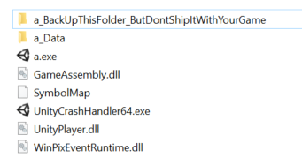

# Windows Player: IL2CPP build files

A Project using the IL2CPP scripting backend will typically (can differ due to build settings) produce these files:

The following files are common to Projects using either Mono or IL2CPP:

|**File:** |**Description:** |
|:---|:---|
|__a_Data__| Folder with game data. |
|__a.exe__ | Main game executable. |
|__UnityCrashHandler64.exe__ | Crash handler executable. |
|__UnityPlayer.dll__ | Unity Player library containing all native code. |
|__WinPixEventRuntime.dll__ | PIX for Windows runtime. This file will only be present in development builds. |

The following files are common to Projects using either Mono or IL2CPP:

|**File:** |**Description:** |
|:---|:---|
|__a_BackUpThisFolder_ButDontShipItWithYourGame__| Folder containing data required to debug your game, including PDB (debug info) files and C++ code generated from your scripts. You should back up this folder for every build you ship, but don’t redistribute it. |
|__GameAssembly.dll__ | Library that contains the IL2CPP runtime and all your script code. |
|__SymbolMap__ | File containing a list of all managed function addresses and their lengths. IL2CPP needs this to resolve managed stack traces. If you delete it, your game will still run but exceptions will not produce sensible call stacks

---
* • 2018-03-13  <!-- include IncludeTextNewPageYesEdit --> 

* New feature in [2018.1](https://docs.unity3d.com/2018.1/Documentation/Manual/30_search.html?q=newin20181) NewIn20181
