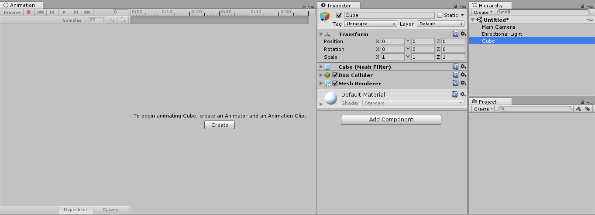

#Creating a New Animation Clip

To animate GameObjects in Unity, the object or objects need an __Animator Component__ attached. This Animator Component must reference an __Animator Controller__, which in turn contains references to one or more __Animation Clips__.

When using the Animation View to begin animating a GameObject in Unity, all these items will be automatically created, attached and set-up for you. 

To create a new __Animation Clip__ for the selected GameObject, and make sure the __Animation Window__ is visible.

If the GameObject does not yet have any Animation Clips assigned, you will see the "Create" button in the centre of the Animation Window timeline area. Click the Create button. You will then be prompted to save your new empty Animation Clip somewhere in your __Assets__ folder. 

 

Once you have saved this new empty Animation Clip, a number of things happen automatically:

* A new Animator Controller asset will be created
* The new clip being created will be added into the Animator Controller as the default state
* An Animator Component will be added to the GameObject being animated
* The Animator Component will have the new Animator Controller assigned to it

The result of this automatic sequence is that all the required elements of the animation system are set up for you, and you can now begin animating the objects.

##Adding another Animation Clip

If the Game Object already has one or more Animation Clips assigned, the "Create" button will not be visible. Instead, one of the clips will be visible in the animation window. You can switch between which Animation Clip is visible in the window by using the menu in the top-left of the Animation window, just under the playback controls.

If you want to create a new Animation Clip on an object that already has animations, you must select "Create New Clip" from this menu. Again, you will be prompted to save your new empty Animation Clip before being able to work with it.

##How it fits together

While the above steps automatically set up the relevant components and references, it can useful to understand which pieces must be connected together.

* A GameObject must have an __Animator__ component
* The Animator component must have an __Animator Controller__ asset assigned
* The Animator Controller asset must have one or more Animation Clips assigned

The diagram below shows how these pieces are assigned, starting from the new animation clip created in the Animation Window:

In the image below, you can see a GameObject selected ("Cube") that is not yet animated. We have just a simple cube, with no Animator component. The Animation, Hierarchy, Project and Inspector windows are arranged side-by-side for clarity. 

 

By pressing the create button in the Animation view, a new animation clip is created. Unity will ask to pick the name &amp; location to save this new Animation Clip. Unity also creates an Animator Controller asset with the same name as the selected GameObject, adds an Animator component to the GameObject, and connects the assets up appropriately. 

 

In the new view above, you can see:

* The Animation Window (top left) now shows a timeline with a white playback head line, ready to record new keyframes. The clip's name is visible in the clip menu, just below the playback controls.
* The Inspector (center) shows that the Cube GameObject now has an __Animator Component__ added, and the "Controller" field of the component shows that an Animator Controller asset called "Cube" is assigned
* The Project Window (bottom right) shows that two new assets have been created - An Animator Controller asset called "Cube" and an Animation Clip asset called "Cube Animation Clip"
* The Animator Window (bottom left) shows the contents of the Animator Controller - you can see that the Cube Animation Clip has been added to the controller, and that it is the "default state" as indicated by the orange color. Subsequent clips added to the controller would have a grey color, indicating they are not the default state.

---
* 2017-09-05 <!-- include IncludeTextAmendPageSomeEdit -->

