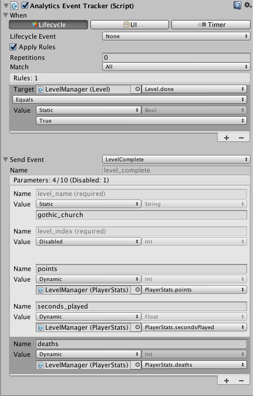
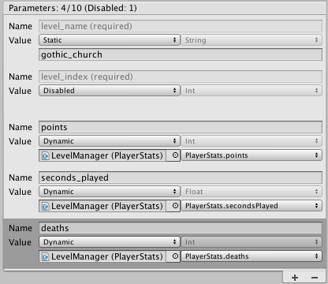

# Analytics Event Tracker

Use the __Analytics Event Tracker__ component to send both Standard and Custom Events. While you can send these events using a script, in some cases it can be more convenient to set up the event triggers and parameters directly from the Inspector window of the Unity Editor.

Attach an Analytics Event Tracker component to any GameObject to send a Standard or Custom event. Use a separate tracker component for each different type of Analytics event that you send.

The Analytics Event Tracker component has two main sections:

* **When**: Specifies when to dispatch the event. 
* **Send Event**: Specifies which event to send, and defines the required and optional parameters.

## When to send an event

There are three ways to trigger the tracker component to send an event: __Lifecycle Event__, __UI__, and __Timer__. 

* Choose __Lifecycle Event__ to dispatch the Analytics event when a specific `MonoBehaviour` lifecycle event (such as `Start` or `OnEnable`) occurs. 
* Choose __UI__ if you are using a UI event to trigger the Analytics event. You must set up the UI event separately. For example, to dispatch an event when a button is clicked, you could add the `AnalyticsEventTracker.TriggerEvent` to the button’s `OnClick()` list:

* Choose __Timer__ to dispatch the Analytics event after a specified delay or at regular intervals (measured in seconds). When using a timer to dispatch the event, remember that there is a limit of 100 events per hour per player, so you could quickly reach your application event limit.

|**_Property:_** | | |**_Function:_** |
|:---|:---|:---|:---|
|__Trigger Type__||| Specifies the type of game event that triggers the Analytics event to be dispatched.|
|| __Lifecycle Event__ || Dispatch when a specific MonoBehaviour event occurs: |
||| __Awake__ | Dispatch when Unity invokes this GameObject's `Awake()` method. |
||| __Start__ | Dispatch when Unity invokes this GameObject's `Start()` method. |
||| __On Enable__ | Dispatch when Unity or your game code enables this GameObject. |
||| __On Disable__ | Dispatch when Unity or your game code disables this GameObject. |
||| __On Application Pause__ | Dispatch when Unity pauses the application. |
||| __On Application Unpause__ | Dispatch when Unity unpauses the application. |
||| __On Destroy__ | Dispatch when Unity destroys the object. |
||| __None__ | The Analytics event is not dispatched automatically. You must call the `AnalyticsEventTracker.TriggerEvent()` method. |
|| __UI__ || Dispatch when a UI event occurs, such as a button press. Hook up the `AnalyticsEventTracker.TriggerEvent()` method to a suitable UI event, such as `Button.OnClick()`.|
|| __Timer__ || Dispatch after a time interval: |
||| __Initial Time__ | The interval after which the Analytics event is dispatched. The interval starts when Unity invokes the `Start()` method of the tracker object.|
||| __Poll Time__ | The interval at which the Analytics event is repeatedly dispatched. Use Rules to limit the number of repetitions. Set to zero for no repetitions. |

## Rules

You can define rules that constrain whether the tracker dispatches the Analytics event when it would otherwise be triggered. For example, if you only want to send an event when the player pushes a button and some other condition is true, you could hook up a UI trigger to the button click event and define one or more rules to specify the condition.

A rule compares the value of the field of one object to either a fixed value or the value of another field. You can use any of the typical comparison operators, such as Is Equals, Is Greater Than, and so on, as well as a couple that aren’t so typical, namely Is Between and Is Between Or Equal To.

If you create more than one rule, you can choose a __Match__ type to specify how the rules are combined. 

In addition to the comparison rules, you can choose the maximum number of times an Analytics event can be sent by setting the __Repetitions__ property. Set to zero for no limit. The repetition limit applies for the lifetime of this instance of the Analytics Event Tracker component. For example, if you put the component on a Prefab object and use more than one instance of that prefab in your game, each prefab has an independent repetition count.

Check the __Apply Rules__ box to reveal the rule section of the Analytics Event Tracker component.

|**_Property:_** ||**_Function:_** |
|:---|:---|:---|
|__Apply Rules__|| Only dispatch the Analytics event if the specified rules are satisfied. |
|__Repetitions__|| The maximum number of times the Analytics event will be dispatched during the GameObject's lifetime. (If the player repeats a level, for example, the events can be dispatched again.) Leave at zero for unlimited repetitions. |
|__Match__|| Whether __All__ rules must match, __Any__ rule may match, or __None__ of the rules can match in order for the tracker to dispatch the Analytics. |
| __Rule List__ || Click __+__ or  __-__ to create and delete rules. Each rule has the form: _target operator value_ where _target_ is a field of some MonoBehaviour object, _value_ is either a static value or another field of a MonoBehaviour object, and _operator_ is the type of comparison to perform. |
|| __Target Object__ | The object containing the field you want to test with the rule.|
|| __Target Field__ | The field of the object to test. You can compare fields and properties with primitive data types (float, int, bool, and string).|
|| __Comparison__ | How to compare the target field to the test value. For some comparisons, like _Is Between_, you specify two comparison values instead of one. |
|| __Value__ | Use __Static__ to compare the target field to a fixed value. Use __Dynamic__ to compare the target field to another field.|
|| __Value Data Type__ | One of the supported, primitive data types: float, int, bool, or string. When you set either a target or a value field, the tracker sets the data type to match that field.|
|| __Value Object__ | When using __Dynamic__, this is the object containing the field or property to compare to the target field. This property is only visible when the **Value** is **Dynamic**.|
|| __Value Field__ | The field to compare to the target field. The tracker compares the current values of the two fields at the time the event is to be dispatched. This property is only visible when the **Value** is **Dynamic**.|
|| __Static Value__ | When using __Static__, the fixed value to compare to the target field. This property is only visible when the **Value** is **Static**.|

## Parameters

You can define up to ten parameters to send to the Analytics Service as part of an Analytics event. Many Standard Events have standard required and optional parameters, which automatically appear in the list when you select the event in the Analytics Event Tracker component. The required and optional parameters do count against the ten parameter limit, but you can set optional parameters to __Disabled__ to remove them. See [Analytics Event Parameters](UnityAnalyticsEventParameters) for additional information.

You can assign a fixed value to a parameter, which the tracker uses every time it dispatches the event. Alternately, you can assign a dynamic value by hooking the parameter to a field or property of a MonoBehaviour object. When you use a dynamic value, the tracker assigns the value of the associated field to the parameter when it dispatches the event.

|**_Property:_** ||**_Function:_** |
|:---|:---|:---|
|__Name__|| The name of the parameter. The name of the standard parameters cannot be changed. |
| __Parameter List__ || Click __+__ or  __-__ to create and delete parameters. You cannot delete the standard parameters of an Analytics event, but you can disable the optional ones. Disabled parameters are not counted against the ten parameter limit (and are not sent to the Analytics Service). |
|| __Value__ | Use __Static__ to assign a fixed value for this parameter. Use __Dynamic__ to assign the current value of an object's field or property. Use __Disabled__ to suppress optional standard parameters. |
|| __Value Data Type__ | One of the supported, primitive data types: float, int, bool, or string. When using __Dynamic__, the tracker sets the data type to match the specified field.|
|| __Value Object__ | When using __Dynamic__, the object containing the field or property to assign to the parameter when the Analytics event is dispatched. This property is only visible when the **Value** is **Dynamic**.|
|| __Value Field__ | The field or property containing the value to assign to the parameter. This property is only visible when the **Value** is **Dynamic**.|
|| __Static Value__ | When using __Static__, the fixed value to assign to the parameter. This property is only visible when the **Value** is **Static**.|

---

* 2018-03-02 <!-- include IncludeTextNewPageNoEdit -->

* 2018-03-02 - Service compatible with Unity 5.2 onwards at this date but version compatibility may be subject to change

* New feature in 5.2

