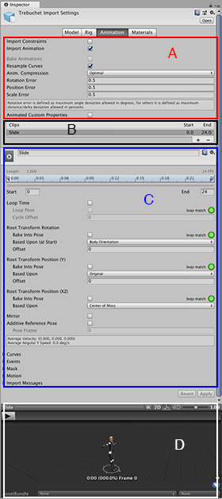
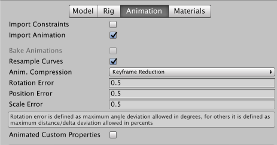
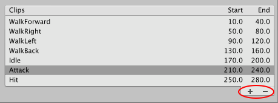
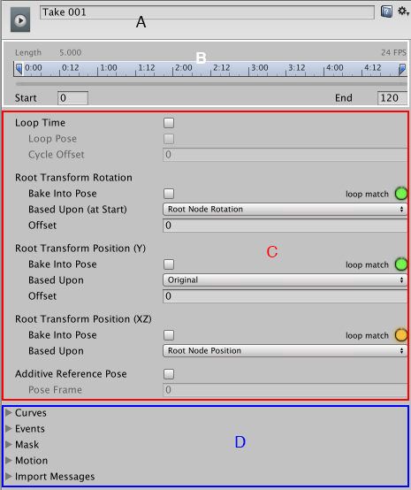
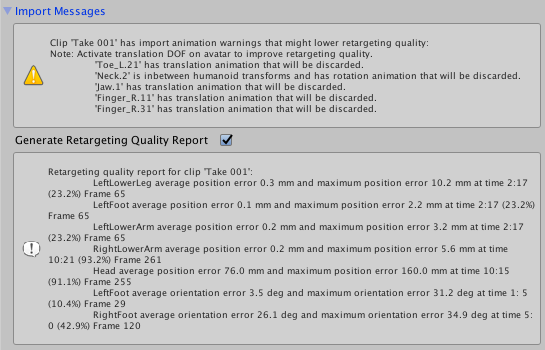
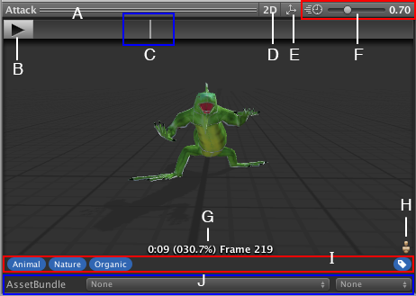

# Animation tab

__Animation Clips__ are the smallest building blocks of animation in Unity. They represent an isolated piece of motion, such as RunLeft, Jump, or Crawl, and can be manipulated and combined in various ways to produce lively end results (see [Animation State Machines](AnimationStateMachines), [Animator Controller](class-AnimatorController), or [Blend Trees](class-BlendTree)). 
You can select Animation Clips from imported FBX data. 

When you click on the model containing animation clips, these properties appear: 

 

There are four areas on the __Rig__ tab of the Inspector window:

* (A) [Asset-specific properties](#AssetProperties). These settings define import options for the entire Asset.
* (B) [Clip selection list](#ClipSelectionList). You can select any item from this list to display its properties and preview its animation. You can also [define new clips](Splittinganimations).
* (C) [Clip-specific properties](#ClipProperties). These settings define import options for the selected __Animation Clip__.
* (D) [Animation preview](#AnimationPreview). You can playback the animation and select specific frames here.

## Asset-specific properties

 

These properties apply to all animation clips and constraints defined within this Asset:

|**_Property:_** ||**_Function:_** |
|:---|:---|:---|
|__Import Constraints__ ||Import [constraints](Constraints) from this asset. |
|__Import Animation__ ||Import animation from this asset.   **_Note:_** If disabled, all other options on this page are hidden and no animation is imported.|
|__Bake Animations__ ||Bake animations created using IK or Simulation to forward kinematic keyframes.   Only available for Autodesk® Maya®, Autodesk® 3ds Max® and Cinema 4D files. |
|__Resample Curves__ ||Resample animation curves as Quaternion values and generate a new Quaternion keyframe for every frame in the animation.   This option is enabled by default.  Disable this to [keep animation curves as they were originally authored](AnimationEulerCurveImport) this only if you're having issues with the interpolation between keys in your original animation  Only appears if the import file contains Euler curves.|
|__Anim. Compression__||The type of compression to use when importing the animation. |
||__Off__|Disable animation compression. This means that Unity doesn't reduce keyframe count on import, which leads to the highest precision animations, but slower performance and bigger file and runtime memory size. It is generally not advisable to use this option - if you need higher precision animation, you should enable keyframe reduction and lower allowed __Animation Compression Error__ values instead.|
||__Keyframe Reduction__ |Reduce redundant keyframes on import. If selected, the __Animation Compression Errors__ options are displayed. This affects both file size (runtime memory) and how curves are evaluated.|
||__Keyframe Reduction and Compression__|Reduce keyframes on import and compress keyframes when storing animations in files. This affects only file size - the runtime memory size is the same as __Keyframe Reduction__. If selected, the __Animation Compression Errors__ options are displayed.|
||__Optimal__ |Let Unity decide how to compress, either by keyframe reduction or by using dense format.   Only for __Generic__ and __Humanoid__ [Animation Type](FBXImporter-Rig) rigs. |
| __Animation Compression Errors__ || Only available when __Keyframe Reduction__ or __Optimal__ compression is enabled. |
||__Rotation Error__|How much to reduce rotation curves. The smaller the value, the higher the precision. |
||__Position Error__|How much to reduce position curves. The smaller the value, the higher the precision. |
||__Scale Error__|How much to reduce scale curves. The smaller the value, the higher the precision. |
|__Animated Custom Properties__||Import any FBX properties that you designated as custom user properties.   Unity only supports a small subset of properties when importing FBX files (such as translation, rotation, scale and visibility). However, you can treat standard FBX properties like user properties by naming them in your importer script via the [extraUserProperties](ScriptRef:ModelImporter-extraUserProperties.html) member. During import, Unity then passes any named properties to [the Asset postprocessor](ScriptRef:AssetPostprocessor.OnPostprocessGameObjectWithUserProperties.html) just like 'real' user properties. |

## Clip selection list

 

You can perform these tasks in this area of the __Rig__ tab:

* Select a clip from the list to [display its clip-specific properties](#ClipProperties). 
* Play a selected clip in the [clip preview pane](#AnimationPreview).
* [Create a new clip](Splittinganimations) for this file with the add (`+`) button. 
* Remove the selected clip definition with the delete (`-`) button.

## Clip-specific properties

 

This area of the __Rig__ tab displays these features:

* (A) The (editable) name of the selected clip
* (B) The animation clip timeline
* (C) Clip properties to control looping and pose
* (D) Expandable sections for: defining curves, events, masks, and motion roots; and viewing messages from the import process

You can set these properties separately for each animation clip defined within this asset:

<!-- not sure about images in tables -->

|**_Property:_** ||**_Function:_** |
|:---|:---|:---|
|***Area A (editable name)***|||
| ||The take in the source file to use as a source for this animation clip.   This is what defines a set of animation as separated in Motionbuilder, Autodesk® Maya® and other 3D packages. Unity can import these takes as individual clips. You can [create them from the whole file or from a subset of frames](Splittinganimations). |
|***Area B (timeline features)***|||
| ||You can use the drag the start and end indicators around the timeline to define frame ranges for each clip.|
|__Start__ ||Start frame of the clip.|
|__End__ ||End frame of the clip.|
|***Area C (looping and pose control)***|||
|__Loop Time__ ||Play the animation clip through and restart when the end is reached.|
||__Loop Pose__ |Loop the motion seamlessly.|
||__Cycle Offset__ |Offset to the cycle of a looping animation, if it starts at a different time.|
|__Root Transform Rotation__ ||| 
|__Bake into Pose__ ||Bake root rotation into the movement of the bones. Disable to store as root motion.| 
|__Based Upon__ ||Basis of root rotation.|
||__Original__|Keep the original rotation from the source file.|
||__Root Node Rotation__ |Keeps the upper body pointing forward.   Only available for the __Generic__ [Animation Type](FBXImporter-Rig).|
||__Body Orientation__ |Keep the upper body pointing forward.  Only available for the __Humanoid__ [Animation Type](FBXImporter-Rig).|
|__Offset__ ||Offset to the root rotation (in degrees).|
|__Root Transform Position (Y)__ ||| 
|__Bake into Pose__ ||Bake vertical root motion into the movement of the bones. Disable to store as root motion.| 
|__Based Upon (at Start)__ ||Basis of vertical root position.|
||__Original__ |Keep the vertical position from the source file.|
||__Root Node Position__ |Use the vertical root position.  Only available for the __Generic__ [Animation Type](FBXImporter-Rig).|
||__Center of Mass__ |Keep center of mass aligned with the root transform position.  Only available for the __Humanoid__ [Animation Type](FBXImporter-Rig).|
||__Feet__ |Keep feet aligned with the root transform position.  Only available for the __Humanoid__ [Animation Type](FBXImporter-Rig).|
|__Offset__ ||Offset to the vertical root position.|
|__Root Transform Position (XZ)__ ||| 
|__Bake into Pose__ ||Bake horizontal root motion into the movement of the bones. Disable to store as root motion.| 
|__Based Upon__ ||Basis of horizontal root position.|
||__Original__ |Keep the horizontal position from the source file.|
||__Root Node Position__ |Use the horizontal root transform position.  Only available for the __Generic__ [Animation Type](FBXImporter-Rig).|
||__Center of Mass__ |Keep aligned with the root transform position.  Only available for the __Humanoid__ [Animation Type](FBXImporter-Rig).|
|__Offset__ ||Offset to the horizontal root position.|
|__Mirror__ ||Mirror left and right in this clip.   Only appears if the [Animation Type](FBXImporter-Rig) is set to __Humanoid__.|
|__Additive Reference Pose__ ||Enable to set frame for the reference pose used as the base for the [additive animation layer](AnimationLayers). A blue marker becomes visible in the timeline editor:   |
||__Pose Frame__|Enter a frame number to use as the reference pose. You can also drag the blue marker in the timeline to update this value.   Only available if __Additive Reference Pose__ is enabled.| 
|***Area D (expandable sections)***|||
|__Curves__ ||Expand this section to manage [animation curves on imported clips](AnimationCurvesOnImportedClips).|
|__Events__ ||Expand this section to manage [animation events on imported clips](animeditor-AnimationEvents).|
|__Mask__ ||Expand this section to manage [masking imported clips](class-AvatarMask).|
|__Motion__ ||Expand this section to manage [selecting a root motion node](AnimationRootMotionNodeOnImportedClips).|
|__Import Messages__ ||Expand this section to see detailed [information about how your animation was imported](#ImportMessages), including an optional *Retargeting Quality Report*.|

Creating clips is essentially defining the start and end points for segments of animation. In order for these clips to loop, they should be trimmed in such a way to match the first and last frame as best as possible for the [desired loop](LoopingAnimationClips).

## Animation import warnings

If any problems occur during the animation import process, a warning appears at the top of the Animations Import inspector:

The warnings do not necessarily mean your animation has not imported or doesn't work. It may just mean that the imported animation looks slightly different from the source animation. 

To see more information, expand the __Import Messages__ section:

In this case, Unity has provided a __Generate Retargeting Quality Report__ option which you can enable to see more specific information on the retargeting problems.

Other warning details you may see include the following:

- Default bone length found in this file is different from the one found in the source avatar.
- Inbetween bone default rotation found in this file is different from the one found in the source avatar.
- Source avatar hierarchy doesn't match one found in this model.
- This animation has Has translation animation that will be discarded.
- Humanoid animation has inbetween transforms and rotation that will be discarded.
- Has scale animation that will be discarded.

These messages indicate that some data present in your original file was omitted when Unity imported and converted your animation to its own internal format. These warnings essentially tell you that the retargeted animation may not exactly match the source animation.

**Note:** Unity does not support pre- and post-extrapolate modes (also known as pre- and post-infinity modes) other than **constant**, and converts these to **constant** when imported.

## Animation preview

The preview area of the __Rig__ tab provides these features:

* (A) The name of the selected clip
* (B) The play/pause button
* (C) The playback head on the preview timeline (allows scrubbing back and forth)
* (D) The [2D preview mode](Overview2D) button (switches between orthographic and perspective camera)
* (E) The pivot and mass center display button (switches between displaying and hiding the gizmos)
* (F) The animation preview speed slider (move left to slow down; right to speed up)
* (G) The playback status indicator (displays the location of the playback in seconds, percentage, and frame number)
* (H) The Avatar selector (change which GameObject will preview the action)
* (I) The __Tag__ bar, where you can define and apply [Tags](Tags) to your clip
* (J) The [AssetBundles](AssetBundlesIntro) bar, where you can [define AssetBundles and Variants](AssetBundles-Workflow)

---

*  2018-04-25  <!-- include IncludeTextAmendPageSomeEdit -->

*  2017-12-05  <!-- include IncludeTextAmendPageNoEdit -->

* Materials tab added in [2017.2](https://docs.unity3d.com/2017.2/Documentation/Manual/30_search.html?q=newin20172) NewIn20172
