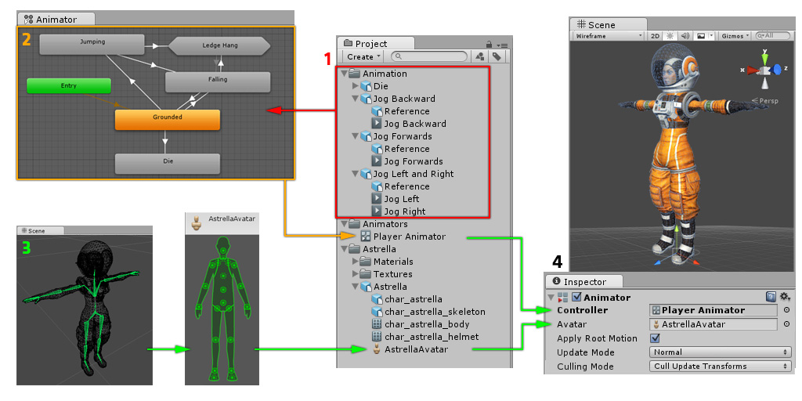

# Animator Component

The Animator component is used to assign animation to a GameObject in your scene. The Animator component requires a reference to an [Animator Controller](class-AnimatorController) which defines which animation clips to use, and controls when and how to blend and transition between them.

If the GameObject is a humanoid character with an [Avatar](class-Avatar) definition, the Avatar should also be assigned in this component, as seen here:

 

This diagram shows how the various assets (Animation Clips, an Animator Controller, and an Avatar) are all brought together in an Animator Component on a Game Object:

 

See Also [State Machines](AnimationStateMachines), [Blend Trees](class-BlendTree), [Avatar](class-Avatar), [Animator Controller](class-AnimatorController)

## Properties

|**_Property:_** ||**_Function:_** |
|:---|:---|:---|
|__Controller__ ||The animator controller attached to this character.|
|__Avatar__ ||The [Avatar](class-Avatar) for this character. (If the Animator is being used to animate a humanoid character) |
|__Apply Root Motion__ ||Should we control the character's position and rotation from the animation itself or from script. |
|__Update Mode__||This allows you to select when the Animator updates, and which timescale it should use.|
||__Normal__| The animator is updated in-sync with the Update call, and the animator’s speed matches the current timescale. If the timescale is slowed, animations will slow down to match.|
||__Animate Physics__| The animator is updated in-sync with the FixedUpdate call (i.e. in lock-step with the physics system). You should use this mode if you are animating the motion of objects with physics interactions, such as characters which can push rigidbody objects around.|
||__Unscaled Time__| The animator is updated in-sync with the Update call, but the animator’s speed ignores the current timescale and animates at 100% speed regardless. This is useful for animating a GUI system at normal speed while using modified timescales for special effects or to pause gameplay.|
|__Culling Mode__||Culling mode you can choose for animations.|
||__Always Animate__ | Always animate, don't do culling even when offscreen.|
||__Cull Update Transforms__| Retarget, IK and write of Transforms are disabled when renderers are not visible. |
||__Cull Completely__ | Animation is completely disabled when renderers are not visible. |

## Animation curve information

The information box at the bottom of the Animator component provides you with a breakdown of the data being used in all the clips used by the Animator Controller.

An animation clip contains data in the form of “curves”, which represent how a value changes over time. These curves may describe the position or rotation of an object, the flex of a muscle in the humanoid animation system, or other animated values within the clip such as a changing material colour.

This table explains what each item of data represents:

|**_Label_** |**_Description_** |
|:---|:---|
|__Clip Count__|The total number of animation clips used by the animator controller assigned to this Animator.|
|__Curves (Pos, Rot & Scale)__|The total number of curves used to animate the position, rotation or scale of objects. These are for animated objects that are not part of a standard humanoid rig. When animating a humanoid avatar, these curves would show up a count for extra non-muscle bones such as a tail, flowing cloth or a dangling pendant. If you have a humanoid animation and you notice unexpected non-muscle animation curves, you mave have unnecessary animation curves in your animation files.|
|__Muscles__|The number of muscle animation curves used for humanoid animation by this Animator. These are the curves used to animate the standard humanoid avatar muscles. As well as the standard muscle movements for all the humanoid bones in Unity’s standard avatar, this also includes two “muscle curves” which store the root motion position and rotation animation.|
|__Generic__|The number of numeric (float) curves used by the animator to animate other properties such as material colour.|
|__PPtr__|The total count of sprite animation curves (used by Unity's 2d system)|
|__Curves Count__|The total combined number of animation curves|
|__Constant__|The number of animation curves that are optimised as constant (unchanging) values. Unity selects this automatically if your animation files contain curves with unchanging values.|
|__Dense__|The number of animation curves that are optimised using the “dense” method of storing data (discrete values which are interpolated between linearly). This method uses less significantly less memory than the “stream” method.|
|__Stream__|The number of animation curves using the “stream” method of storing data (values with time and tangent data for curved interpolation). This data occupies significantly more memory than the “dense” method.|

If your animation clips are imported with “Anim Compression” set to “Optimal” in the [Animation import reference](class-AnimationClip), Unity will use a heuristic algorithm to determine whether it is best to use the dense or stream method to store the data for each curve.

---

*  2018-04-25  <!-- include IncludeTextAmendPageSomeEdit -->
