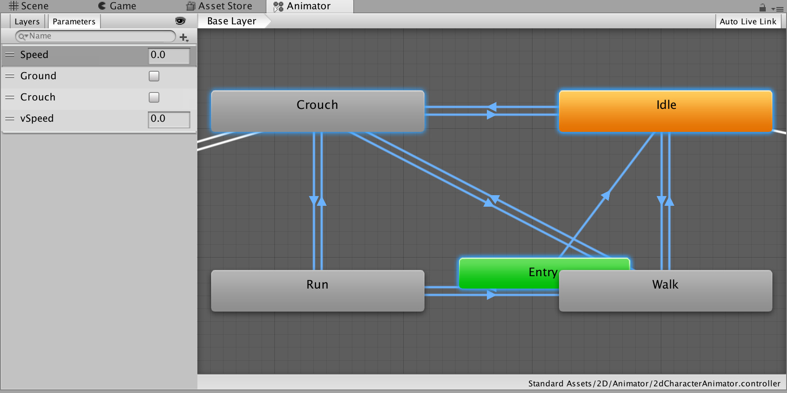
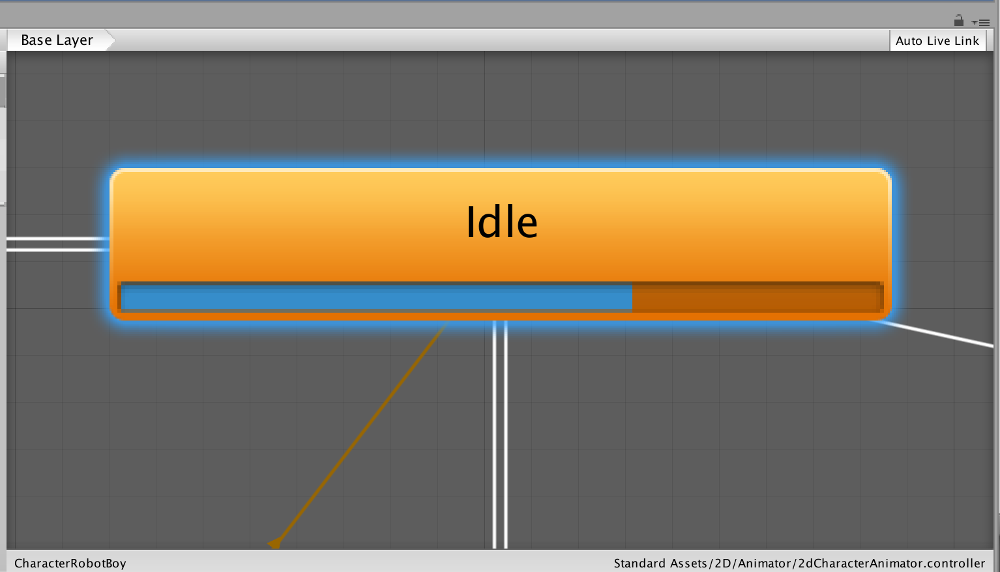

Animator Controller
===================

An Animator Controller allows you to arrange and maintain a set of Animation Clips and associated Animation Transitions for a character or object. In most cases it is normal to have multiple animations and switch between them when certain game conditions occur. For example, you could switch from a walk Animation Clip to a jump Animation Clip whenever the spacebar is pressed. However even if you only have a single Animation Clip you still need to place it into an Animator Controller to use it on a GameObject. 

The Animator Controller has references to the Animation clips used within it, and manages the various Animation Clips and the Transitions between them using a __State Machine__, which could be thought of as a flow-chart of Animation Clips and Transitions, or a simple program written in a visual programming language within Unity. More information about state machines can be found [here](AnimationStateMachines).

Unity automatically creates an Animator Controller when you begin animating a GameObject using the Animation Window, or when you attach an Animation Clip to a GameObject.

To manually create an Animator Controller, right click the Project window and click __Create > Animator Controller__.

##Navigation

Use the scroll wheel on your mouse, or equivalent, to zoom in and out of the Animator Controller window.

To focus on an item in the Animator Controller window, select one or multiple states (click or drag a selection box around the states you wish to select), then press the F key to zoom in on the selection. 

Press the A key to fit all of the animation states into the Animator Controller view. 

Unity preserves your selection. Press the A and F keys to switch between your selected animation states and the entire Animator Controller. 

During Play Mode, the Animator pans the view so that the current state being played is always visible. The Animator Controller respects the independent zoom factors of the Base Layer and Sub-State Machine, and the window pans automatically to ensure visibility of the active state or states. 

To modify the zoom during Play Mode, follow these steps:

* Enable __Auto Live Link__ in the Animator Controller window
* Click the Play button to enter Play Mode
* Click Pause
* In the Animator Controller, select the state or states you want to zoom into
* Press the F key to zoom into the selection
* Click the Play button again to resume Play Mode

Note that the Animator Controller pans to each state when it activates.

---

* 2017-11-21 <!-- include IncludeTextNewPageSomeEdit -->

* Animator zoom added in [2017.3](https://docs.unity3d.com/2017.3/Documentation/Manual/30_search.html?q=newin20173) NewIn20173