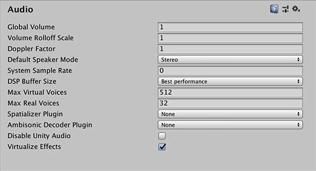

#Audio

The __Audio__ settings (main menu: **Edit** > **Project Settings**, then select the **Audio** category) allows you to tweak the maximum volume of all sounds playing in the Scene.

 

|**Property** ||**Function** |
|:---|:---|:---|
|__Global Volume__ ||Set the volume for all sounds during playback. |
|__Volume Rolloff Scale__ ||Set the global attenuation rolloff factor for [Logarithmic rolloff-based sources](class-AudioSource). The higher the value, the faster the volume attenuates. Conversely, the lower the value, the slower it attenuates.  **Tip:** A value of 1 simulates the "real world".|
|__Doppler Factor__ ||Set how audible the Doppler effect is. Use 0 to disable it. Use 1 make it audible for fast moving objects. **Tip:** After setting the __Doppler Factor__ to 1, you can tweak both __Speed of Sound__ and __Doppler Factor__ until you are satisfied. |
|__Default Speaker Mode__ ||Set which speaker mode should be the default for your project. The default is 2, which corresponds to stereo speakers. For the full list of modes, see the [AudioSpeakerMode](ScriptRef:AudioSpeakerMode.html) API reference. **Note:** You can also change the speaker mode at runtime through scripting. See [Audio Settings](ScriptRef:AudioSettings.html) for details.|
|__System Sample Rate__||Set the output sample rate. If set to 0, Unity uses the sample rate of the system.  **Note:** This only serves as a reference only, since certain platforms allow you to change the sample rate, such as iOS or Android. |
|__DSP Buffer Size__||Set the size of the DSP buffer to optimize for latency or performance.|
||__Default__|Default buffer size.|
||__Best Latency__|Trade off performance in favour of latency.|
||__Good Latency__|Balance between latency and performance.|
||__Best Performance__|Trade off latency in favour of performance.|
|__Max Virtual Voices__||Set the number of virtual voices that the audio system manages. This value should always be larger than the number of voices played by the game. If not, Unity displays warnings in the console. |
|__Max Real Voices__||Set the number of real voices that can play at the same time. At every frame, the loudest voice is picked. |
|__Spatializer Plugin__||Choose which native audio plugin to use in order to perform spatialized filtering of 3D sources. |
|__Ambisonic Decoder Plugin__||Choose which native audio plugin to perform ambisonic-to-binaural filtering of sources. |
|__Disable Unity Audio__ ||Enable to deactivate the audio system in standalone builds. Note that this also affects the audio of MovieTextures.  In the Editor the audio system is still on and supports previewing audio clips, but Unity does not handle calls to [AudioSource.Play](ScriptRef:AudioSource.Play.html) and [AudioSource.playOnAwake](ScriptRef:AudioSource.playOnAwake.html) in order to simulate behavior of the standalone build. |
|__Virtualize Effect__||Enable to dynamically turn off effects and spatializers on AudioSources that are culled in order to save CPU. |

