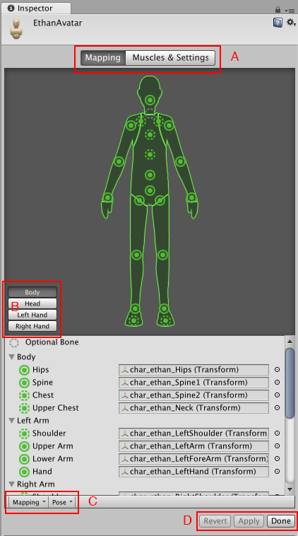
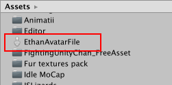

# Avatar Mapping tab

After you save the scene, the __Avatar Mapping__ tab appears in the __Inspector__ displaying Unity's bone mapping:

 

* (A) Buttons to toggle between the __Mapping__ and __Muscles &amp; Settings__ tabs. You must __Apply__ or __Revert__ any changes made before switching between tabs.
* (B) Buttons to switch between the sections of the Avatar: __Body__, __Head__, __Left Hand__, and __Right Hand__.
* (C) Menus which provide various __Mapping__ and __Pose__ tools to help you map the bone structure to the Avatar.
* (D) Buttons to accept any changes made (__Accept__), discard any changes (__Revert__), and leave the Avatar window (__Done__). You must __Apply__ or __Revert__ any changes made before leaving the __Avatar__ window.

The Avatar Mapping indicates which of the bones are required (solid circles) and which are optional (dotted circles). Unity can interpolate optional bone movements automatically. 

## Saving and reusing Avatar data (Human Template files)

You can save the mapping of bones in your skeleton to the Avatar on disk as a [Human Template file](class-HumanTemplate) (extention `*.ht`). You can reuse this mapping for any character. For example, you want to put the Avatar mapping under source control and you prefer to commit text-based files; or perhaps you want to parse the file with your own custom tool.

To save the Avatar data in a Human Template file, choose __Save__ from the __Mapping__ drop-down menu at the bottom of the __Avatar__ window. 

 

Unity displays a dialog box for you to choose the name and location of the file to save. 

To load a Human Template file previously created, choose __Mapping__ &gt; __Load__ and selecr the file you want to load.

## Using Avatar Masks

Sometimes it is useful to restrict an animation to specific body parts. For example, an walking animation might involve the character swaying their arms, but if they pick up a torch, they should hold it up to cast light. You can use an __Avatar Body Mask__ to specify which parts of a character an animation should be restricted to. See documentation on [Avatar Masks](class-AvatarMask) for further details.

---

*  2018-04-25  <!-- include IncludeTextAmendPageSomeEdit -->
