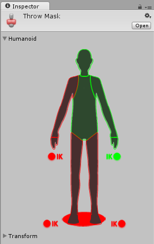
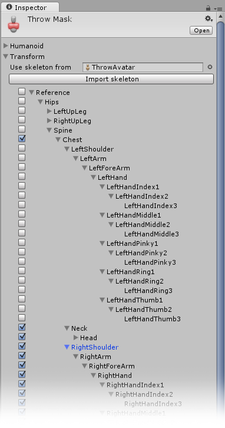

# Avatar Mask window

There are two ways to define which parts of your animation should be masked: 

* By selecting from a [Humanoid body map](#Humanoid)
* By choosing which bones to include or exclude from a [Transform hierarchy](#Transform)

## Humanoid body selection

If your animation uses a Humanoid Avatar, you can select or deselect portions of the simplified humanoid body diagram to indicate where to mask the animation:

 

The body diagram groups body parts into these portions: 

* Head
* Left Arm
* Right Arm
* Left Hand
* Right Hand
* Left Leg
* Right Leg
* Root (denoted by the "shadow" under the feet)

To include animation from one of these body portions, click the Avatar diagram for that portion until it appears as green.
To exclude animation, click the body portion until it appears red.
To include or exclude all, double-click the empty space surrounding the Avatar.
 
You can also toggle __Inverse Kinematics (IK)__ for hands and feet, which determines whether or not to include IK curves in animation blending.

## Transform selection

Alternatively, if your animation does not use a Humanoid Avatar, or if you want more detailed control over which individual bones are masked, you can select or deselect portions of the Model's hierarchy: 

1. Assign a reference to the Avatar whose transform you would like to mask. 
2. Click the __Import Skeleton__ button. The hierarchy of the avatar appears in the inspector. 
3. You can check each bone in the hierarchy to use as your mask.

 

Mask assets can be used in [Animator Controllers](AnimatorControllers), when specifying [Animation Layers](AnimationLayers) to apply masking at runtime, or in the import settings of of your animation files to apply masking during to the import animation.

A benefit of using Masks is that they tend to reduce memory overheads since body parts that are not active do not need their associated animation curves. Also, the unused curves need not be calculated during playback which will tend to reduce the CPU overhead of the animation.

---

*  2018-04-25  <!-- include IncludeTextAmendPageSomeEdit -->
