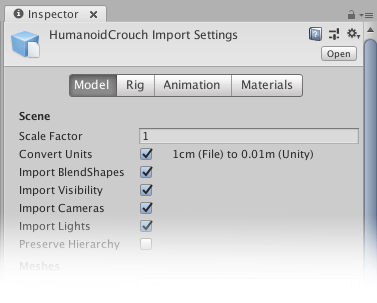

# Model Import Settings window

When you put Model files in the Assets folder under your Unity Project, Unity automatically imports and stores them as Unity Assets. To view the import settings in the __Inspector__, click on the file in the __Project__ window. You can customize how Unity imports the selected file by setting the properties on four tabs on this window:

 A 3D [Model](FBXImporter-Model) can represent a character, a building, or a piece of furniture. In these cases, Unity creates multiple Assets from a single model file. In the Project window, the main imported object is a model __Prefab__. Usually there are also several __Mesh__ objects that the model Prefab references.

 A [Rig](FBXImporter-Rig) (sometimes called a _skeleton_) comprises a set of deformers arranged in a hierarchy that animate a Mesh (sometimes called _skin_) on one or more models created in a 3D modeling application such as as Autodesk® 3ds Max® or Autodesk® Maya®. For __Humanoid__ and __Generic__ (non-humanoid) Models, Unity creates an __Avatar__ to reconcile the imported Rig with the Unity __GameObject__.

 You can define any series of different poses occurring over a set of frames, such as walking, running, or even idling (shifting from one foot to the other) as an [Animation Clip](class-AnimationClip). You can reuse clips for any Model that has an identical Rig. Often a single file contains several different actions, each of which you can define as a specific __Animation Clip__.

 You can extract [Materials and Textures](FBXImporter-Materials) or leave them embedded within the model. You can also adjust how Material is mapped in the Model.

### See also

* [Model import workflows](ImportingModelFiles): Overview of importing Model files
* [Model file formats](3D-formats): Which file formats (both proprietary and generic) that Unity supports, as well as issues specific to various 3D modeling software applications
* [Exporting from other applications](HOWTO-exportFBX): General guidelines for how to export FBX (and proprietary) files from your 3D modeling applications

---

*  2018-04-25  <!-- include IncludeTextAmendPageSomeEdit -->
