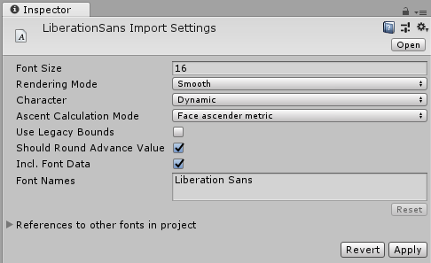
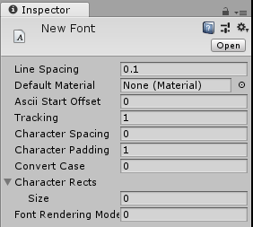
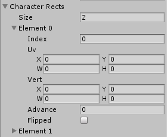
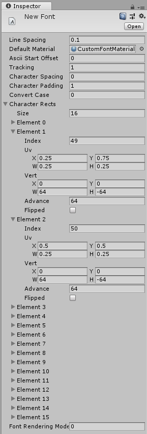

#Font

__Fonts__ can be created or imported for use in either the [GUI Text](class-GUIText) or the [Text Mesh](class-TextMesh) __Components__.

##Importing Font files

To add a font to your project you need to place the font file in your Assets folder. Unity will then automatically import it. Supported Font formats are TrueType Fonts (.ttf files) and OpenType Fonts (.otf files).

To change the __Size__ of the font, highlight it in the __Project View__ and you have a number of options in the __Import Settings__ in the __Inspector__.

 

|**_Property:_** |**_Function:_** |
|:---|:---|
|__Font Size__ |The size of the font, based on the sizes set in any word processor.|
|__Rendering mode__ |The font rendering mode, which tells Unity how to apply smoothing to the glyphs. |
|__Character__ |The character set of the font to import into the font texture |
| |Setting this mode to Dynamic causes Unity to embed the font data itself and render font glyphs at runtime (see below).|

_Import Settings specific to dynamic fonts_

|**_Property:_** |**_Function:_** |
|:---|:---|
|__Include Font Data__ |This setting controls the packaging of the font when used with Dynamic font property. When selected the TTF is included in the output of the build. When not selected it is assumed that the end user will have the font already installed on their machine. Note that fonts are subject to copyright and you should only include fonts that you have licensed or created for yourself. |
|__Font Names__ |A list of fallback fonts to use when fonts or characters are not available (see below). |

After you import the font, you can expand the font in Project View to see that it has auto-generated some assets. Two assets are created during import: "font material" and "font texture".  Unlike many applications you might be familiar with, fonts in Unity are converted into textures, and the glyphs that you display are rendered using textured quads.  Adjusting the font size effectively changes how many pixels are used for each glyph in this generated texture.  Text Mesh assets are 3d geometry textured with these auto-generated font textures.  You will want to vary the size of the font to make these assets look crisp.

##Dynamic fonts

When you set the __Characters__ drop-down in the Import Settings to __Dynamic__, Unity will not pre-generate a texture with all font characters. Instead, it will use the FreeType font rendering engine to create the texture on the fly. This has the advantage that it can save in download size and texture memory, especially when you are using a font which is commonly included in user systems, so you don't have to include the font data, or when you need to support asian languages or large font sizes (which would make the font textures very large using normal font textures).

When Unity tries to render text with a dynamic font, but it cannot find the font (because __Include Font Data__ was not selected, and the font is not installed on the user machine), or the font does not include the requested glyph (like when trying to render text in east Asian scripts using a latin font, or when using styled bold/italic text), then it will try each of the fonts listed in the __Font Names__ field, to see if it can find a font matching the font name in the project (with font data included) or installed on the user machine which has the requested glyph. If none of the listed fallback fonts are present and have the requested glyph, Unity will fall back to a hard-coded global list of fallback fonts, which contains various international fonts commonly installed on the current runtime platform.

Note that some target platforms (WebGL, some consoles) do not have OS default fonts Unity can access for rendering text. For those platforms, __Include Font Data__ will be ignored, and font data will always be included. All fonts to be used as fallbacks must be included in the project, so if you need to render international text or bold/italic versions of a font, you need to add a font file which has the required characters to the project, and set up that font in the __Font Names__ list of other fonts which should use it as fallbacks. If the fonts are set up correctly, the fallback fonts will be listed in the Font Importer inspector, as _References to other fonts in project_.

##Default font asset

The default font asset is a dynamic font which is set up to use [Arial](https://en.wikipedia.org/wiki/Arial). If Unity can't find the Arial font on your computer (for example, if you don't have it installed), it will fall back to a font bundled with Unity called [Liberation Sans](https://en.wikipedia.org/wiki/Liberation_fonts).

Liberation Sans looks like Arial, but it does not include bold or italic font styles, and only has a basic Latin character set - so styled text or non-latin characters may fall back to other fonts or fail to render. It does however have a license which allows it to be included in player builds.

##Custom fonts

To create a custom font select ‘Create->custom font’ from the project window. This will add a custom font asset to your project library.

The **Ascii Start Offset** field is a decimal that defines the Ascii index you would like to begin your **Character Rects** index from. For example, if your Ascii Start Offset is set to 0 then the capital letter A will be at index 65 but if the Ascii Start Offset is set to 65 then the letter A will be at index 0. You can consult the Ascii Table [here](http://ascii.cl/) but you should bear in mind that custom font uses the decimal ascii numbering system.

**Tracking** can be set to modify how close each character will be to the next character on the same line and  **Line spacing** can be set to define how close each line will be to the next.

To create a font material you will need to import your font as a texture then apply that texture to a material, then drag your font material onto the  **Default Material** section.

The **Character Rects** section is where each character of your font is defined.

The **Size** field is for defining how many characters are in your font.

Within each **Element** there is an index field for the ascii index of the character. This will be an integer that represents the character in this element.

To work out the **UV** values you need to figure out how your characters are positioned on a scale of 0 to 1. You divide 1 by the number of characters on a dimension. For example if you have a font and the image dimensions on it are 256x128, 4 characters across, 2 down (so 64x64), then UV width will be 0.25 and UV height will be 0.5.

For UV X and Y, it's just a matter of deciding which character you want and multiplying the width or height value times the column/row of the letter.

**Vert** size is based on the pixel size of the characters e.g. your characters are each 128x128, putting 128 and -128 into the Vert Width and Height will give properly proportioned letters. Vert Y must be negative.

**Advance** will be the desired horizontal distance from the origin of this character to the origin of the next character in pixels. It is multiplied by **Tracking** when calculating the actual distance.

##Unicode support

Unity has full unicode support. Unicode text allows you to display German, French, Danish or Japanese characters that are usually not supported in an ASCII character set. You can also enter a lot of different special purpose characters like arrow signs or the option key sign, if your font supports it.

To use unicode characters, choose either __Unicode__ or __Dynamic__ from the __Characters__ drop-down in the Import Settings. You can now display unicode characters with this font. If you are using a __GUIText__ or __Text Mesh__, you can enter unicode characters into the Component's __Text__ field in the Inspector.

You can also use unicode characters if you want to set the displayed text from scripting. The C# compiler fully supports Unicode based scripts. You have to save your scripts with UTF-16 encoding. Now you can add unicode characters to a string in your script and they will display as expected in __UnityGUI__, a GUIText, or a Text Mesh.

Note that surrogate pairs are not supported.

##Changing Font Color

There are different ways to change the color of your displayed font, depending on how the font is used.

###GUIText and Text Mesh

If you are using a GUIText or a Text Mesh, you can change its color by using a custom __Material__ for the font. In the Project View, click on __Create &gt; Material__, and select and set up the newly created Material in the __Inspector__. Make sure you assign the texture from the font asset to the material. If you use the built-in __GUI/Text Shader__ shader for the font material, you can choose the color in the __Text Color__ property of the material.

###UnityGUI

If you are using UnityGUI scripting to display your font, you have much more control over the font's color under different circumstances. To change the font's color, you create a __GUISkin__ from __Assets &gt; Create &gt; GUI Skin__, and define the color for the specific control state, e.g. __Label &gt; Normal &gt; Text Color__. For more details, please read the [GUI Skin page](class-GUISkin).

##Hints

* To display an imported font select the font and choose __GameObject &gt; Create Other &gt; 3D Text__.
* You can reduce the generated texture size for fonts by using only lower or upper case characters.

