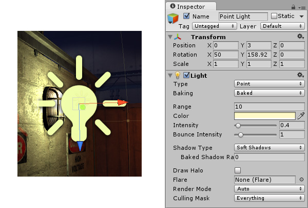
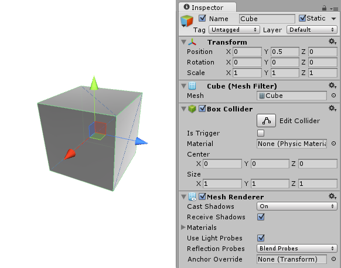

#GameObject

__GameObjects__ are the fundamental objects in Unity that represent characters, props and scenery. They do not accomplish much in themselves but they act as containers for __Components__, which implement the real functionality.

For example, a Light object is created by attaching a [Light](class-Light) component to a GameObject.

 

A solid cube object has a Mesh Filter and Mesh Renderer component, to draw the surface of the cube, and a Box Collider component to represent the object's solid volume in terms of physics.

 

##Details

A GameObject always has a [Transform](class-Transform) component attached (to represent position and orientation) and it is not possible to remove this. The other components that give the object its functionality can be added from the editor's __Component__ menu or from a script. There are also many useful pre-constructed objects (primitive shapes, Cameras, etc) available on the __GameObject &gt; 3D Object__ menu, see [Primitive Objects](PrimitiveObjects).

Since GameObjects are a very important part of Unity, there is a [GameObjects](GameObjects) section in the manual with extensive detail about them. You can find out more about controlling GameObjects from scripts on the [GameObject scripting reference page](ScriptRef:GameObject.html).