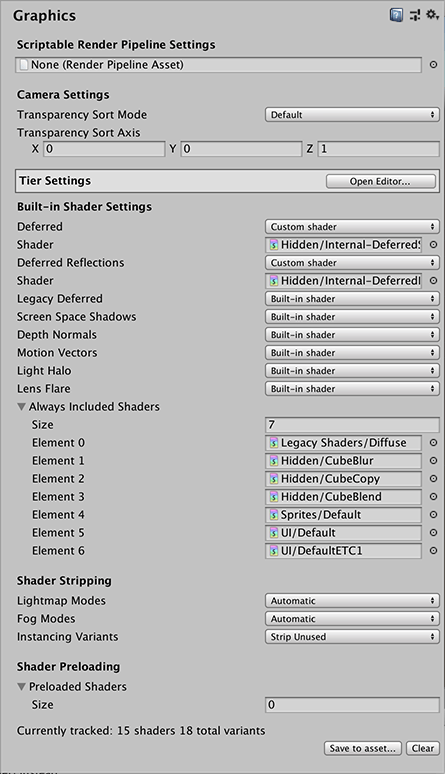
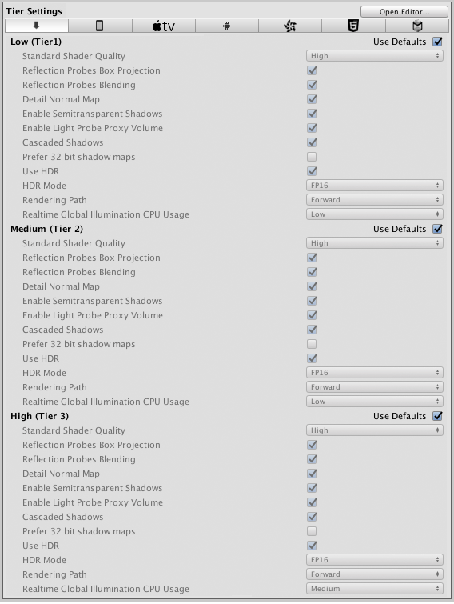

#Graphics

Use the __Graphics__ settings (main menu: **Edit** > **Project Settings**, then select the **Graphics** category) to apply global settings for Graphics.  

This section provides documentation on the following groups of properties:

* [Scriptable Render Pipeline Settings](#SRLoop) 
* [Camera Settings](#Camera)
* [Tier Settings](#Tier)
* [Built-in shader settings](#Built-in) 
* [Always-included Shaders](#Always)
* [Shader stripping](#stripping) 
* [Shader preloading](#preloading) 

## Scriptable Render Pipeline Settings

This allows you to define a series of commands to control exactly how the Scene should be rendered (instead of using the default rendering pipeline used by Unity). For more information on this feature, see the [Scriptable Render Pipeline](https://docs.unity3d.com/Packages/com.unity.render-pipelines.core@latest) package documentation.

## Camera Settings

These properties control various rendering settings.

|**Property** ||**Function** |
|:---|:---|:---|
|__Transparency Sort Mode__|| Define the order for rendering objects by their distance along a specific axis. Renderers in Unity are sorted by several criteria, such as their layer number or their distance from the camera. This is generally only useful in 2D development: for example, sorting Sprites by height or along the Y-axis.|
||_Default_| Sort objects based on the Camera mode. |
||_Perspective_| Sort objects based on perspective view.|
||_Orthographic_| Sort objects based on orthographic view. |
||_Custom Axis_| Sort objects based on the sort mode defined with the __Transparency Sort Axis__. |
|__Transparency Sort Axis__|| Define a custom __Transparency Sort Mode__.|

## Tier Settings

These settings allow you to make platform-specific adjustments to rendering and shader compilation, by tweaking built-in defines. For example, you can use this to enable Cascaded Shadows on high-tier iOS devices, but to disable them on low-tier devices to improve performance. Tiers are defined by [Rendering.GraphicsTier](ScriptRef:Rendering.GraphicsTier.html).

|**Property** ||**Function** |
|:---|:---|:---|
|__Standard Shader Quality__||Set the quality of the [Standard Shader](shader-StandardShader) to _High_, _Medium_, or _Low_.|
|__Reflection Probes Box Projection__||Enable projection for reflection UV mappings on [Reflection Probes](class-ReflectionProbe).|
|__Reflection Probes Blending__||Enable [blending on Reflection Probes](UsingReflectionProbes).|
|__Detail Normal Map__||Enable [Detail Normal Map](StandardShaderMaterialParameterDetail) sampling, if assigned.|
|__Enable Semitransparent Shadows__||Enable Semitransparent Shadows.  This adds or removes the UNITY_USE_DITHER_MASK_FOR_ALPHABLENDED_SHADOWS shader compiler define.|
|__Enable Light Probe Proxy Volume__||Enable rendering a 3D grid of interpolated [Light Probes](class-LightProbeProxyVolume).|
|__Cascaded Shadows__||Enable using cascaded shadow maps.  This adds or removes the UNITY_NO_SCREENSPACE_SHADOWS shader compiler define.|
|__Prefer 32 bit shadow maps__||Enable 32-bit float shadow map when you are targeting PS4 or platforms using DX11 or DX12. Most platforms have a fixed shadow map format that you can't adjust. These vary in format, and can be 16-bit, 24-bit, or 32-bit, and can also be either float- or integer-based. 32-bit shadow maps give higher quality shadows than 16-bit, but use increased memory and bandwidth on the GPU. **Note:** To use 32-bit shadow maps, make sure the depth buffer is also set to 32-bit.|
|__Use HDR__||Enable [High Dynamic Range rendering](HDR) for this tier.|
|__HDR Mode__||Select the format to use for the HDR buffer when __HDR__ is enabled for the current Graphics Tier. By default, this is set to _FP16_.|
||_FP16_|Color render texture format, 16-bit floating point per channel.|
||_R11G11B10_|Color render texture format. R and G channels are 11-bit floating point, B channel is 10-bit floating point.|
|__Rendering Path__||Choose how Unity should render graphics. Different rendering paths affect the performance of your game, and how lighting and shading are calculated. Some paths are more suited to different platforms and hardware than others. _Deferred_ rendering is not supported when using Orthographic projection. If the camera’s projection mode is set to Orthographic, these values are overridden, and the camera always uses _Forward_ rendering. For more information, see [Rendering Paths](RenderingPaths).|
||_Forward_|The [traditional rendering path](RenderTech-ForwardRendering). This supports all the typical Unity graphics features (normal maps, per-pixel lights, shadows etc.). However under default settings, only a small number of the brightest lights are rendered in per-pixel lighting mode. The rest of the lights are calculated at object vertices or per-object.|
||_Deferred_|[Deferred shading](RenderTech-DeferredShading) has the most lighting and shadow fidelity, and is best suited if you have many realtime lights. It requires a certain level of hardware support.|
||_Legacy Vertex Lit_|[Legacy Vertex Lit](RenderTech-VertexLit) is the rendering path with the lowest lighting fidelity and no support for realtime shadows. It is a subset of _Forward_ rendering path.|
||_Legacy Deferred (light prepass)_|[Legacy Deferred](RenderTech-DeferredLighting) is similar to Deferred Shading, just using a different technique with different trade-offs. It does not support the Unity 5 physically-based standard shader.|
|__Realtime Global Illumination CPU Usage__||Choose how much CPU usage to assign to the final lighting calculations at runtime. Increasing this makes the system react faster to changes in lighting at a cost of using more CPU time. **Note:** Some platforms allow all CPUs to be occupied by worker threads whereas some enforce maximums. For example, Xbox One and PS4 allow a maximum of 4 CPU cores. For Android devices, if it is a bigLittle architecture, only the little CPUs are used; otherwise the maximum is one less than the total number of CPUs.|
||_Low_|25% of the allowed CPU threads are used as worker threads.|
||_Medium_|50% of the allowed CPU threads are used as worker threads.|
||_High_|75% of the allowed CPU threads are used as worker threads.|
||_Unlimited_|100% of the allowed CPU threads are used as worker threads.|

## Built-in shader settings

Use these settings to specify which shader is used to do lighting pass calculations in each rendering path listed.

|**Rendering path** |**Shader to use** |
|:---|:---|
|__Deferred__|Use with [Deferred shading](RenderTech-DeferredShading). |
|__Deferred Reflection__|Use with [Reflection Probes](class-ReflectionProbe) along deferred lighting. |
|__Screen Space shadows__|Use with cascaded shadow maps for directional lights on PC/console platforms.|
|__Legacy deferred__|Use with [Legacy Deferred](RenderTech-DeferredLighting) lighting.|
|__Motion vectors__|Set [MeshRenderer::Motion Vectors](class-MeshRenderer) when using [Legacy Deferred](RenderTech-DeferredLighting) lighting.|
|__Lens Flare__|Use with [Lens Flares](class-Flare).|
|__Light Halo__|Use with [Light Halos](class-Halo).|

For each of these rendering paths, you can choose the shader you want to use:

* __No Support__ to disable this calculation. Use this setting if you are not using deferred shading or lighting. This will save some  space in the built game data files.
* __Built-in shader__ to use Unity's built-in shaders to do the calculation. This is the default.
* __Custom shader__ to use your own compatible shader to do the calculation. This enables you to do deep customization of deferred rendering.

When you choose __Custom shader__, a __Shader__ reference property appears below the rendering path property where you can set a reference to the Shader you want to use.

 

## Always-included Shaders

Specify a list of [Shaders](class-Shader) that are always stored along with the Project, even if nothing in your Scene actually uses them. It is important to add Shaders used by streamed AssetBundles to this list to ensure they can be accessed.

To add a shader to the list, increase the value in the __Size__ property. 

To remove the last Shader in the list, decrease the **Size** property.

To remove a Shader which is not the last one in the list, you can set the value to __None__.

## Shader stripping

Lower your build data size and improve loading times by stripping out certain shaders. 

By default, Unity looks at your Scenes and lightmapping settings to figure out which [fog](#fog) and [lightmapping](#lightmaps) modes are not in use, and skips corresponding [Shader variants](#variants). 

However, you can choose specific modes if you are [building asset bundles](AssetBundles-Building) to ensure that the modes you want to use are included.

### Lightmapping

By default, the __Lightmap modes__ property defaults to __Automatic__, meaning that Unity decides which shader variants to skip. 

To specify which modes to use yourself, change this to __Custom__ and enable or disable the following lightmapping modes:

* __Baked Non-Directional__ 
* __Baked Directional__
* __Realtime Non-Directional__
* __Realtime Directional__
* __Baked Shadowmask__
* __Baked Subtractive__

### Fog 

By default, the __Fog Modes__ property defaults to __Automatic__, meaning that Unity decides which shader variants to skip. 

To specify which modes to use yourself, change this to __Custom__ and enable or disable the following fog modes:

* __Linear__
* __Exponential__
* __Exponential Squared__

### Instancing Shader variants

Unity strips instancing variants if [GPU instancing](GPUInstancing) is not enabled on any GameObject in the Scene. You can use the __Instancing Variants__ property to override the default stripping behavior.

|**Value** |**Description** |
|:---|:---|
|__Strip Unused__ (Default value)| When Unity builds a Project, it only includes instancing Shader variants if at least one Material referencing the Shader has __Enable instancing__ enabled. Unity strips any Shaders that are not referenced by Materials with __Enable instancing__ disabled. |
|__Strip All__| Strip all instancing Shader variants, even if they are being used.|
|__Keep All__| Keep all instancing Shader variants, even if they are not being used.|

## Shader preloading

Specify a list of shader variant collection assets to preload while loading the game. Shader variants specified in this list are loaded during entire lifetime of the application. Use it for preloading very frequently used shaders. See [Optimizing Shader Load Time](OptimizingShaderLoadTime) page for details.

To add a shader variant collection to the list, increase the value in the __Size__ property. 

## See also

* [Optimizing Shader Load Time](OptimizingShaderLoadTime)
* [Optimizing Graphics Performance](OptimizingGraphicsPerformance)
* [Shaders reference](SL-Shader)

----

* 10-01-2018 <!-- include IncludeTextAmendPageSomeEdit -->
* Updated for Unified Settings changes 
* Updated Tier Setting description 
* New features added in 5.6 

