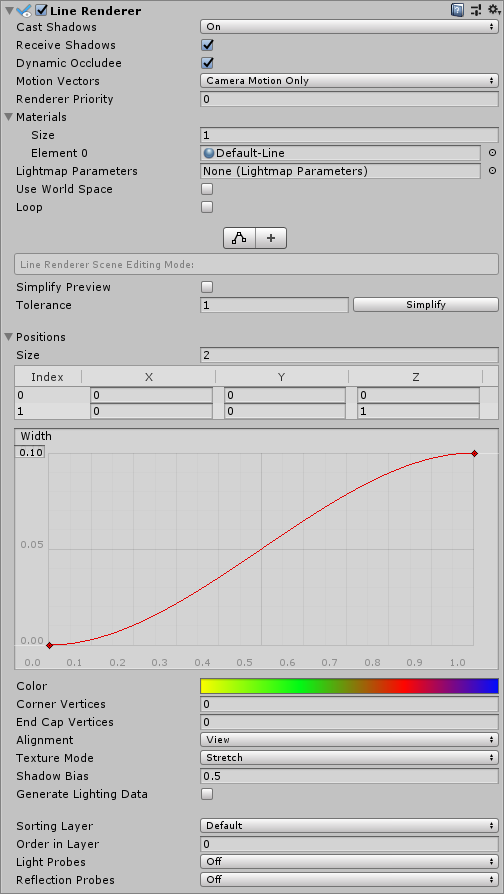
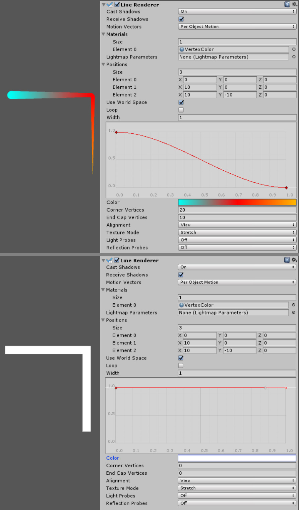

#Line Renderer

The __Line Renderer__ component takes an array of two or more points in 3D space, and draws a straight line between each one. A single Line Renderer component can therefore be used to draw anything from a simple straight line to a complex spiral. The line is always continuous; if you need to draw two or more completely separate lines, you should use multiple GameObjects, each with its own Line Renderer.

The Line Renderer does not render one-pixel-wide lines. It renders billboard lines (polygons that always face the camera) that have a width in world units and can be textured. It uses the same algorithm for line rendering as the [Trail Renderer](class-TrailRenderer).

 

##Properties

|**_Property_** |**_Function_** |
|:---|:---|
|__Cast Shadows__ |Determines whether the line casts shadows, whether they should be cast from one or both sides of the line, or whether the line should only cast shadows and not otherwise be drawn. See [Renderer.shadowCastingMode](ScriptRef:Renderer-shadowCastingMode.html) in the Scripting API reference documentation to learn more. |
|__Receive Shadows__ |If enabled, the line receives shadows. |
|__Motion Vectors__ |Select the Motion Vector type to use for this Line Renderer. See [Renderer.motionVectorGenerationMode](ScriptRef:Renderer-motionVectorGenerationMode.html) in the Scripting API reference documentation to learn more. |
|__Materials__ |These properties describe an array of Materials used for rendering the line. The line will be drawn once for each material in the array. |
|__Light Parameters__ |Reference a [Lightmap Parameters](class-LightmapParameters) Asset here to enable the line to interact with the global illumination system.|
|__Positions__ |These properties describe an array of Vector3 points to connect. |
|__Use World Space__ |If enabled, the points are considered as world space coordinates, instead of being subject to the transform of the GameObject to which this component is attached. |
|__Loop__ |Enable this to connect the first and last positions of the line. This forms a closed loop. |
|__Width__ |Define a width value and a curve to control the width of your line at various points between its start and end. The curve is only sampled at each vertex, so its accuracy is limited by the number of vertices present in your line. The overall width of the line is controlled by the width value. |
|__Color__ |Define a gradient to control the color of the line along its length. |
|__Corner Vertices__ |This property dictates how many extra vertices are used when drawing corners in a line. Increase this value to make the line corners appear rounder. |
|__End Cap Vertices__ |This property dictates how many extra vertices are used to create end caps on the line. Increase this value to make the line caps appear rounder. |
|__Alignment__ |Set to __View__ to make the line face the Camera, or __Local__ to align it based on the orientation of its Transform component. |
|__Texture Mode__ |Control how the Texture is applied to the line. Use __Stretch__ to apply the Texture Map along the entire length of the line, or use __Wrap__ to make the Texture repeat along the length of the line. Use the Tiling parameters in the Material to control the repeat rate. |
|__Shadow Bias__| Move shadows along the direction of the light to remove shadowing artifacts cused by approximating a volume with billboarded geometry. |
|__Generate Lighting Data__| If enabled (the box is checked), the Line geometry is built with Normals and Tangents included. This allows it to use Materials that use the scene lighting, for example via the Standard Shader, or by using a custom shader. |
|__Sorting Layer__| Name of the Renderer’s sorting layer. |
|__Order in Layer__| This Renderer’s order within a sorting layer. |
|__Light Probes__ |Probe-based lighting interpolation mode.|
|__Reflection Probes__ |If enabled and reflection probes are present in the Scene, a reflection Texture is picked for this Line Renderer and set as a built-in Shader uniform variable.|

##Details

To create a Line Renderer:

1. In the Unity menu bar, go to __GameObject__ > __Create Empty__
1. In the Unity menu bar, go to __Component__ > __Effects__ > __Line Renderer__
1. Drag a Texture or Material onto the Line Renderer. It looks best if you use a Particle Shader in the Material.

##Hints

* Line Renderers are useful for effects where you need to lay out all the vertices in one frame.
* The lines might appear to rotate as you move the Camera. This is intentional when __Alignment__ is set to __View__. Set __Alignment__ to __Local__ to disable this.
* The Line Renderer should be the only Renderer on a GameObject.
* Unity samples colors from the Color Gradient at each vertex. Between each vertex, Unity applies linear interpolation to colors. Adding more vertices to your Line Renderer might give a closer approximation of a detailed Color Gradient.

##Line Renderer example setup

 

---------
*  2017-05-31  <!-- include IncludeTextAmendPageYesEdit -->

*  Some properties added in Unity  [2017.1](../Manual/30_search.html?q=newin20171) NewIn20171

*  Shadow Bias property added to Line Renderer in Unity  [2018.3](../Manual/30_search.html?q=newin20183) NewIn20183

