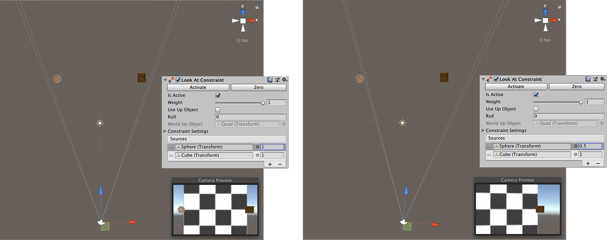

# Look At Constraints

A Look At Constraint rotates a GameObject to face its source GameObjects. You typically apply the Look At Constraint on a [Camera](class-Camera.md) to follow around one or more GameObjects. In addition, if you [import a Target Camera](FBXImporter-Model.md#CameraImportProperties), Unity creates a camera with a Look At Constraint using the target object as the source.

Look At is a simplified version of the [Aim](class-AimConstraint.md) Constraint. Whereas the Aim Constraint allows you to choose which axis will follow the constraining GameObject, the Look At Constraint always follows the z-axis. 

You can specify the upward direction for the Look At Constraint by setting it to another GameObject's y-axis, or you can specify a roll, which is a rotation around the z-axis (your aiming axis).

## Properties

|**Property:** |**Function:** |
|:---|:---|
| __Is Active__ | Enable this option to evaluate the Constraint. To also apply the Constraint, enable the **Lock** property. |
| **Weight** | Set the strength of the Constraint. Valid values range from 0 (the Constraint has no effect) to 1 (this GameObject rotates at the same rate as its source GameObjects move).    This weight value affects all source GameObjects equally, but you can also change the weight on each GameObject individually in the **Sources** list. |
| **Use Up Object** | Enable this option to set this GameObject's up vector to the y-axis of the **World Up Object**. If you disable this option, the up vector is set to the **Roll** value instead. A GameObject's up vector establishes which direction is up. |
| **Roll** | Set the rotation angle in degrees along the z-axis to use for this GameObject's up vector (upward direction).   Only available when **Use Up Object** is disabled. |
| **World Up Object** | Set a reference to the GameObject you want to use as the up vector reference. When set, the y-axis of this up vector GameObject becomes the upward direction for the constrained GameObject.   Only available when **Use Up Object** is enabled. |
| **Constraint Settings** ||
| **Lock** | Enable this option to let the Constraint rotate the GameObject (apply the Constraint). If you disable this option, you can modify the GameObject's rotation, as well as the **Rotation At Rest** and **Rotation Offset** properties. When you are satisfied with your changes, check Lock to let the Constraint control this GameObject.    This property has no effect in Play Mode. |
| **Rotation At Rest** | Set the orientation of the constrained GameObject when resting in X, Y, and Z. A GameObject is resting when the total weights,  including the individual weights of all sources, add up to 0.    To modify this property, disable the **Lock**. |
| **Rotation Offset** | Set an offset from the constrained orientation (the rotation calculated by the Constraint) in X, Y, and Z.    To modify this property, disable the **Lock**. |
| **Sources** | The list of GameObjects that constrain this GameObject. Unity evaluates source GameObjects in the order that they appear in this list.    The order affects how this Constraint rotates the constrained GameObject because of the way that rotations accumulate. To get the result you want, drag and drop items in this list. Different orders lead to different results.    Each entry in the list contains a reference to a GameObject and its weight (that is, influence in the Constraint). Unity calculates the average of the source GameObjects in this list, and you can adjust the influence by changing the weights for each source. For example, if you have two sources (a cube and a sphere) and you want to concentrate the camera more on the sphere, you can set the sphere's weight to 1 (the maximum) and the cube's weight to 0.5. |

---

*  2018-10-23  <!-- include IncludeTextNewPageYesEdit -->

* Look At Constraint added in 2018.2