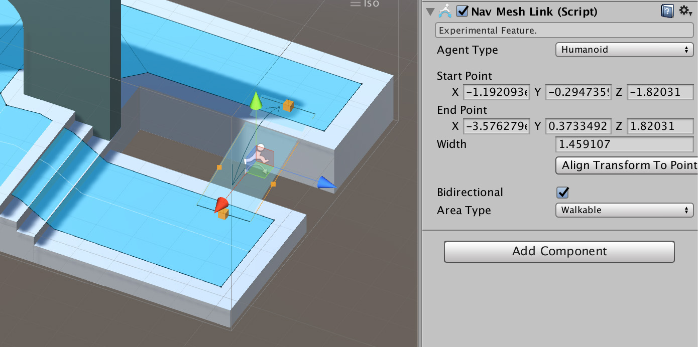
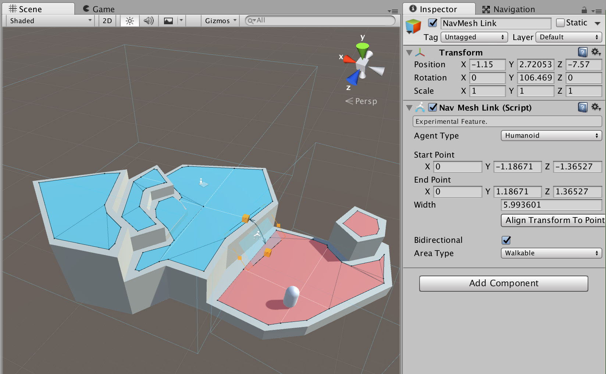

# NavMesh Link

The NavMesh Link component is not in the Unity standard install; see documentation on [high-level NavMesh building components](NavMesh-BuildingComponents) for information on how to access it. 

NavMesh Link creates a navigable link between two locations that use NavMeshes.

This link can be from point to point or it can span a gap, in which case the Agent uses the nearest location along the entry edge to cross the link.

You must use a NavMesh Link to connect different NavMesh Surfaces.

To use the NavMesh Link component, navigate to __GameObject__ > __AI__ > __NavMesh Link__.

| __Property__| __Function__ |
|:---|:---| 
| __Agent Type__| The Agent type that can use the link.  - __Humanoid__  - __Ogre__ |
| __Start Point__| The start point of the link, relative to the GameObject. Defined by XYZ measurements. |
| __End Point__| The end point of the link, relative to the GameObject. Defined by XYZ measurements. |
| __Align Transform To Points__| Clicking this button moves the GameObject at the link’s center point and aligns the transform’s forward axis with the end point. |
| __Bidirectional__| With this tickbox checked, NavMesh Agents traverse the NavMesh Link both ways (from the start point to the end point, and from the end point back to the start point). When this tickbox is unchecked, the NavMesh Link only functions one-way (from the start point to the end point only). |
| __Area Type__| The area type of the NavMesh Link (this affects pathfinding costs).   - __Walkable__ (this is the default option)  - __Not Walkable__   - __Jump__ |

## Connecting multiple NavMesh Surfaces together

If you want an Agent to move between multiple NavMesh Surfaces in a Scene, they must be connected using a NavMesh Link.

In the example Scene above, the blue and red NavMeshes are defined in different NavMesh Surfaces, with a NavMesh link connecting them.

Note that when connecting NavMesh Surfaces:

* You can connect NavMesh Surfaces using multiple NavMesh Links.

* Both the NavMesh Surfaces and the NavMesh Link must have same Agent type.

* The NavMesh Link’s start and end point must only be on one NavMesh Surface - be careful if you have multiple NavMeshes at the same location. 

* If you are loading a second NavMesh Surface and you have unconnected NavMesh Links in the first Scene, check that they do not connect to any unwanted NavMesh Surfaces.

  

---

*  2017-05-26  <!-- include IncludeTextNewPageSomeEdit -->

* New feature in 5.6