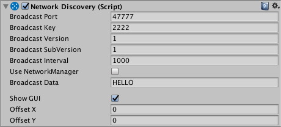

#Network Discovery

Network Discovery is a component that allows Unity applications using the networking system to find each other on a local network (LAN). This does not allow discovery for internet play. Use the Multiplayer Service (along with MatchMaker and Relay service) to connect to . 

The Network Discovery component does not require any integration with Unity services, and is intended as a fully stand-alone solution to finding other games on your local network to connect with.

The Network Discovery component in the Inspector window

|**Property**|**Function**|
|:---|:---|
|__Broadcast Port__|The network port to broadcast on and listen to.|
|__Broadcast Key__|The key to broadcast. This should be a unique value to indicate your discovery’s compatibility to other Network Discovery instances. Unique broadcast keys avoid games of different types from trying to connect to each other if they run on the same local network.|
|__Broadcast Version__|The major version to include in the broadcast. Use this along with Broadcast SubVersion to indicate version compatibility.|
|__Broadcast SubVersion__|The minor version to include in the broadcast. Use this alongside Broadcast Version to indicate version compatibility.|
|__Broadcast Interval__|Specify how often Unity should broadcast discovery information, in seconds.|
|__Use NetworkManager__|Enable this to use the Network Manager settings for broadcasting, and to then auto-join found games.|
|__Broadcast Data__|Enter custom data to include in the broadcast. The Network Manager overrides this if you have enabled Use NetworkManager.|
|__Show GUI__|Enable this to show the default broadcast GUI in Play mode. This GUI is only intended for developer testing.|
|__Offset X__|The x-axis offset of the broadcast GUI. This setting is only visible if Show GUI is enabled.|
|__Offset Y__|The y-axis offset of the broadcast GUI. This setting is only visible if Show GUI is enabled.|

###When running in play mode

When running in play mode, the following information is also visible in the inspector:

|**Property** |**Function** |
|:---|:---|
|__hostId__ |The host Id being used to broadcast. |
|__running__ |True if currently broadcasting. |
|__isServer__ |True if broadcasting as a server. |
|__isClient__ |True if listening for broadcasts as a client. |
|__broadcastsReceived__ |A list of broadcast messages received. |