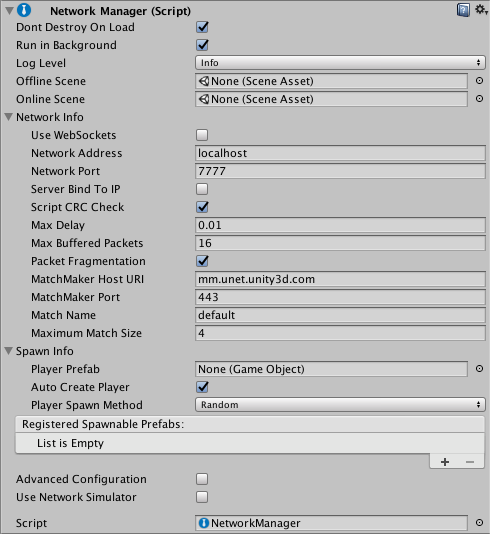

#Network Manager

The Network Manager component allows you to control the state of a networked game. It provides an interface in the Editor for you to configure the network, the Prefabs you use for spawning GameObjects, and the Scenes you use for different game states.

For more details on implementing the Network Manager in your game, see documentation on [Using the Network Manager](UNetManager).

|**Property**|**Function**|
|:---|:---|
|**Dont Destroy On Load**|Use this property to control whether or not Unity should destroy the GameObject with the Network Manager when the Scene changes. Tick this checkbox to ensure Unity does not destroy your Network Manager GameObject when the Scene changes in your game. Untick the checkbox if you want Unity to destroy the GameObject when the Scene it exists in is no longer the active Scene. This is useful if you want to manage multiple, separate Network Manager GameObjects in each of your Scenes. This checkbox is ticked by default.|
|**Run In Background**|Use this property to control whether the networked game runs when the window it is running in is not focused. Tick the checkbox if you want it to run; untick it if you want the game to stop running when the window is not focused. This checkbox is ticked by default. You need to enable this property if you want to run multiple instances of a program on the same machine, such as when testing using localhost. You should disable it when deploying to mobile platforms. When enabled, it sets [Application.runInBackground](ScriptRef:Application-runInBackground.html) to true when the Network Manager starts up. You can also set this property from the Unity menu: **Edit** > **Project Settings**, then select the **Player** category, and navigate to the **Resolution and Presentation** panel.|
|**Log Level**|Use this property to control the amount of information Unity outputs to the console window. A low level results in more information; a high level results in less information. Each level includes message from all the levels higher than itself (for example, if you select "Warn", the console also prints outputs all “Error” and “Fatal” log messages). The drop-down lists the levels from low to high. This property is set to Info by default. You can set Log Level to **Set in Scripting** to prevent the Network Manager from setting the log level at all. This means you can control the level from your own scripts instead.|
|**Offline Scene**|If you assign a Scene to this field, the Network Manager automatically switches to the specified Scene when a network session stops - for example, when the client disconnects, or when the server shuts down.|
|**Online Scene**|If you assign a Scene to this field, the Network Manager automatically switches to the specified Scene when a network session starts - for example, when the client connects to a server, or when the server starts listening for connections.|
<!-- include UNetManagerInspectorCommonProperties -->
