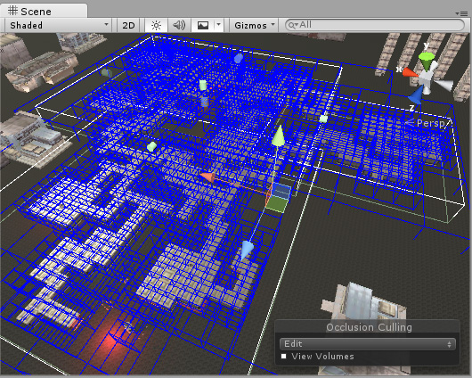

Occlusion Area
==============

To apply occlusion culling to moving objects you have to create an __Occlusion Area__ and then modify its size to fit the space where the moving objects will be located (of course the moving objects cannot be marked as static). You can create Occlusion Areas by adding the __Occlusion Area__ component to an empty game object (__Component -&gt; Rendering -&gt; Occlusion Area__ in the menus).

After creating the __Occlusion Area__, check the _Is View Volume_ checkbox to occlude moving objects. 

 

|**_Property:_** |**_Function:_** |
|:---|:---|
|__Size__ |Defines the size of the Occlusion Area.|
|__Center__ |Sets the center of the Occlusion Area. By default this is 0,0,0 and is located in the center of the box.|
|__Is View Volume__ |Defines where the camera can be. Check this in order to occlude static objects that are inside this _Occlusion Area_.|

 

After you have added the Occlusion Area, you need to see how it divides the box into cells. To see how the occlusion area will be calculated, select __Edit__ and toggle the __View__ button 
in the __Occlusion Culling Preview Panel__. 

 

Testing the generated occlusion
-------------------------------

After your occlusion is set up, you can test it by enabling the _Occlusion Culling_ (in the __Occlusion Culling Preview Panel__ in Visualize mode) and moving the __Main Camera__ around in the scene view.

 

As you move the Main Camera around (whether or not you are in Play mode), you'll see various objects disable themselves. The thing you are looking for here is any error in the occlusion data. You'll recognize an error if you see objects suddenly popping into view as you move around. If this happens, your options for fixing the error are either to change the resolution (if you are playing with target volumes) or to move objects around to cover up the error. To debug problems with occlusion, you can move the Main Camera to the problematic position for spot-checking.

When the processing is done, you should see some colorful cubes in the View Area. The blue cubes represent the cell divisions for __Target Volumes__. The white cubes represent cell divisions for __View Volumes__. If the parameters were set correctly you should see some objects not being rendered. This will be because they are either outside of the view frustum of the camera or else occluded from view by other objects.

After occlusion is completed, if you don't see anything being occluded in your scene then try breaking your objects into smaller pieces so they can be completely contained inside the cells.
