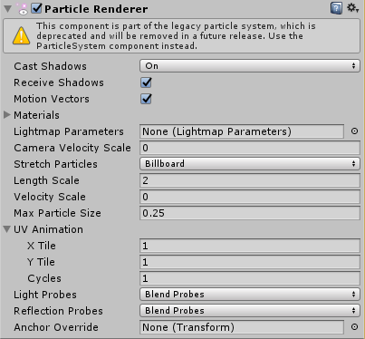
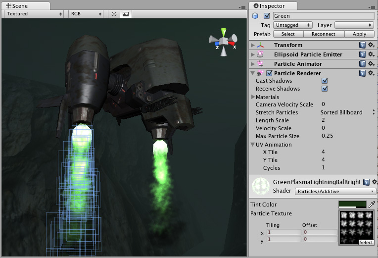

Particle Renderer (Legacy)
==========================

The __Particle Renderer__ renders the __Particle System__ on screen.

 

Properties
----------

|**_Property:_** |**_Function:_** |
|:---|:---|
|__Cast Shadows__ |If enabled, this allows the Mesh to cast shadows.|
|__Receive Shadows__ |If enabled, this allows the Mesh to receive shadows.|
|__Motion Vectors__ |If enabled, the line has motion vectors rendered into the Camera motion vector Texture. See [Renderer.motionVectors](ScriptRef:Renderer-motionVectors.html) in the Scripting API reference documentation to learn more. |
|__Materials__ |Reference to a list of __Materials__ that are displayed in the position of each individual particle. |
|__Light Probes__ |Probe-based lighting interpolation mode.|
|__Reflection Probes__ |If enabled and reflection probes are present in the Scene, a reflection Texture is picked for this Particle Renderer and set as a built-in Shader uniform variable.|
|__Probe Anchor__ |If defined (using a GameObject), the Renderer uses this GameObject's position to find the interpolated Light Probe.|
|__Camera Velocity Scale__ |The amount of stretching that is applied to the Particles based on [Camera](class-Camera) movement. |
|__Stretch Particles__ |Determines how the particles are rendered: |
|&#160;&#160;&#160;&#160;&#160;&#160;&#160;&#160;__Billboard__ |The particles are rendered as if facing the Camera. |
|&#160;&#160;&#160;&#160;&#160;&#160;&#160;&#160;__Stretched__ |The particles are facing the direction they are moving. |
|&#160;&#160;&#160;&#160;&#160;&#160;&#160;&#160;__SortedBillboard__ |The particles are sorted by depth. Use this when using a blending Material. |
|&#160;&#160;&#160;&#160;&#160;&#160;&#160;&#160;__VerticalBillboard__ |All particles are aligned flat along the X/Z axes. |
|&#160;&#160;&#160;&#160;&#160;&#160;&#160;&#160;__HorizontalBillboard__ |All particles are aligned flat along the X/Y axes. |
|__Length Scale__ |If __Stretch Particles__ is set to __Stretched__, this value determines how long the particles are in their direction of motion. |
|__Velocity Scale__ |If __Stretch Particles__ is set to __Stretched__, this value determines the rate at which particles are stretched, based on their movement speed. |
|__UV Animation__ |If X, Y or both are defined, the UV coordinates of the particles are generated for use with a tile animated texture. See [Animated Textures](#animatedtextures), below. |
|&#160;&#160;&#160;&#160;&#160;&#160;&#160;&#160;__X Tile__ |Number of frames located across the X axis. |
|&#160;&#160;&#160;&#160;&#160;&#160;&#160;&#160;__Y Tile__ |Number of frames located across the Y axis. |
|&#160;&#160;&#160;&#160;&#160;&#160;&#160;&#160;__Cycles__ |How many times to loop the animation sequence. |

Details
-------

Particle Renderers are required for any Particle System to be displayed on the screen.

 

###Choosing a Material

When setting up a Particle Renderer, it is very important to use an appropriate [Material](class-Material) and Shader that renders both sides of the Material. Unity recommends using Particle Shaders with the Particle Renderer.; most of the time you can simply use a Material with one of the built-in Particle Shaders. There are some premade Materials in the __Standard Assets__ &gt; __Particles__ &gt; __Sources__ folder that you can use.

Creating a new Material is easy:

1. In the Unity menu bar, go to __Assets__ &gt; __Create__ &gt; __Material__.
1. In the Inspector window, navigate to __New Material__ and click the __Shader__ dropdown. Choose one of the Shaders in the __Particles__ group (for example: __Particles__ &gt; __Multiply__).
1. To assign a Texture, navigate to the grey box in the Inspector window containing the text __None (Texture)__ and click the __Select__ button to launch a pop-up menu containing the Textures available. 

Note that different Shaders use the alpha channel of the Textures slightly differently, but most of the time a value of black in the alpha channel makes it invisible, and a value of white displays it on screen.

###Distorting particles

By default, particles are rendered billboarded (that is, as simple square sprites). This is useful for smoke, explosions, and most other particle effects. See [Billboard Renderer](class-BillboardRenderer) for more information.

Particles can be made to stretch with the velocity. __Length Scale__ and __Velocity Scale__ affects how long the stretched particle is. This is useful for effects like sparks, lightning or laser beams.

__Sorted Billboard__ can be used to make all particles sort by depth. Sometimes this is necessary, mostly when using __Alpha Blended__ particle shaders. This can be resource-demanding and affect performance; it should only be used if it makes a significant quality difference when rendering.

###Animated textures

Particle Systems can be rendered with an animated tile Texture. To use this feature, make the Texture out of a grid of images. As the particles go through their life cycle, they cycle through the images. This is good for adding more life to your particles, or making small rotating debris pieces.