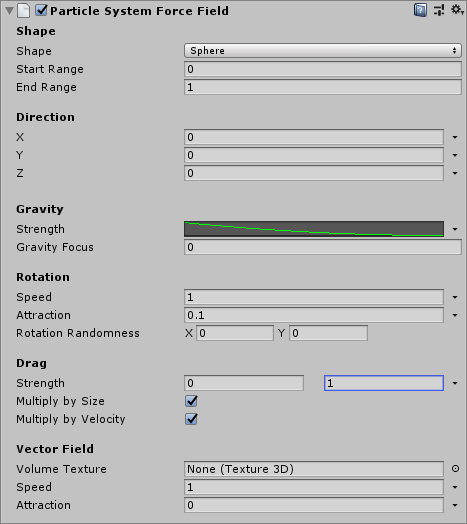

#Particle System Force Field

A __Particle System Force Field__ component can apply forces to particles belonging to [Particle Systems](class-ParticleSystem). To attach this component to a Particle System, enable the [External Forces Module](PartSysExtForceModule) in the Particle System, and assign either a Layer Mask, or the specific Force Field component. 

For a full introduction to particle systems and their uses, see documentation on [Particle Systems](ParticleSystems).

##Properties

Use the Particle System Force Field component to apply various types of forces to particles.

|**_Property_** |**_Function_** |
|:---|:---|
|__Shape__ ||
|__Shape__ |The shape of the area of influence. |
|__Start Range__ |The inner point within the shape, where the area of influence begins. |
|__End Range__ |The outer point of the shape, where the area of influence ends. |
|__Direction X, Y and Z__ |A linear force to apply to particles along the x-axis, y-axis and z-axis respectively. The higher the value, the greater the force. You can specify a constant force or vary the force over time. See [Varying properties over time](PartSysUsage.html#VaryOverTime).|
|__Gravity__ ||
|__Strength__ |The amount of attraction that particles have towards the focal point within the shape. The higher the value, the greater the strength. You can specify a constant strength or vary the strength over time. See [Varying properties over time](PartSysUsage.html#VaryOverTime). |
|__Gravity Focus__ |The focal point for gravity to pull particles towards. A value of 0 attracts particles to the center of the shape, and a value of 1 attracts particles to the outer edge of the shape. |
|__Rotation__ ||
|__Speed__ |The speed at which the Particle System propels particles around the vortex, which is the center of the force field. The higher the value, the faster the speed. You can specify a constant speed or vary the speed over time. See [Varying properties over time](PartSysUsage.html#VaryOverTime). |
|__Attraction__ |The strength at which particles are dragged into the vortex motion. A value of 1 applies the maximum attraction, and a value of 0 applies no attraction. You can specify a constant attraction or vary the attraction over time. See [Varying properties over time](PartSysUsage.html#VaryOverTime).|
|__Rotation Randomness__ |A random axes of the shape to propel particles around. A value of 1 applies maximum randomness, and a value of 0 applies no randomness. |
|__Drag__ ||
|__Strength__ |The strength of the drag effect, which slows particles down. The higher the value, the greater the strength. You can specify a constant strength or vary the strength over time. See [Varying properties over time](PartSysUsage.html#VaryOverTime).|
|__Multiply Drag by Size__ |Adjust the drag based on the size of the particles. |
|__Multiply Drag by Velocity__ |Adjust the drag based on the velocity of the particles. |
|__Vector Field__ ||
|__Volume Texture__ |The texture of the vector field. |
|__Speed__ |The speed multiplier to apply to particles traveling through the vector field. The higher the value, the faster the speed. You can specify a constant strength or vary the strength over time. See [Varying properties over time](PartSysUsage.html#VaryOverTime).|
|__Attraction__ |The strength at which Unity drags particles into the vector field motion. The higher the value, the greater the attraction. You can specify a constant attraction or vary the attraction over time. See [Varying properties over time](PartSysUsage.html#VaryOverTime). |

---------
* 2018-10-19 <!-- include IncludeTextAmendPageYesEdit -->

* Particle System Force Field added in [2018.3](../Manual/30_search.html?q=newin20183) NewIn20183
