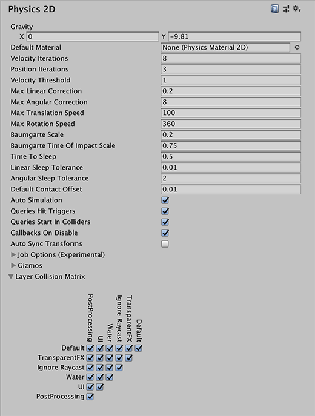
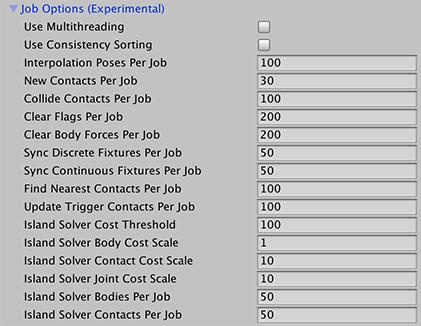
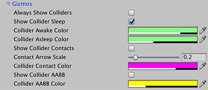

#Physics 2D

Use the __Physics 2D__ settings to apply global settings for 2D physics.  

**Note:** To manage global settings for 3D physics, use the [Physics 3D](class-PhysicsManager) settings instead.

 

The Physics 2D settings define limits on the accuracy of the physical simulation. Generally speaking, a more accurate simulation requires more processing overhead, so these settings offer a way to trade off accuracy against performance. See the [Physics](PhysicsSection) section of the manual for further information.

|**Property** |**Function** |
|:---|:---|
|__Gravity__ |Set the amount of gravity applied to all [Rigidbody 2D](class-Rigidbody2D) GameObjects. Generally, you only set gravity for the negative direction of the y-axis. |
|__Default Material__ |Set a reference to the [Physics Material 2D](class-PhysicsMaterial2D) to use if none has been assigned to an individual Collider 2D. |
|__Velocity Iterations__ |Set the number of iterations made by the physics engine to resolve velocity effects. Higher numbers result in more accurate physics but at the cost of CPU time. |
|__Position Iterations__ |Set the number of iterations made by the physics engine to resolve position changes. Higher numbers result in more accurate physics but at the cost of CPU time. |
|__Velocity Threshold__ |Set the threshold for elastic collisions. Unity treats collisions with a relative velocity lower than this value as inelastic collisions (that is, the colliding GameObjects do not bounce off each other). |
|__Max Linear Correction__ |Set the maximum linear position correction used when solving constraints (from a range between 0.0001 to 1000000). This helps to prevent overshooting. |
|__Max Angular Correction__ |Set the maximum angular correction used when solving constraints (from a range between 0.0001 to 1000000). This helps to prevent overshooting. |
|__Max Translation Speed__ |Set the maximum linear speed of a Rigidbody 2D GameObject during any physics update. |
|__Max Rotation Speed__ |Set the maximum rotation speed of a Rigidbody 2D GameObject during any physics update. |
|__Baumgarte Scale__ |Set the scale factor that determines how fast Unity resolves collision overlaps. |
|__Baumgarte Time of Impact Scale__ |Set the scale factor that determines how fast Unity resolves time-of-impact overlaps.  |
|__Time to Sleep__ |The time (in seconds) that must pass after a Rigidbody 2D stops moving before it goes to sleep. |
|__Linear Sleep Tolerance__ |Set the linear speed below which a Rigidbody 2D goes to sleep after the __Time to Sleep__ elapses. |
|__Angular Sleep Tolerance__ |Set the rotational speed below which a Rigidbody 2D goes to sleep after __Time to Sleep__ elapses. |
|__Default Contact Offset__|Set a proximity distance value for colliders to be considered *in contact*, even they are not actually in contact. Colliders whose distance is less than the sum of their contactOffset values generate contacts. This allows the collision detection system to predictively enforce the contact constraint even when the objects are slightly separated. **Caution:** Reducing this value too far could cripple Unity's ability to calculate continuous polygon collisions. Conversely, increasing the value too much could create artifacts for vertex collision.|
|__Auto Simulation__|Enable this option to automatically run the physics simulation or allow explicit control of it.|
|__Queries Hit Triggers__ |Enable this option if you want Collider 2Ds marked as __Triggers__ to return a hit when any physics query (such as Linecasts or Raycasts) intersects with them. Defaults to enabled. |
|__Queries Start In Colliders__ | Enable this option if you want physics queries that start inside a Collider 2D to detect the collider they start in. |
|__Callbacks On Disable__ |Enable this option to produce collision callbacks when a collider with contacts is disabled. |
|__Auto Sync Transforms__|Enable this option to automatically sync transform changes with the physics system. |
|__Job Options (Experimental)__|See the [Job Options](#jobs) section below.|
|__Gizmos__|See the [Gizmos](#gizmos) section below.|
|__Layer Collision Matrix__ |Define how the [layer-based collision](LayerBasedCollision) detection system behaves. Select which layers on the Collision Matrix interact with the other layers by checking them.|

## Job Options

The settings in the __Job Options__ section allow you to use the [C# Job System](JobSystem) to configure multi-threaded physics.

|**Property:** |**Function:** |
|:---|:---|
|__Use Multithreading__| Enable this option to execute the simulation steps using the job system and use the rest of these options to control how to achieve that. |
|__Use Consistency Sorting__| Enable this option if maintaining a consistent processing order becomes important to the simulation.  Executing simulation steps on multiple CPU threads produces separate batches of data. Processing these separate batches reduces determinism in processing order, although produces faster results. |
|__Interpolation Poses Per Job__| Set the minimum number of [Rigidbody 2D](class-Rigidbody2D) objects being interpolated in each simulation job. |
|__New Contacts Per Job__| Set the minimum number of new contacts to find in each simulation job. |
|__Collide Contacts Per Job__| Set the minimum number of contacts to collide in each simulation job. |
|__Clear Flags Per Job__| Set the minimum number of flags to be cleared in each simulation job. |
|__Clear Body Forces Per Job__| Set the minimum number of bodies to be cleared in each simulation job. |
|__Sync Discrete Fixtures Per Job__| Set the minimum number of fixtures to synchronize in the broadphase during discrete island solving in each simulation job. |
|__Sync Continuous Fixtures Per Job__| Set the minimum number of fixtures to synchronize in the broadphase during continuous island solving in each simulation job. |
|__Find Nearest Contacts Per Job__| Set the minimum number of nearest contacts to find in each simulation job. |
|__Update Trigger Contacts Per Job__| Set the minimum number of trigger contacts to update in each simulation job. |
|__Island Solver Cost Threshold__| Set the minimum threshold cost of all bodies, contacts and joints in an island during discrete island solving. |
|__Island Solver Body Cost Scale__| Set the cost scale of each body during discrete island solving. |
|__Island Solver Contact Cost Scale__| Set the cost scale of each contact during discrete island solving. |
|__Island Solver Joint Cost Scale__| Set the cost scale of each joint during discrete island solving. |
|__Island Solver Bodies Per Job__| Set the minimum number of bodies to solve in each simulation job when performing island solving. |
|__Island Solver Contacts Per Job__| Set the minimum number of contacts to solve in each simulation job when performing island solving. |

## Gizmos

|**Property:** |**Function:** |
|:---|:---|
|__Always Show Colliders__| Enable this option to show collider gizmos even when they are not selected. |
|__Show Collider Sleep__|Enable this option to show the sleep-state for each collider.|
|__Collider Awake Color__|Set the color to indicate that the collider (body) is awake. |
|__Collider Asleep Color__|Set the color to indicate that the collider (body) is asleep. |
|__Show Collider Contacts__|Enable this option to show current contacts for each gizmo. |
|__Contact Arrow Scale__|Set the size of the contact arrow that appears on collider gizmos. |
|__Collider Contact Color__|Set the gizmo color to indicate the collider contact. |
|__Show Collider AABB__|Enable this option to show the collider's bounding box. |
|__Collider AABB Color__|Set the gizmo color for the collider's bounding box. |

 

------

* 2018-10-02 <!-- include IncludeTextAmendPageYesEdit -->

* Updated for Unified Settings