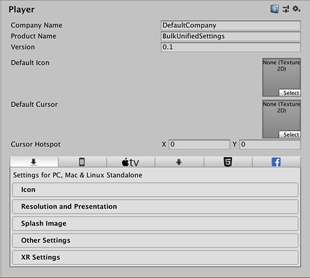

#Player

Use the __Player__ settings to set various options for the final game built by Unity. 

There are a few general settings that are the same regardless of the build target. These are [covered below](#general).

Most settings, however, are platform-specific and divided into the following sections:

* **Icon**: the game icon(s) as shown on the desktop.
* **Resolution and Presentation**: settings for screen resolution and other presentation details such as whether the game should default to fullscreen mode.
* **Splash Image**: the image shown while the game is launching. This section also includes common settings for creating a Splash Screen, which are documented in the [Splash Screen](class-PlayerSettingsSplashScreen) section.
* **Other Settings**: any remaining settings specific to the platform.
* **Publishing Settings**: details of how the built application is prepared for delivery from the app store or host webpage.
* **XR Settings**: settings specific to [Virtual Reality, Augmented Reality, and Mixed Reality](XR) applications. 

You can find information about the settings specific to individual platforms in the [platform's own manual section](PlatformSpecific). Not all sections are supported on every platform. This table provides a breakdown of which platform support these sections:

|               | Icon | Resolution and Presentation | Splash Image | Debugging and Crash Reporting | Other Settings | Publishing Settings | XR Settings |
| --------------------------- | :--------: | :---: | :-------------: | :---: | :--: | :-----: | :-----: |
| [Standalone](class-PlayerSettingsStandalone) | √ | √ | √ |  | √ |      | √ |
| [iOS](class-PlayerSettingsiOS) | √ | √ | √ | √ | √ |      | √ |
| [Apple TV / tvOS](class-PlayerSettingstvOS) | √ | √ | √ | √ | √ |      |         |
| [Android](class-PlayerSettingsAndroid) | √ | √ | √ |       | √ | √ | √ |
| [WebGL](class-PlayerSettingsWebGL) | -- | √ | (√) |       | √ | √ |         |
| [Facebook](class-PlayerSettingsFacebook) | √ | -- | (√) | | √ | √ | |
| [Universal Windows / WSA](class-PlayerSettingsWSA) | √ | √ | √ | | √ | √ | √ |

##General settings

|**Property** |**Function** |
|:---|:---|
|__Company Name__ |Enter the name of your company. This is used to locate the preferences file. |
|__Product Name__ |Enter the name that appears on the menu bar when your game is running. Unity also uses this to locate the preferences file. |
|__Version__|Enter the version number of your application. |
|__Default Icon__ |Pick the the Texture 2D file that you want to use as a default icon for the application on every platform. You can override this for specific platforms. |
|__Default Cursor__ |Pick the the Texture 2D file that you want to use as a default cursor for the application on every supported platform.|
|__Cursor Hotspot__ |Set the offset value (in pixels) from the top left of the default cursor to the location of the cursor hotspot. |

