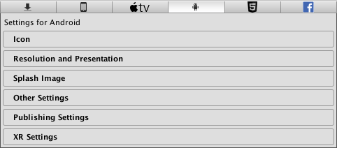
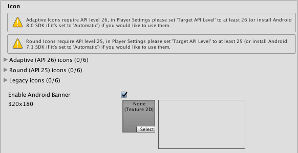
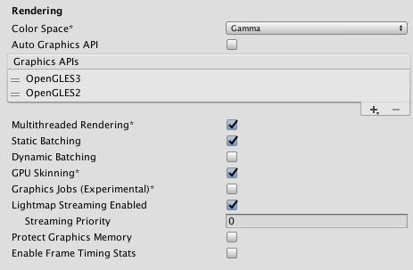
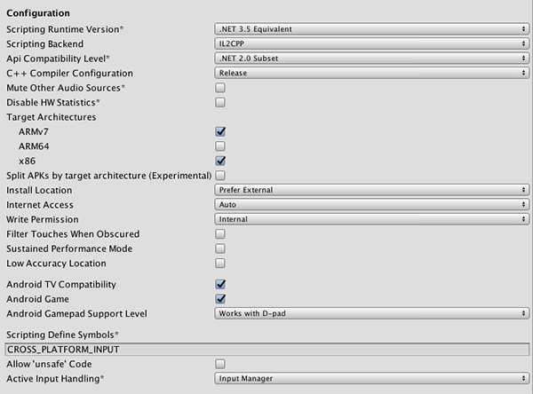
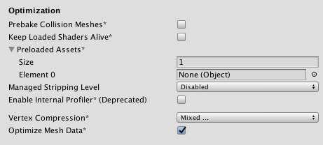
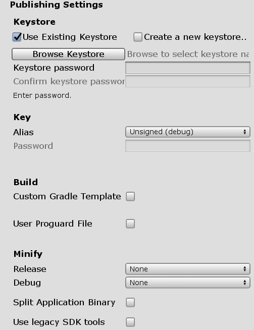

#Player settings for the Android platform

This page details the __Player__ settings specific to the Android platform. For a  description of the general __Player__ settings, see the [Player](class-PlayerSettings#general) settings.

You can find documentation for the properties in the following sections:

* [Icon](#Icon)
* [Resolution and Presentation](#Resolution)
* [Splash Image](#Splash)
* [Other Settings](#Other)
* [Publishing Settings](#Publishing)
* [XR Settings](#XR)

##Icon

 

|**Property** |**Function** |
|:---|:---|
|__Adaptive__ |Set up textures for the Android Adaptive icons in your app.|
|__Round__ |Set up textures for the Android Round icons in your app.|
|__Legacy__ |Set up textures for the Android Legacy icons in your app.|
|__Enable Android Banner__ |Enables a custom banner for Android TV builds. |

## Resolution and Presentation

Use the __Resolution and Presentation__ section to customize aspects of the screen's appearance.

 

|**Setting** |**Function** |
|:---|:---|
|__Start in fullscreen mode__|Hide the navigation bar while the splash screen or first scene loads. When not set, the navigation bar appears while the splash screen or first scene loads.|
|__Preserve framebuffer alpha__|Enable this option if you want Unity to render on top of native the Android UI. The camera's Clear Flags have to be set to Solid color with an alpha less than 1 for this to have any effect. (OpenGL ES only).|

Other Resolution and Presentation properties are grouped under these sections:

* [Resolution Scaling](#Scaling)
* [Supported Aspect Ratio](#Aspect)
* [Orientation](#Orientation)
* [Allowed Orientations for Auto Rotation](#supportedOris)
* [Other](#OtherRes)

### Resolution Scaling

|**Setting** ||**Function** |
|:---|:---|:---|
|__Resolution Scaling Mode__||Allows you to set the scaling to be equal to or below the native screen resolution.|
||_FixedDPI_ |Allows you to scale the device’s screen resolution below its native resolution and show the __Target DPI__ property. Use this to optimize performance and battery life or target a specific DPI setting. |
||_Disabled_|Ensures that scaling is not applied and the game renders to its native screen resolution. |
| __Target DPI__||Set the resolution of the game screen. Unity downscales the game screen to match this setting if the device's native screen DPI is higher than this value. The scale is calculated as `min(Target DPI * Factor / Screen DPI, 1)`. The __Factor__ is controlled by the __Resolution Scaling Fixed DPI Factor__ on the [Quality](class-QualitySettings) window. **Note:** This option only appears when the __Resolution Scaling Mode__ is set to __Fixed DPI__.|
|__Blit Type__||Controls whether a blit is used to render the final image to the screen.|
||_Always_ | (Always blit) Make Unity render to an offscreen buffer and then copy to the system framebuffer. This is compatible with most devices, but is usually slower than __Never__ blitting. |
||_Never_ | (Never blit) Make Unity render to the framebuffer provided by the OS. If a condition arises during application run time that causes this to fail, the application will print a one-time warning to the device log. __Never__ blitting is usually faster than __Always__ blitting, but it's not compatible with all devices. |
||_Auto_ | Make Unity render to the framebuffer provided by the OS, if possible. If a condition is met that prevents your application from rendering to the system framebuffer, the application switches to offscreen rendering and issues a warning to the device console. |

### Supported Aspect Ratio

Set the __Aspect Ratio Mode__  for the device. You can choose from _Legacy Wide Screen (1.86)_, _Native Aspect Ratio_, and _Custom_. When you choose _Custom_, the __Up To__ field appears. 

Set a custom maximum screen width with the __Up To__ property. This property is only available when __Aspect Ratio Mode__ is set to _Custom_.

### Orientation

Choose the game's screen orientation from the __Default Orientation__ drop-down menu: 

|**Setting** |**Function** |
|:---|:---|
|__Portrait__|Home button appears at the bottom. |
|__Portrait Upside Down__|Home button appears at the top. |
|__Landscape Left__|Home button appears on the right side. |
|__Landscape Right__|Home button appears on the left side. |
|__Auto Rotation__|Allow the screen to automatically rotate to any of the orientations specified by the **Allowed Orientations for Auto Rotation** settings. This is the default.|

**Note:** This setting is shared between iOS and Android devices.

When you set the orientation to __Auto Rotation__, the __Allowed Orientations for Auto Rotation__ section appears.

### Allowed Orientations for Auto Rotation

This section is only visible when __Default Orientation__ is set to __Auto Rotation__. 

Because __Auto Rotation__ changes screen orientation to match the device, you may want to limit the screen orientations allowed (for example, locking a device to landscape). 

Enable each orientation you want to allow by checking its box in this section:

|**Setting** |**Function** |
|:---|:---|
|__Portrait__ |Allow portrait orientation. |
|__Portrait Upside Down__|Allow portrait upside-down orientation. |
|__Landscape Right__|Allow landscape right orientation (home button on the **left** side).|
|__Landscape Left__|Allow landscape left orientation (home button is on the **right** side). |

### Other

|**Setting** |**Function** |
|:---|:---|
|__Use 32-bit Display Buffer__ |Enable this option to create a Display Buffer to hold 32-bit color values (16-bit by default). Use it if you see banding, or need alpha in your [post-processed effects](PostProcessingOverview), because they create [Render Textures](class-RenderTexture) in the same format as the Display Buffer.|
|__Disable Depth and Stencil__ |Enable this option to disable the depth and stencil buffers.|
|__Show Loading Indicator__ |Select how the loading indicator should appear. The options are _Don't Show_, _Large_, _Inversed Large_, _Small_ and _Inversed Small_. |

##Splash Image

Above the [common Splash Screen settings](class-PlayerSettingsSplashScreen), you can use the __Virtual Reality Splash Image__ setting to specify a custom splash image for [Virtual Reality](XR) displays.

Below the common Splash Screen settings, you can set up an Android-specific __Static Splash Image__. 

Use the __Android Splash Screen__ property to specify the texture that should be used for the Android splash screen. The standard size for the splash screen image is 320x480.

Choose how you want Unity to scale the splash image to fit the device's screen from the __Splash Scaling__ drop-down menu. The options are: 

* __Center (only scale down)__
* __Scale to Fit (letter-boxed)__
* __Scale to Fill (cropped)__

##Other Settings

This section allows you to customize a range of options organized into the following groups:

* [Rendering](#Rendering)
* [Vulkan Settings](#Vulkan)
* [Identification](#Identification)
* [Configuration](#Configuration)
* [Optimization](#Optimization)
* [Logging](#Logging) 
* [Legacy](#Legacy)

###Rendering

Use these settings to customize how Unity renders your game for the Android platform.

 

|**Property** |**Function** |
|:---|:---|
|__Color Space__ |Choose which color space should be used for rendering: __Gamma__ or __Linear__.  See the [Linear rendering overview](LinearLighting) for an explanation of the difference between the two. |
|__Auto Graphics API__ | Disable this option to manually pick and reorder the graphics APIs from the Open Graphics Library ([OpenGL](https://developer.android.com/guide/topics/graphics/opengl.html)). By default this option is enabled, and Unity tries GLES3.2. If the device does not support GLES3.2, Unity falls back to GLES3.1, GLES3 or GLES2. If only GLES3 is in the list, additional checkboxes appear: __Require ES3.1__, __Require ES3.1+AEP__ and __Require ES3.2__. These allow you to force the corresponding graphics API.   **Important**: Unity adds the GLES3/GLES3.1/AEP/3.2 requirement to your Android manifest only if GLES2 is not in the list, *and* the [Minimum API Level](#minAPIlevel) is set to JellyBean (API level 18) or higher. In this case only, your application won’t show up on unsupported devices in Google Play Store. |
|__Multithreaded Rendering__ | Enable this option to move graphics API calls from Unity’s main thread to a separate worker thread. This can help to improve performance in applications that have high CPU usage on the main thread. |
|__Static Batching__ |Enable this option to use [Static batching](DrawCallBatching) on your build (enabled by default).|
|__Dynamic Batching__ |Enable this option to use [Dynamic Batching](DrawCallBatching) on your build (enabled by default).|
|__GPU Skinning__ |Enable this option to use OpenGL ES 3 GPU skinning. To learn more about GPU skinning, see the [Wikipedia page on skeletal animation](https://en.wikipedia.org/wiki/Skeletal_animation).  **Note:** This property only supports VR apps, and only works if the [Virtual Reality Supported](#VRsupport) checkbox is ticked.|
|__Graphics Jobs  (Experimental)__|Enable this option to instruct Unity to offload graphics tasks (render loops) to worker threads running on other CPU cores. This reduces the time spent in [Camera.Render](ScriptRef:Camera.Render.html) on the main thread, which is often a bottleneck.  **Note:** This feature is experimental. It may not deliver a performance improvement for your project, and may introduce instability. Unity currently only supports Graphics Jobs when using [Vulkan](https://www.khronos.org/vulkan/) and this setting has no effect when using [OpenGL](https://developer.android.com/guide/topics/graphics/opengl.html) ES.|
|__Lightmap Streaming Enabled__|Enable this option to load only the lightmap mipmaps when needed. To render the current game Cameras, Unity applies this value to the lightmap textures when it generates the textures. **Note:** To use this value, enable the [Texture Streaming Quality setting](class-QualitySettings#texStream).|
|__Streaming Priority__|Define the lightmap mip map streaming priority when there’s contention for resources. The valid range is -127 to 128, where a positive number represent higher priority. This setting is only available when Lightmap Streaming Enabled is checked. To use this value, enable the [Texture Streaming Quality setting](class-QualitySettings#texStream).|
|__Protect Graphics Memory__ |Check this box to force the graphics buffer to be displayed only through a hardware-protected path. Works only on devices which support it.|
|__Enable Frame Timing Stats__ |Gather statistics on how much time a frame takes on the CPU and GPU.|

###Vulkan Settings

Enable the __SRGB Write Mode__ option to allow Graphics.SetSRGBWrite() on Vulkan renderer to toggle the sRGB write mode during the frame.

**Note:** Enabling this feature may reduce performance, especially for tiled GPUs.

###Identification

|**Property** |**Function** |
|:---|:---|
|__Package Name__ |Set the application ID, which uniquely identifies your app on the device and in Google Play Store. The basic structure of the identifier is __com.CompanyName.AppName__, and can be chosen arbitrarily. This setting is shared between iOS and Android.|
|__Version__ |Enter the build version number of the bundle, which identifies an iteration (released or unreleased) of the bundle. The version is specified in the common format of a string containing numbers separated by dots (eg, 4.3.2). (Shared between iOS and Android.)|
|__Bundle Version Code__ |An internal version number. This number is used only to determine whether one version is more recent than another, with higher numbers indicating more recent versions. This is not the version number shown to users; that number is set by the `versionName` attribute. The value must be set as an integer, such as “100”. You can define it however you want, as long as each successive version has a higher number.   For example, it could be a build number. Or you could translate a version number in “x.y” format to an integer by encoding the “x” and “y” separately in the lower and upper 16 bits. Or you could simply increase the number by one each time a new version is released.   Keep this number under 100000 if __Split APKs by target architecture__ is enabled. Each APK must have a unique version code so Unity adds 100000 to the number for ARMv7, 200000 for ARM64 and 300000 for x86.|
|__Minimum API Level__|Minimum Android version (API level) required to run the application.|
|__Target API Level__|Target Android version (API level) against which to compile the application.|

###Configuration

|**Setting** ||**Function** |
|:---|:---|:---|
|__Scripting Runtime Version__ ||Choose which .NET runtime to use in your project. For more details, see Microsoft's [.NET documentation](https://docs.microsoft.com/en-us/dotnet/).|
||_.NET 3.5 Equivalent (Deprecated)_|A .NET runtime which implements the .NET 3.5 API. This functionality is deprecated, and should no longer be used. Please use .NET 4.|
||_.NET 4.x Equivalent_|A .NET runtime which implements the .NET 4 API. This API is newer than .NET 3.5, and as such, it offers access to more APIs, is compatible with more external libraries, and supports C# 6. This is the default scripting runtime.|
|__Scripting Backend__ ||Choose the scripting backend you want to use. The scripting backend determines how Unity compiles and executes C# code in your Project. |
||_Mono_|Compiles C# code into .NET Common Intermediate Language (CIL) and executes that CIL using a Common Language Runtime. See the [Mono Project](https://www.mono-project.com/) website for more information. |
||_IL2CPP_|Compiles C# code into CIL, converts the CIL to C++ and then compiles that C++ into native machine code, which executes directly at run time. See [IL2CPP](IL2CPP) for more information. |
|__API Compatibility Level__ ||Choose which .NET APIs can be used in your project. This setting can affect compatibility with 3rd-party libraries. **Tip:** If you are having problems with a third-party assembly, you can try the suggestion in the [API Compatibility Level](#apiComp) section below.|
||_.Net 2.0_|.Net 2.0 libraries. Maximum .net compatibility, biggest file sizes. Part of the deprecated .NET 3.5 runtime.|
||_.Net 2.0 Subset_|Subset of full .net compatibility, smaller file sizes. Part of the deprecated .NET 3.5 runtime.|
||_.Net Standard 2.0_|Compatible with [.NET Standard 2.0](https://docs.microsoft.com/en-us/dotnet/standard/net-standard). Produces smaller builds and has full cross-platform support.|
||_.Net 4.x_|Compatible with the .NET Framework 4 (which includes everything in the .NET Standard 2.0 profile as well as additional APIs). Choose this option when usng libraries that access APIs not included in .NET Standard 2.0. Produces larger builds and any additional APIs available are not necessarily supported on all platforms. See [Referencing additional class library assemblies](dotnetProfileAssemblies) for more information. |
|__C++ Compiler Configuration__ ||Choose the C++ compiler configuration used when compiling IL2CPP generated code. **Note:** This property is disabled unless __Scripting Backend__ is set to _IL2CPP_.|
|__Mute Other Audio Sources__ ||Enable this option if you want your Unity application to stop Audio from applications running in the background. Otherwise, Audio from background applications continues to play alongside your Unity application.|
|__Disable HW Statistics__ ||Enable this option to instruct the application not to send information about the hardware to Unity. By default, Unity Android applications send anonymous HW statistics to Unity. This provides you with aggregated information to help you make decisions as a developer.|
|__Target Architectures__ ||Select which CPUs you want to allow the application to run on (32-bit ARM, 64-bit ARM, and 32-bit Intel).  **Note**: Running Android apps in a 64-bit environment has performance benefits and 64-bit apps can address more than 4 GB of memory space.|
|__Split APKs by target architecture (Experimental)__ ||Enable this option to create a separate APK for each CPU architecture selected in __Target Architectures__. This makes download size smaller for Google Play Store users. This is primarily a Google Play store feature and may not work in other stores. For more details, refer to [Multiple APK Support](https://developer.android.com/google/play/publishing/multiple-apks.html).|
|__Install Location__ ||Specifies application install location on the device (for detailed information, refer to [Android Developer documentation on install locations](http://developer.android.com/guide/appendix/install-location.html).|
||_Automatic_ |Let the operating system decide. User will be able to move the app back and forth.|
||_Prefer External_ |Install the application to external storage (SD card) if possible. The operating system does not guarantee it; if not possible, the app will be installed to internal memory.|
||_Force Internal_ |Force the application to be installed to internal memory. The user will be unable to move the app to external storage.|
|__Internet Access__ ||Choose whether to always add the networking (`INTERNET`) permission to the [Android manifest](android-manifest), even if you are not using any networking APIs. Set to _Require_ by default for development builds.|
||_Auto_|Only add the internet access permission if you are using a networking API. |
||_Require_|Always add the internet access permission.|
|__Write Permission__ ||Choose whether to enable write access to the external storage (such as the SD card) and add a corresponding permission to the Android manifest. Set to _External(SDCard)_ by default for development builds.|
||_Internal_|Only grant write permission to internal storage. |
||_External(SDCard)_|Enable write permission to external storage.|
|__Filter Touches When Obscured__||Enable this option to discard touches received when another visible window is covering the Unity application. This is to prevent tapjacking. |
|__Sustained Performance Mode__||Enable this option to set a predictable and consistent level of device performance over longer periods of time, without thermal throttling. Overall performance might be lower when this setting is enabled. Based on the [Android Sustained Performance API] (https://developer.android.com/about/versions/nougat/android-7.0.html#sustained_performance_api). |
|__Maximum Java Heap Size__ ||Set the maximum Java heap size to user for building (in megabytes). Defaults to 4096. |
|__Low Accuracy Location__ ||Enable this option to use low accuracy values with Android location APIs instead. |
|__Android TV Compatibility__ ||Enable this option to mark the application as Android TV compatible.|
|__Android Game__ ||Enable this option to mark the output package (APK) as a game rather than a regular application.|
|__Android Gamepad Support Level__ ||Choose the level of support your application offers for a gamepad. The options are _Works with D-Pad_, _Supports Gamepad_, and _Requires Gamepad_.|
|__Scripting Define Symbols__||Set custom compilation flags. For more details, see [Platform dependent compilation](PlatformDependentCompilation).|
|__Allow 'unsafe' Code__|| Enable support for compiling [‘unsafe’ C# code](https://docs.microsoft.com/en-us/dotnet/csharp/language-reference/keywords/unsafe) in a pre-defined assembly (for example, `Assembly-CSharp.dll`).  For Assembly Definition Files (`.asmdef`), click on one of your `.asmdef` files and enable the option in the Inspector window  that appears. |
|__Active Input Handling__|| Choose how you want to handle input from users. |
||_Input Manager_| Use the traditional [Input](#class-InputManager) window. |
||_Input System (Preview)_| Use the newer [Input](ScriptRef:Input.html) system. The Input System is under development. To try an early preview of the Input System, install the [InputSystem package](https://github.com/Unity-Technologies/InputSystem). If you select the __Input System (Preview)__ option without having that package installed, nothing happens except for some extra processing. |
||_Both_| Use both systems side by side. |

#### API Compatibility Level

You can choose your mono API compatibility level for all targets. Sometimes a 3rd-party .NET library uses functionality that is outside of your .NET compatibility level. In order to understand what is going on in such cases, and how to best fix it, try following these suggestions: 

1. Install [Reflector](http://www.airsquirrels.com/reflector/) for Windows. 
2. Drag the .NET assemblies for the API compatilibity level you are having issues with into Reflector. You can find these under `Frameworks/Mono/lib/mono/YOURSUBSET/`.
3. Drag in your 3rd-party assembly.
4. Right-click your 3rd-party assembly and select **Analyze**.
5. In the analysis report, inspect the **Depends on** section. The report highlights anything that the 3rd-party assembly depends on, but that is not available in the .NET compatibility level of your choice in red.

### Optimization

|**Setting** ||**Function** |
|:---|:---|:---|
|**Prebake Collision Meshes**||Enable this option to add collision data to Meshes at build time. |
|**Keep Loaded Shaders Alive**||Enable this option to prevent shaders from being unloaded. |
|__Preloaded Assets__||Set an array of Assets for the player to load on startup.  To add new Assets, increase the value of the __Size__ property and then set a reference to the Asset to load in the new __Element__ box that appears.|
|__Strip Engine Code__ (IL2CPP only)||Specify whether the Unity Linker tool removes code for Unity Engine features that your Project does not use.|
|__Managed Stripping Level__||Defines how aggressively Unity strips unused managed (C#) code. When Unity builds your game or application, the Unity Linker process can strip unused code from the managed dynamically linked libraries used in the project. Stripping code can make the resulting executable significantly smaller, but can sometimes mistakenly remove code that is actually used. This setting allows you to choose how aggressively Unity should remove unused code.|
||_Disabled_ (Mono only)|Do not strip any code. (Managed code stripping is always enabled when using IL2CPP.)|
||_Normal_|Remove unreachable managed code to reduce build size and Mono/IL2CPP build times.|
||_Aggressive_ (Experimental)|Remove code more aggressively than under the _Normal_ option. Code size is further reduced, but this additional reduction may have side effects. For example, some methods may no longer be visible in the debugger and code accessed through reflection can be stripped. You can create a custom link.xml file to preserve specific classes and methods. See [Managed bytecode stripping with IL2CPP](IL2CPP-BytecodeStripping) for more information.|
|**Enable Internal profiler (Deprecated)**||Enable this option to get the profiler data from your device in the Android SDK’s [adblogcat](https://developer.android.com/studio/command-line/logcat.html) output while testing your projects. This is only available in development builds.|
|__Script Call Optimization__ ||Choose how to optionally disable exception handling for a speed boost at runtime. See [iOS Optimization](iphone-iOS-Optimization) for details.|
||_Slow and Safe_ |Use full exception handling (with some performance impact on the device when using the Mono scripting backend). |
||_Fast but no Exceptions_ |No data provided for exceptions on the device (the game runs faster when using the Mono scripting backend). **Note**: Using this option with the _IL2CPP_ [Scripting Backend](#backend) does not impact performance; however, using it can avoid undefined behavior on release builds. |
|__Vertex Compression__||Set vertex compression per channel. For example, you can enable compression for everything except positions and lightmap UVs. Whole Mesh compression set per imported object overrides where vertex compression is set on objects. Everything else obeys these vertex compression settings. |
|__Optimize Mesh Data__||Enable this option to remove any data from Meshes that is not required by the Material applied to them (such as tangents, normals, colors, and UVs).|

### Logging

Select what type of logging to allow in specific contexts.

 Check one box that corresponds to each Log Type (__Error__, __Assert__, __Warning__, __Log__, and __Exception__) when running scripts (__ScriptOnly__) , all the time (__Full__), or never (__None__).

### Legacy

Enable the __Clamp BlendShapes (Deprecated)__ option to clamp the range of Blend Shape weights in [SkinnedMeshRenderers](class-SkinnedMeshRenderer).

## Publishing Settings

Use these settings to customize building your Android app. 

**Note**: For security reasons, Unity does not save the passwords on this page. The unsigned debug keystore is located by default at `~/.android/debug.keystore` on MacOS and `%USERPROFILE%\\.android\debug.keystore` on Windows.

### Keystore

To use an existing [Keystore](https://developer.android.com/training/articles/keystore.html): 

1. Enable the __Use Existing Keystore__ option.
2. Click on the __Browse Keystore__ button and select the Keystore from your filesystem. 
3. Enter your password in __Keystore password__.

Alternatively, you can create a new one:

1. Enable the __Create a new keystore__ option.
2. Enter a password in __Keystore password__.
3. Re-enter the password in __Confirm password__.

### Key

Select your key from the __Alias__ drop-down menu. 

Once selected, you can enter your __Password__.

### Build

Enable the __Custom Gradle Template__ to customize the Gradle build process by providing your own changes to the Gradle build file, located here: `Assets/Plugins/Android/mainTemplate.gradle`.

Enable the __User Proguard File__ to use a [Proguard](https://www.guardsquare.com/en/products/proguard/manual/usage) file to shrink and optimize your app. For more information, see [Gradle for Android](android-gradle-overview).  This file is located here: `Assets/Plugins/Android/proguard-user.txt`

### Minify

Specify whether you want to use __Proguard__ or __Gradle (Experimental)__ for minification, or __None__ at all. Choose one of these options from the __Release__ and __Debug__ drop-down menus.

Enable the __Split Application Binary__ option to split your output package into main (APK) and expansion (OBB) packages. This is required to publish applications larger than 100 MBytes to Google Play Store.

Enable __Use Legacy SDK tools__ to use the deprecated Android SDK build tools to build the app. Selecting this option can increase build times.

##XR Settings

 

|**Setting** ||**Function** |
|:---|:---|:---|
|__Virtual Reality Supported__||Enable this if your application is a virtual reality application, then add the required VR SDKs to the list.|
|__Virtual Reality SDKs__||Add and remove Virtual Reality SDKs from the list. This list is only available available when the __Virtual Reality Supported__ is enabled. To add an SDK to the list, click the plus (+) button. To remove an SDK from the list, select it and then click the minus (-) button.  Some of the SDKs provide extra settings that appear here. For details, see [XR SDKs](XR-SDK_overviews).|
|__Stereo Rendering Mode__||Choose how you want to render for a virtual reality device.|
||_Multi Pass_|This is the normal rendering mode. Unity renders the Scene twice: first to render the left-eye image; and then again for the right-eye image.|
||_Single Pass Multiview or Instanced (Preview)_|Render both eye images at the same time into one packed Render Texture. This means that the whole Scene is only rendered once, which significantly reduces CPU processing time.|
|__ARCore__|Enable this option to use Google’s [ARCore](https://developers.google.com/ar/discover/) platform.|
|__Vuforia Augmented Reality Supported__||Enable this option to use Vuforia Augmented Reality SDK, which is required when using the Vuforia __Virtual Reality SDK__.|

### XR Support Installers

You can click the __Vuforia Augmented Reality__ link to enable the [Vuforia Software Development Kit](vuforia-sdk-overview). You must have a Vuforia Software License and agree to the terms of that license before the __Vuforia Augmented Reality Supported__ property is enabled.

 

----
* 2018-10-19 <!-- include IncludeTextAmendPageSomeEdit -->

* Updated features in 5.5
* __Sustained Performance Mode__ added in 2017.3
* .NET 4.x runtime added in 2018.1
* Android __Multiple APK__ features added in 2018.2
