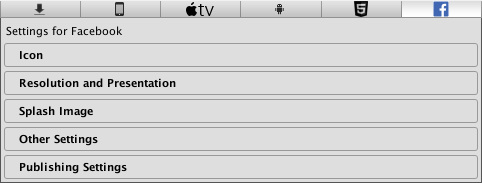
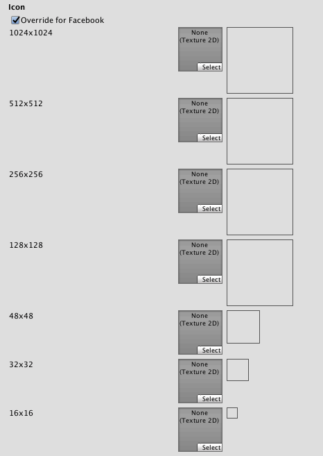
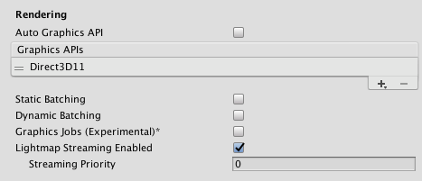
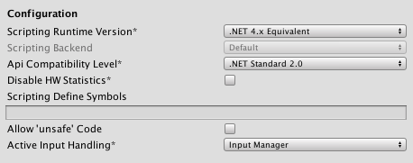
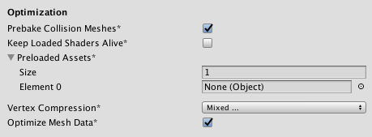
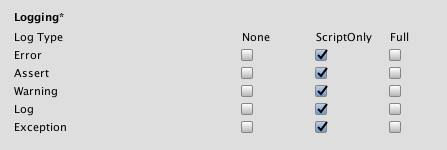
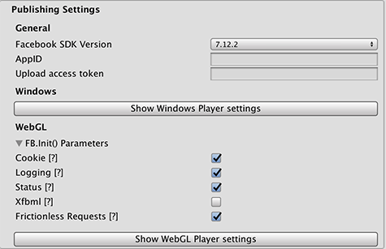

# Player settings for the Facebook platform

This page details the __Player__ settings specific to the Facebook platform. For a description of the general __Player__ settings, see [Player](class-PlayerSettings#general).

You can find documentation for the properties in the following sections:

* [Icon](#Icon)
* [Other Settings](#Other)
* [Publishing Settings](#Publishing)

**Note:** Although the __Resolution and Presentation__ panel appears on the Facebook platform's **Player** settings, there are no settings on the panel. Also, the only settings on the __Splash Image__ panel are the [common Splash Screen](class-PlayerSettingsSplashScreen) settings. 

Since the Facebook build target uses the existing [WebGL](class-PlayerSettingsWebGL) and Windows [Standalone](class-PlayerSettingsStandalone) build targets, the Player settings for those targets also apply.

##Icon

Enable the __Override for Facebook__ setting to assign a custom icon for your standalone game. You can upload different sizes of the icon to fit each of the squares provided.

 

## Other Settings

This section allows you to customize a range of options organized into the following groups:

* [Rendering](#Rendering)
* [Configuration](#Configuration)
* [Optimization](#Optimization)
* [Logging](#Logging) 
* [Legacy](#Legacy)

### Rendering

Use these settings to customize how Unity renders your game for the Facebook platform.

|**Property** |**Function** |
|:---|:---|
|__Auto Graphics API__|Disable this option to manually pick and reorder the graphics APIs. By default this option is enabled, and Unity includes Direct3D11. |
|__Static Batching__|Enable this option to use [Static batching](DrawCallBatching).|
|__Dynamic Batching__|Enable this option to use [Dynamic Batching](DrawCallBatching) (activated by default).|
|__Graphics Jobs (Experimental)__|Enable this option to instruct Unity to offload graphics tasks (render loops) to worker threads running on other CPU cores. This is intended to reduce the time spent in `Camera.Render` on the main thread, which is often a bottleneck.  **Note:** This feature is experimental. It may not deliver a performance improvement for your project, and may introduce instability. Unity currently only supports Graphics Jobs when using [Vulkan](https://www.khronos.org/vulkan/) and this setting has no effect when using [OpenGL](https://developer.android.com/guide/topics/graphics/opengl.html) ES.|
|__Lightmap Streaming Enabled__|Enable this option to load only the lightmap mip maps as needed to render the current game Cameras. This value applies to the lightmap textures as they are generated. **Note:** To use this setting, you must enable the [Texture Streaming Quality](class-QualitySettings#texStream) setting.|
|__Streaming Priority__|Set the lightmap mip map streaming priority to resolve resource conflicts. These values are applied to the light map textures as they are generated. Positive numbers give higher priority. Valid values range from -128 to 127.|

### Configuration

|**Setting** ||**Function** |
|:---|:---|:---|
|__Scripting Runtime Version__ ||Choose which .NET runtime to use in your project. For more details, see Microsoft's [.NET documentation](https://docs.microsoft.com/en-us/dotnet/).|
||_.NET 3.5 Equivalent (Deprecated)_|A .NET runtime which implements the .NET 3.5 API. This functionality is deprecated, and should no longer be used. Please use .NET 4.|
||_.NET 4.x Equivalent_|A .NET runtime which implements the .NET 4 API. This API is newer than .NET 3.5, and as such, it offers access to more APIs, is compatible with more external libraries, and supports C# 6. This is the default scripting runtime.|
|__Scripting Backend__ ||This option is not available for WebGL.|
|__API Compatibility Level__ ||There are two options for API compatibility level: _.NET 4.0_, or _.NET Standard 2.0_. **Tip:** If you are having problems with a third-party assembly, you can try the suggestion in the [API Compatibility Level](#apiComp) section below.|
|__Disable HW Statistics__ ||Enable this option to instruct the application not to send information about the hardware to Unity. By default, Unity Android applications send anonymous HW statistics to Unity. This provides you with aggregated information to help you make decisions as a developer. |
|__Scripting Define Symbols__||Set custom compilation flags. For more details, see [Platform dependent compilation](PlatformDependentCompilation).|
|__Allow 'unsafe' Code__|| Enable support for compiling [‘unsafe’ C# code](https://docs.microsoft.com/en-us/dotnet/csharp/language-reference/keywords/unsafe) in a pre-defined assembly (for example, `Assembly-CSharp.dll`).  For Assembly Definition Files (`.asmdef`), click on one of your `.asmdef` files and enable the option in the Inspector window  that appears. |
|__Active Input Handling__|| Choose how you want to handle input from users. |
||_Input Manager_| Use the traditional [Input](#class-InputManager) settings. |
||_Input System (Preview)_| Use the newer [Input](ScriptRef:Input.html) system. The Input System is under development. To try an early preview of the Input System, install the [InputSystem package](https://github.com/Unity-Technologies/InputSystem). If you select the __Input System (Preview)__ option without having that package installed, nothing happens except for some extra processing. |
||_Both_| Use both systems side by side. |

#### API Compatibility Level

You can choose your mono API compatibility level for all targets. Sometimes a 3rd-party .NET library uses functionality that is outside of your .NET compatibility level. In order to understand what is going on in such cases, and how to best fix it, try following these suggestions: 

1. Install [Reflector](http://www.airsquirrels.com/reflector/) for Windows. 
2. Drag the .NET assemblies for the API compatilibity level you are having issues with into Reflector. You can find these under `Frameworks/Mono/lib/mono/YOURSUBSET/`.
3. Drag in your 3rd-party assembly.
4. Right-click your 3rd-party assembly and select **Analyze**.
5. In the analysis report, inspect the **Depends on** section. The report highlights anything that the 3rd-party assembly depends on, but that is not available in the .NET compatibility level of your choice in red.

### Optimization

|**Setting** |**Function** |
|:---|:---|
|**Prebake Collision Meshes**|Enable this option to add collision data to Meshes at build time. |
|**Keep Loaded Shaders Alive**|Enable this option to prevent shaders from being unloaded. |
|__Preloaded Assets__|Set an array of Assets for the player to load on startup.  To add new Assets, increase the value of the __Size__ property and then set a reference to the Asset to load in the new __Element__ box that appears.|
|__Vertex Compression__|Set vertex compression per channel. For example, you can enable compression for everything except positions and lightmap UVs. Whole Mesh compression set per imported object overrides where vertex compression is set on objects. Everything else obeys these vertex compression settings. |
|__Optimize Mesh Data__|Enable this option to remove any data from Meshes that is not required by the Material applied to them (such as tangents, normals, colors, and UVs).|

### Logging

Select what type of logging to allow in specific contexts.

 Check one box that corresponds to each Log Type (__Error__, __Assert__, __Warning__, __Log__, and __Exception__) when running scripts (__ScriptOnly__) , all the time (__Full__), or never (__None__).

### Legacy

Enable the __Clamp BlendShapes (Deprecated)__ option to clamp the range of Blend Shape weights in [SkinnedMeshRenderers](class-SkinnedMeshRenderer).

## Publishing settings

| Property| Function |
|:---|:---|
|__Facebook SDK Version__| Choose the version of the Facebook SDK you want use for your Project. As Facebook publishes new versions compatible with your version of Unity, they will appear in this menu. |
|__AppID__| Enter your AppID, used by Facebook to identify your app. See [Getting Started Facebook for Unity](https://developers.facebook.com/docs/unity/gettingstarted) for help with setting up an AppID. |
|__Upload access token__| Enter your upload access token. Facebook requires this token to authorize the Unity Editor to upload builds of your app to Facebook. You can get this from Facebook, on your app configuration page, under the **Web Hosting** tab. |
|__Show Windows Player Settings__| Click this button to switch to the [Standalone Player settings](class-PlayerSettingsStandalone), which affect any Facebook builds for Gameroom. |
|__FB.Init() Parameters__| Some parameters affecting how the Facebook SDK is initialized on the facebook.com web page. For more information, see the Facebook Developers [FB.Init](https://developers.facebook.com/docs/unity/reference/current/FB.Init/) reference page. |
|__Show WebGL Player Settings__| Click this button to switch to the [WebGL Player settings](class-PlayerSettingsWebGL), which affect any Facebook builds for WebGL. |

 

---

*  2017-05-16  <!-- include IncludeTextNewPageNoEdit -->

