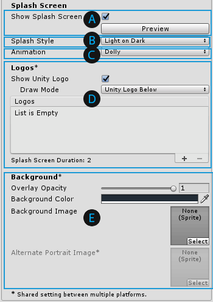
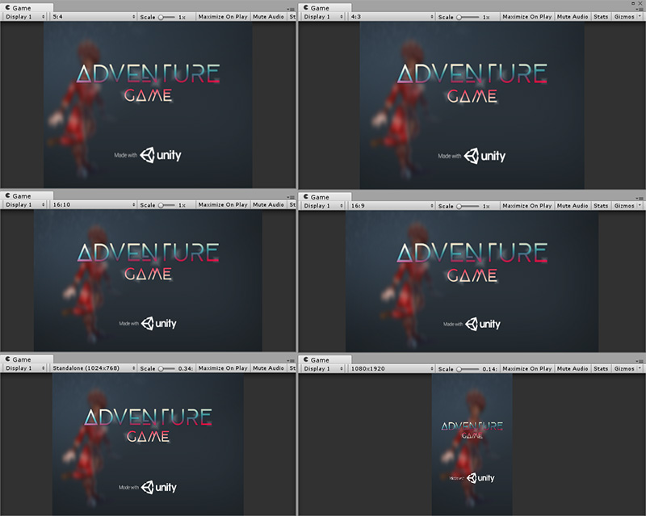
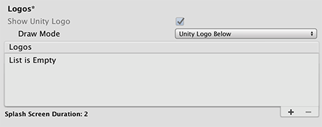
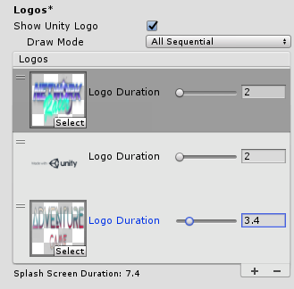
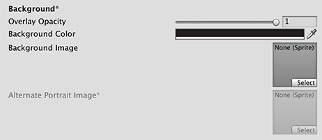
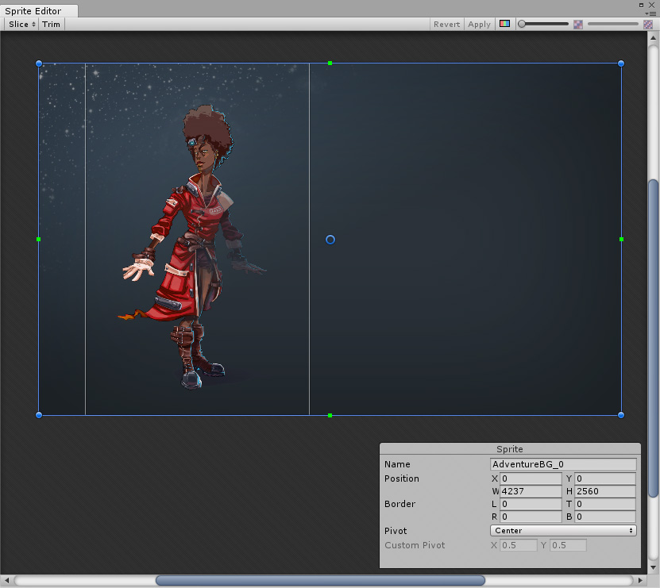

# Splash Screen

The Unity Editor allows you to configure a Splash Screen for your project. The level to which you can customize the Unity Splash Screen depends on your Unity license; depending on which licence you have, you can disable the Unity Splash Screen entirely, disable the Unity logo, and add your own logos, among other options. 

You can also make your own introductory screens or animations to introduce your Project in your first [Scene](CreatingScenes), using the Unity [UI System](UISystem). These can be in addition to or instead of using the Unity Splash Screen, depending on your license.

The Unity Splash Screen is uniform across all platforms. It displays promptly, displaying while the first Scene loads asynchronously in the background. This is different to your own introductory screens or animations which can take time to appear; this is due to Unity having to  load the entire engine and first Scene before displaying them. 

**Note:** Unity copies these options directly to the *Package.appxmanifest* file.

##License limitations

The Unity Pro Edition and Plus Editions licenses have no limitations to customisation of the Unity Splash Screen.

The Unity Personal Edition license has the following limitations:

* The Unity Splash Screen cannot be disabled.
* The Unity logo cannot be disabled.
* The opacity level can be set to a minimum value of 0.5.

## Unity Splash Screen settings

To access the Unity Splash Screen settings, open __Edit__ > __Project Settings__ from the main menu in Unity and select the __Player__ category. Then expand the __Splash Image__ section and scroll down to the __Splash Screen__ property.

The screen contains the following sections:

 [Preview](#Preview)

 [Style](#Style)

[Animation](#Animation)

 [Logos](#Logos)

 [Background](#Background)

### Preview

Enable the __Show Splash Screen__ option to display the Splash Screen at the start of the game. In the Unity Personal Edition you cannot disable this option.

Use the __Preview__ button to see a preview of the Splash Screen in the Game view. The preview reflects the resolution and aspect ratio of the Game view. Use multiple Game views to preview multiple different resolutions and aspect ratios simultaneously. This is particularly useful for simulating the Splash Screen’s appearance on multiple different devices.

###  Style

Use the __Splash Style__ setting to control the style of the Unity branding. 

Choose either __Light on Dark__ (the default) or __Dark on White__ from the __Splash Style__ drop-down menu.

### Animation

Use the __Animation__ setting to define how the Splash Screen appears and disappears from the screen. 

Choose one of the following values from the __Animation__ drop-down menu:

|**Value** | **Function**|
|:---|:---|
|__Static__| Do not apply animation. |
|__Dolly__| The logo and background zoom to create a visual dolly effect.  This is the default.|
|__Custom__| Configure the background and logo zoom amounts to allow for a modified dolly effect. |

### Logos

Use the settings in the __Logos__ section to customize your application's logos.

Your application is co-branded with the Unity logo by default. If you are using the Unity Personal Edition you cannot disable this option. If you are using the Pro or Plus editions, you can disable the __Show Unity Logo__ option to remove the Unity logo from your application.

If you are using Unity co-branding, you can control how it appears by choosing one of the following values from the __Draw Mode__ drop-down box:

|**Value** | **Function**|
|:---|:---|
|__Unity Logo Below__| Draw the co-branding Unity logo beneath all logos that are shown. |
|__All Sequential__| Insert the co-branding Unity logo as a logo into the __Logos__ list. |

You can customize the list of logos to appear on the Splash Screen:

Each logo must be a Sprite Asset. You can change the aspect ratio of the logo by changing the dimensions of the Sprite on the [Sprite Editor](SpriteEditor). Make sure the __Sprite Mode__ is set to _Multiple_.

To add and remove logos, use the plus (+) and minus (-) buttons. 

To reorder logos, drag and drop them in the list.  

You can control the length of time each Sprite Asset appears on the screen by setting its __Logo Duration__ setting. Use a value between 2 and 10 seconds.

If an entry in the Logos list has no logo Sprite Asset assigned, no logo is shown for the duration of that entry. You can use this to create delays between logos.

The entire duration of the Splash Screen is the total of all logos plus 0.5 seconds for fading out. This might be longer if the first Scene is not ready to play, in which case the Splash Screen shows only the background image or color and then fades out when the first Scene is ready to play.

### Background

Use the settings in the __Background__ section to customize the background of your application's Splash Screen.

#### Overlay Opacity

Adjust the strength of the __Overlay Opacity__ setting to make the logos stand out. This affects the background color and image color, based on how you set up your [Splash Style](#Style). 

You can set the opacity to a lower number to reduce this effect. You can also completely disable the effect by setting it to 0. For example, if the Splash Screen style is __Light on Dark,__ with a white background, the background becomes gray when __Overlay Opacity__ is set to 1, and white when __Overlay Opacity__ is set to 0. In the Unity Personal Edition, this option has a minimum value of 0.5.

#### Background Color

Set the __Background Color__ when no background image is set. Note that the actual background color may be affected by the __Overlay Opacity__ setting, and might not match the assigned color.

#### Background Image

Specify a reference to a Sprite image in the __Background Image__ setting instead of using a color background. Unity adjusts the background image so that it fills the screen. The image is uniformly scaled until it fits both the width and height of the screen. This means that parts of the image might extend beyond the screen edges in some aspect ratios. To adjust the background image’s response to aspect ratio, change the Sprite’s __Position__ values in the Sprite Editor.

#### Alternate Portrait Image

Set an __Alternate Portrait Image__ with portrait aspect ratios (for example, a mobile device in portrait mode). If there is no __Alternate Portrait Image__ Sprite assigned, the Unity Editor uses the Sprite assigned as the __Background Image__ for both portrait and landscape mode.

You can adjust the __Position__ and dimensions of the Sprite in the [Sprite Editor](SpriteEditor) to control the aspect ratio and position of the background image on the Splash Screen. In this example, the same image is being used for both landscape and portrait; however, the portrait position has been adjusted.

