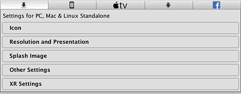
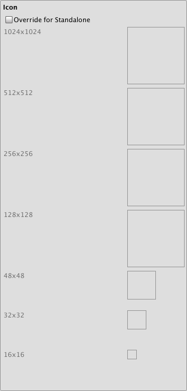
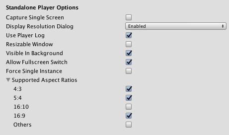
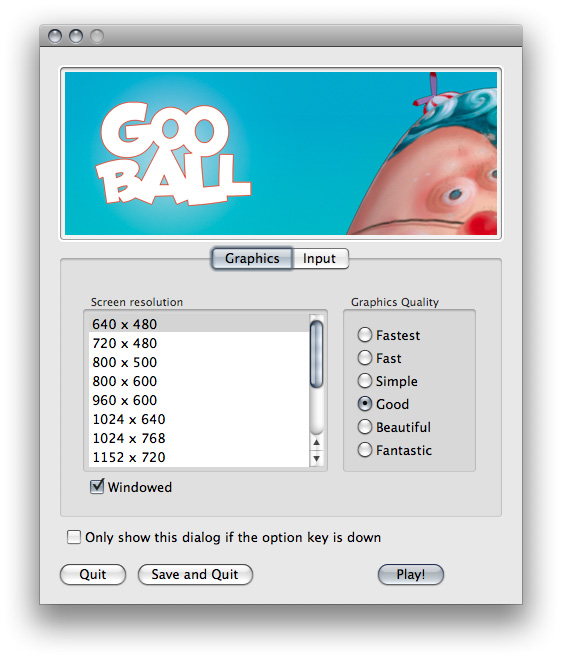
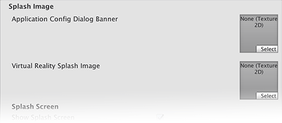
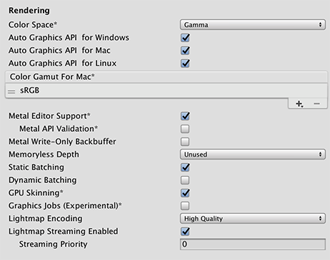
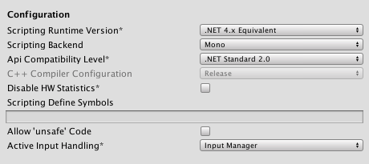
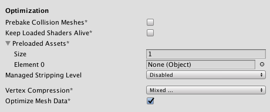
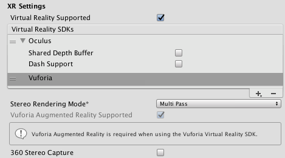

#Player settings for Standalone platforms

This page details the __Player__ settings specific to standalone platforms (Mac OSX, Windows and Linux). For a  description of the general __Player__ settings, see [Player Settings](class-PlayerSettings#general).

You can find documentation for the properties in the following sections:

* [Icon](#Icon)
* [Resolution and Presentation](#Resolution)
* [Splash Image](#Splash)
* [Other Settings](#Other)
* [XR Settings](#XR)

##Icon

Enable the __Override for Standalone__ setting to assign a custom icon for your standalone game. You can upload different sizes of the icon to fit each of the squares provided.

 

##Resolution and Presentation

Use the __Resolution and Presentation__ section to customize aspects of the screen's appearance in the [Resolution](#Resolution1) and [Standalone Player Options](#Resolution2) sections.

### Resolution section

This section allows you to customize the screen mode and default size.

|**Property** ||**Function** |
|:---|:---|:---|
|__Fullscreen Mode__ ||Choose the full-screen mode. This defines the default window mode at startup. |
||_Fullscreen Window_ |Set your app window to the full-screen native resolution of the display. Unity renders app content at the resolution set by script (or by user selection when the built application launches), but scales it to fill the window. When scaling, Unity adds black bars to the rendered output to match the aspect ratio chosen in the **Player** settings, so that the content isn't stretched. This process is called [letterboxing](https://en.wikipedia.org/wiki/Letterboxing_(filming)). |
||_Exclusive Fullscreen_ (Windows only) |Set your app to maintain sole full-screen use of a display. Unlike _Fullscreen Window_, this mode changes the OS resolution of the display to match the app’s chosen resolution. This option is only supported on Windows; on other platforms, the setting falls back to _Fullscreen Window_. |
||_Maximized Window_ (Mac only) |Set the app window to the operating system’s definition of “maximized”. On macOS, this means a full-screen window with an auto-hidden menu bar and dock. This option is only supported on macOS; on other platforms, the setting falls back to _Fullscreen Window_. |
||_Windowed_ | Set your app to a standard, non-full-screen, movable window, the size of which is dependent on the app resolution. In this mode, the window is resizable by default. To disable this, disable the [Resizable Window](#resizable) setting. |
|__Default Is Native Resolution__ ||Enable this option to make the game use the default resolution used on the target machine. This option is not available if the __Fullscreen Mode__ is set to _Windowed_.|
|__Default Screen Width__ ||Set the default width of the game screen in pixels. This option is only available if the __Fullscreen Mode__ is set to _Windowed_.|
|__Default Screen Height__ ||Set the default height of the game screen in pixels. This option is only available if the __Fullscreen Mode__ is set to _Windowed_.|
|__Mac Retina Support__ || Enable this option to enable support for high DPI (Retina) screens on a Mac. Unity enables this by default. This enhances Projects on a Retina display, but it is somewhat resource-intensive when active. |
|__Run In background__ ||Enable this option to make the game keep running (rather than pausing) if the app loses focus. |

### Standalone Player Options section

This section allows you to customize how the user can customize the screen. For example, here you can [set up a startup dialog](#Dialog) to allow the user to set their screen resolution from a list of aspect ratios that you provide. You can also determine whether the user can resize the screen and how many instances can run concurrently.

|**Property** |**Function** |
|:---|:---|
|__Capture Single Screen__ |Enable this option to ensure standalone games in [Fullscreen Mode](#fullscreen) do not darken the secondary monitor in multi-monitor setups. This is not supported on Mac OS X.|
|__Display Resolution Dialog__ |See [Customizing your Resolution Dialog](#Dialog) for details. |
|__Use Player Log__ |Enable this option to write a log file with debugging information. Defaults to enabled. **Warning:** If you plan to submit your application to the Mac App Store, leave this option disabled. For more information, see [Publishing to the Mac App Store](#AppStore). |
|__Resizable Window__ |Enable this option to allow the user to resize the standalone player window. **Note:** If you disable this option, your application can't use the _Windowed_ [Fullscreen Mode](#fullscreen). |
|__Visible in Background__ |Enable this option to show the application in the background if _Windowed_ [Fullscreen Mode](#fullscreen) is used (in Windows).|
|__Allow Fullscreen Switch__ |Enable this option to allow default OS full-screen key presses to toggle between full-screen and windowed modes.|
|__Force Single Instance__ |Enable this option to restrict standalone players to a single concurrent running instance.|
|__Supported Aspect Ratios__ |Enable each aspect ratio that you want to appear in the Resolution Dialog at startup (as long as they are supported by the user's monitor). |

#### Creating a Resolution Dialog on Startup

If you want to let the user choose the screen resolution to run the game in, you can create a dialog window that appears when your game launches.

Choose one of these values from the __Display Resolution Dialog__ dropdown menu:

|**Value** |**Description**|
|:---|:---|
|__Disabled__|Don't show the dialog at startup.|
|__Enabled__|Display a dialog asking the user to choose the screen resolution at startup.|
|__Hidden by Default__|Display a dialog asking the user to choose the screen resolution only if the user holds down the Alt key at startup. |

In addition, you can add a custom banner image to display on the dialog window. Expand the [Splash Image](#Splash) section and set a reference to the image you want to use in the __Application Config Dialog Banner__ property. The maximum image size is 432 x 163 pixels. The image does not scale up to fit the screen selector: Unity centers and crops it automatically.

 

##Splash Image

Above the [common Splash Screen](class-PlayerSettingsSplashScreen) settings, the **Player Settings** settings allow you to specify splash images for standalone platforms.

 

|**Property** |**Function** |
|:---|:---|
|__Application Config Dialog Banner__ |Select a custom splash image to appear on the resolution startup dialog window. For more information, see [Creating a Resolution Dialog on Startup](#Dialog).|
|__Virtual Reality Splash Image__ |Select a custom splash image to be displayed in [Virtual Reality](XR) displays.|

##Other Settings 

This section allows you to customize a range of options organized into the following groups:

* [Rendering](#Rendering)
* [Vulkan Settings](#Vulkan)
* [Mac App Store Options](#AppStore)
* [Configuration](#Configuration)
* [Optimization](#Optimization)
* [Logging](#Logging) 
* [Legacy](#Legacy)

### Rendering

Use these settings to customize how Unity renders your game for Standalone platforms.

|**Property** ||**Function** |
|:---|:---|:---|
|__Color Space__||Choose which color space should be used for rendering: __Gamma__ or __Linear__.  See the [Linear rendering overview](LinearLighting) for an explanation of the difference between the two.|
|__Auto Graphics API for Windows__||Enable this option to use the best Graphics API on the Windows machine the game is running on. Disable it to add and remove supported Graphics APIs. |
|__Auto Graphics API for Mac__||Enable this option to use the best Graphics API on the Mac the game is running on. Disable it to add and remove supported Graphics APIs. |
|__Auto Graphics API for Linux__||Enable this option to use the best Graphics API on the Linux machine it runs on. Disable it to add and remove supported Graphics APIs. |
|__Color Gamut for Mac__||You can add or remove [color gamuts](https://color.viewsonic.com/zh-cn/explore/content/Color-gamut_6.html) for the Standalone Mac platforms to use for rendering. Click the plus (+) icon to see a list of available gamuts. A color gamut defines a possible range of colors available for a given device (such as a monitor or screen). The sRGB gamut is the default (and required) gamut. |
|__Metal Editor Support__ || Enable this option to use the Metal API in the Unity Editor and unlock faster Shader iteration for targeting the Metal API. |
|__Metal API Validation__||Enable this option when you need to debug Shader issues. **Note:** Validation increases CPU usage, so use it only for debugging.|
|__Metal Write-Only Backbuffer__ || Allow improved performance in non-default device orientation. This sets the frameBufferOnly flag on the back buffer, which prevents readback from the back buffer but enables some driver optimization. |
|__Memoryless Depth__ || Choose when to use [memoryless render textures](ScriptRef:RenderTextureMemoryless.Depth.html). Memoryless render textures are temporarily stored in the on-tile memory when rendered, not in CPU or GPU memory. This reduces memory usage of your app but you cannot read or write to these render textures. **Note:** Memoryless render textures are only supported on iOS, tvOS 10.0+ Metal and Vulkan. Render textures are read/write protected and stored in CPU or GPU memory on other platforms. |
||_Unused_ |Never use memoryless framebuffer depth.|
||_Forced_ |Always use memoryless framebuffer depth.|
||_Automatic_ |Let Unity decide when to use memoryless framebuffer depth.|
|__Static Batching__ ||Enable this option to use Static batching.|
|__Dynamic Batching__ ||Enable this option to use [Dynamic Batching](DrawCallBatching) on your build (enabled by default). **Note:** Dynamic batching has no effect when a [Scriptable Render Pipeline](ScriptableRenderPipeline) is active, so this setting is only visible when nothing is set in the **Scriptable Render Pipeline Asset** [Graphics](class-GraphicsSettings#SRLoop) setting. |
|__GPU Skinning__ | |Enable this option to enable DX11/ES3 GPU skinning.|
|__Graphics Jobs (Experimental)__ ||Enable this option to instruct Unity to offload graphics tasks (render loops) to worker threads running on other CPU cores. This is intended to reduce the time spent in `Camera.Render` on the main thread, which is often a bottleneck.  **Note:** This feature is experimental. It may not deliver a performance improvement for your project, and may introduce new crashes. |
|__Lightmap Encoding__ ||Choose _Normal Quality_ or _High Quality_ to set the lightmap encoding. This setting affects the encoding scheme and compression format of the lightmaps.|
|__Lightmap Streaming Enabled__ ||Enable this option to load only the lightmap mip maps as needed to render the current game Cameras. This value applies to the lightmap textures as they are generated. **Note:** To use this setting, you must enable the [Texture Streaming Quality](class-QualitySettings#texStream) setting.|
|__Streaming Priority__ ||Set the lightmap mip map streaming priority to resolve resource conflicts. These values are applied to the light map textures as they are generated. Positive numbers give higher priority. Valid values range from -128 to 127.|

### Vulkan Settings

Enable the __SRGB Write Mode__ option to allow Graphics.SetSRGBWrite() on Vulkan renderer to toggle the sRGB write mode during the frame.

**Note:** Enabling this feature may reduce performance, especially for tiled GPUs.

### Mac App Store Options

For details on setting these options, see [Delivering your application to the Mac App Store](HOWTO-PortToAppleMacStore).

#### Publishing to the Mac App Store

The [Use Player Log](#UsePlayerLog) property enables writing a log file with debugging information. This is useful for investigating problems with your game. However you need to disable this when publishing games for Apple's Mac App Store, as Apple may reject your submission if it is enabled. See the Unity Manual [Log Files](LogFiles) page for further information about log files.

The __Use Mac App Store Validation__ property enables receipt validation for the Mac App Store. If enabled, your game only runs when it contains a valid receipt from the Mac App Store. Use this when submitting games to Apple for publishing on the App Store. This prevents people from running the game on a different computer to the one it was purchased on. 

Note that this feature does not implement any strong copy protection. In particular, any potential crack against one Unity game would work against any other Unity content. For this reason, it is recommended that you implement your own receipt validation code on top of this, using Unity's plugin feature. However, since Apple requires plugin validation to initially happen before showing the screen setup dialog, you should still enable this property to avoid Apple rejecting your submission.

### Configuration

|**Setting** ||**Function** |
|:---|:---|:---|
|__Scripting Runtime Version__ ||Choose which .NET implementation to use in your project. For more details about .NET Runtimes, see Microsoft's [.NET documentation](https://docs.microsoft.com/en-us/dotnet/standard/components).|
||_.NET 3.5 Equivalent (Deprecated)_|A .NET runtime which implements the .NET 3.5 API. This functionality is deprecated, and should no longer be used. Please use .NET 4.|
||_.NET 4.x Equivalent_|A .NET runtime that implements the .NET 4 API. This API is newer than .NET 3.5, and as such, it offers access to more APIs, is compatible with more external libraries, and supports C# 6. This is the default scripting runtime.|
|__Scripting Backend__ ||Choose the scripting backend you want to use. The scripting backend determines how Unity compiles and executes C# code in your Project. |
||_Mono_|Compiles C# code into .NET Common Intermediate Language (CIL) and executes that CIL using a Common Language Runtime. See the [Mono Project](https://www.mono-project.com/) website for more information. |
||_IL2CPP_|Compiles C# code into CIL, converts the CIL to C++ and then compiles that C++ into native machine code, which executes directly at run time. See [IL2CPP](IL2CPP) for more information. |
|__API Compatibility Level__ ||Choose which .NET APIs you can use in your project. This setting can affect compatibility with 3rd-party libraries. **Tip:** If you are having problems with a third-party assembly, you can try the suggestion in the [API Compatibility Level](#apiComp) section below.|
||_.Net 2.0_|.Net 2.0 libraries. Maximum .net compatibility, biggest file sizes. Part of the deprecated .NET 3.5 runtime.|
||_.Net 2.0 Subset_|Subset of full .net compatibility, smaller file sizes. Part of the deprecated .NET 3.5 runtime.|
||_.Net Standard 2.0_|Compatible with [.NET Standard 2.0](https://docs.microsoft.com/en-us/dotnet/standard/net-standard). Produces smaller builds and has full cross-platform support.|
||_.Net 4.x_|Compatible with the .NET Framework 4 (which includes everything in the .NET Standard 2.0 profile as well as additional APIs). Choose this option when usng libraries that access APIs not included in .NET Standard 2.0. Produces larger builds and any additional APIs available are not necessarily supported on all platforms. See [Referencing additional class library assemblies](dotnetProfileAssemblies) for more information. |
|__C++ Compiler Configuration__ ||Choose the C++ compiler configuration used when compiling IL2CPP generated code. **Note:** This property is disabled unless __Scripting Backend__ is set to _IL2CPP_.|
|__Disable HW Statistics__ ||Enable this option to instruct the application not to send information about the hardware to Unity. By default, Unity Android applications send anonymous HW statistics to Unity. This provides you with aggregated information to help you make decisions as a developer. See [Unity Hardware Statistics](http://hwstats.unity3d.com/) for more details |
|__Scripting Define Symbols__||Set custom compilation flags. For more details, see [Platform dependent compilation](PlatformDependentCompilation).|
|__Allow 'unsafe' Code__|| Enable support for compiling [‘unsafe’ C# code](https://docs.microsoft.com/en-us/dotnet/csharp/language-reference/keywords/unsafe) in a pre-defined assembly (for example, `Assembly-CSharp.dll`).  For Assembly Definition Files (`.asmdef`), click on one of your `.asmdef` files and enable the option in the Inspector window  that appears. |
|__Active Input Handling__|| Choose how you want to handle input from users. |
||_Input Manager_| Use the traditional [Input](#class-InputManager) settings. |
||_Input System (Preview)_| Use the newer [Input](ScriptRef:Input.html) system. The Input System is under development. To try an early preview of the Input System, install the [InputSystem package](https://github.com/Unity-Technologies/InputSystem). If you select the __Input System (Preview)__ option without having that package installed, nothing happens except for some extra processing.|
||_Both_| Use both systems side by side. |

#### API Compatibility Level

You can choose your mono API compatibility level for all targets. Sometimes a 3rd-party .NET library uses functionality that is outside of your .NET compatibility level. In order to understand what is going on in such cases, and how to best fix it, try following these suggestions: 

1. Install [Reflector](http://www.airsquirrels.com/reflector/) for Windows. 
2. Drag the .NET assemblies for the API compatilibity level you are having issues with into Reflector. You can find these under `Frameworks/Mono/lib/mono/YOURSUBSET/`.
3. Drag in your 3rd-party assembly.
4. Right-click your 3rd-party assembly and select **Analyze**.
5. In the analysis report, inspect the **Depends on** section. The report highlights anything that the 3rd-party assembly depends on, but that is not available in the .NET compatibility level of your choice in red.

### Optimization

|**Property** ||**Function** |
|:---|:---|:---|
|**Prebake Collision Meshes**||Enable this option to add collision data to Meshes at build time. |
|**Keep Loaded Shaders Alive**||Enable this option to prevent shaders from being unloaded. |
|__Preloaded Assets__||Set an array of Assets for the player to load on startup.  To add new Assets, increase the value of the __Size__ property and then set a reference to the Asset to load in the new __Element__ box that appears.|
|__Strip Engine Code__ (IL2CPP only)||Specify whether the Unity Linker tool removes code for Unity Engine features that your Project does not use.|
|__Managed Stripping Level__||Defines how aggressively Unity strips unused managed (C#) code. When Unity builds your game or application, the Unity Linker process can strip unused code from the managed dynamically linked libraries used in the project. Stripping code can make the resulting executable significantly smaller, but can sometimes mistakenly remove code that is actually used. This setting allows you to choose how aggressively Unity should remove unused code.|
||_Disabled_ (Mono only)|Do not strip any code. (Managed code stripping is always enabled when using IL2CPP.)|
||_Normal_|Remove unreachable managed code to reduce build size and Mono/IL2CPP build times.|
||_Aggressive_ (Experimental)|Remove code more aggressively than under the _Normal_ option. Code size is further reduced, but this additional reduction may have side effects. For example, some methods may no longer be visible in the debugger and code accessed through reflection can be stripped. You can create a custom link.xml file to preserve specific classes and methods. See [Managed bytecode stripping with IL2CPP](IL2CPP-BytecodeStripping) for more information.|
|**Enable Internal profiler (Deprecated)**||Enable this option to get the profiler data from your device in the Android SDK’s [adblogcat](https://developer.android.com/studio/command-line/logcat.html) output while testing your projects. This is only available in development builds.|
|__Script Call Optimization__ ||Choose how to optionally disable exception handling for a speed boost at runtime. See [iOS Optimization](iphone-iOS-Optimization) for details.|
||_Slow and Safe_ |Use full exception handling (with some performance impact on the device when using the Mono scripting backend). |
||_Fast but no Exceptions_ |No data provided for exceptions on the device (the game runs faster when using the Mono scripting backend). **Note**: Using this option with the _IL2CPP_ [Scripting Backend](#backend) does not impact performance; however, using it can avoid undefined behavior on release builds. |
|__Vertex Compression__||Set vertex compression per channel. For example, you can enable compression for everything except positions and lightmap UVs. Whole Mesh compression set per imported object overrides where vertex compression is set on objects. Everything else obeys these vertex compression settings. |
|__Optimize Mesh Data__||Enable this option to remove any data from Meshes that is not required by the Material applied to them (such as tangents, normals, colors, and UVs).|

### Logging

Select what type of logging to allow in specific contexts.

 Check one box that corresponds to each Log Type (__Error__, __Assert__, __Warning__, __Log__, and __Exception__) when running scripts (__ScriptOnly__) , all the time (__Full__), or never (__None__).

### Legacy

Enable the __Clamp BlendShapes (Deprecated)__ option to clamp the range of Blend Shape weights in [SkinnedMeshRenderers](class-SkinnedMeshRenderer).

##XR Settings

 

|**_Property:_** ||**_Function:_** |
|:---|:---|:---|
|__Virtual Reality Supported__||Enable native VR support for the Unity Editor and your game builds.|
|__Virtual Reality SDKs__||Add and remove Virtual Reality SDKs from the list. This list is only available available when the __Virtual Reality Supported__ is enabled. To add an SDK to the list, click the plus (+) button. To remove an SDK from the list, select it and then click the minus (-) button.  Some of the SDKs provide extra settings that appear here. For details, see [XR SDKs](XR-SDK_overviews).|
|__Stereo Rendering Mode__||Choose how you want to render for a virtual reality device.|
||__Multi Pass__|This is the normal rendering mode. Unity renders the Scene twice: first to render the left-eye image; and then again for the right-eye image.|
||__Single Pass__|Render both eye images at the same time into one packed Render Texture. This means that the whole Scene is only rendered once, which significantly reduces CPU processing time.|
||__Single Pass Instanced (Preview)__|The GPU performs a single render pass, replacing each draw call with an instanced draw call. This heavily decreases CPU use, and slightly decreases GPU use, due to the cache coherency between the two draw calls. Using this mode significantly reduces the power consumption of your application.|
|__Vuforia Augmented Reality Supported__||Enable this option to use Vuforia Augmented Reality SDK, which is required when using the Vuforia __Virtual Reality SDK__.|
|__360 Stereo Capture__||Enable this option to use 360 capture-enabled shader variants. By default, this option is disabled and Unity does not generate these shader variants. |

### XR Support Installers

You can click the __Vuforia Augmented Reality__ link to enable the [Vuforia Software Development Kit](vuforia-sdk-overview). You must have a Vuforia Software License and agree to the terms of that license before the __Vuforia Augmented Reality Supported__ property is enabled.

 

---

*  2018-10-07  <!-- include IncludeTextAmendPageSomeEdit --> 

*  2017-09-04 > Added MacOS Retina Support checkbox Added in [2017.2](https://docs.unity3d.com/2017.2/Documentation/Manual/30_search.html?q=newin20172) NewIn20171

* Allow 'unsafe' Code checkbox added in Unity [2018.1](https://docs.unity3d.com/2018.1/Documentation/Manual/30_search.html?q=newin20181) NewIn20181

* .NET 4.x runtime added in 2018.1

* Updated for United Settings, .Net 3.5 scripting runtime deprecated in Unity [2018.3](../Manual/30_search.html?q=newin20183) NewIn20183

