#Player settings for the Universal Windows platform

This page details the __Player__ settings specific to the Universal Windows platform. For a description of the general Player settings, see [Player Settings](class-PlayerSettings).

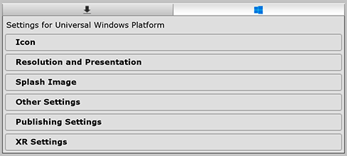

You can find documentation for the properties in the following sections:

* [Icon](#Icon)
* [Resolution and Presentation](#Resolution)
* [Splash Image](#Splash)
* [Other Settings](#Other)
* [Publishing Settings](#Publishing)
* [XR Settings](#XR)


<a name="Icon"></a>

## Icon

Use the **Icon** settings to customize the branding for your app on the Windows Store.

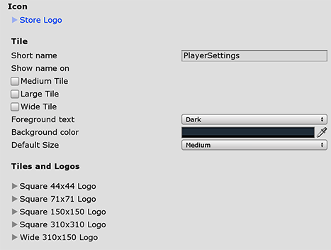

Expand the __Store Logo__ section to specify the image that appears on the Store description page for the application. You can add up to eight different resolutions. 

### Tile section

Customize the general appearance of your Windows Store tiles with these settings:

|**Setting**||**Function**|
|:---|:---|:---|
| __Short name__ || Set an abbreviated name for the app. |
| __Show name on__ || Indicate each icon image you want the name to appear on: __Medium Tile__, __Large Tile__, or __Wide Tile__. |
| __Foreground text__ || Choose whether you want to use __Light__ or __Dark__ text on the app's Tile. |
| __Background color__ || Specify what color you want to use for the background. |
| __Default Size__ || Choose what size you want to use as the default size for the Tile. |
||_Not Set_|Don't use a default size.|
||_Medium_|Use a medium size.|
||_Wide_|Use a wide size.|

Unity copies these options directly to the *Package.appxmanifest* file.


### Tiles and Logos section

Specify the images your tiles display on the Windows Store with these settings:

|**Setting**|**Function**|
|:---|:---|
|__Square 44x44 Logo__|Set a 44x44 logo image to use on the app's tile. You can set up to 10 resolutions.|
|__Square 71x71 Logo__|Set a 71x71 logo image to use on the app's tile. You can set up to 5 resolutions.|
|__Square 150x150 Logo__|Set a 150x150 logo image to use on the app's tile. You can set up to 5 resolutions.|
|__Square 310x310 Logo__|Set a 310x310 logo image to use on the app's tile. You can set up to 5 resolutions.|
|__Wide 310x150 Logo__|Set a 310x150 logo image to use on the app's tile. You can set up to 5 resolutions.|


<a name="Resolution"></a>

## Resolution and Presentation

Use the __Resolution and Presentation__ section to customize aspects of the screen's appearance.

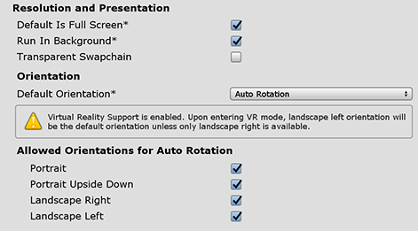


|**Setting** |**Function** |
|:---|:---|
|__Default is Fullscreen__ |Set the window to the full-screen native resolution of the display. Unity renders app content at the resolution set by script (or by user selection when the built application launches), but scales it to fill the window. When scaling, Unity adds black bars to the rendered output to match the aspect ratio chosen in the **Player** settings, so that the content isn't stretched. This process is called [letterboxing](https://en.wikipedia.org/wiki/Letterboxing_(filming)). |
|__Run In background__ |Enable this option to make the game keep running (rather than pausing) if the app loses focus. |
|__Transparent Swapchain__|Sets AlphaMode on the swap chain to *DXGI_ALPHA_MODE_PREMULTIPLIED*.<br />This setting is only used for UWP projects that use the XAML build type. By enabling this setting, you can compose Unity content with other XAML content in your application. For more information, see the [PlayerSettings.WSA.transparentSwapchain](ScriptRef:PlayerSettings.WSA-transparentSwapchain.html). |

### Orientation

Choose the game's screen orientation from the __Default Orientation__ drop-down menu: 

|**Setting** |**Function** |
|:---|:---|
|__Portrait__|Orient the screen so that the device's Home button appears at the bottom.|
|__Portrait Upside Down__|Orient the screen so that the device's Home button appears at the top.|
|__Landscape Left__|Orient the screen so that the device's Home button appears on the right side.|
|__Landscape Right__|Orient the screen so that the device's Home button appears on the left side.|
|__Auto Rotation__ |Screen orientation changes with device orientation. This is the default.|

When you set the orientation to __Auto Rotation__, the __Allowed Orientations for Auto Rotation__ section appears.

<a name="supportedOris"></a>

### Allowed Orientations for Auto Rotation

This section is only visible when __Default Orientation__ is set to __Auto Rotation__. 

Because __Auto Rotation__ changes screen orientation to match the device, you may want to limit the screen orientations allowed (for example, locking a device to landscape). 

Enable each orientation you want to allow by checking its box in this section:


|**Setting** |**Function** |
|:---|:---|
|__Portrait__ |Allow portrait orientation. |
|__Portrait Upside Down__ |Allow portrait upside-down orientation.|
|__Landscape Right__ |Allow landscape right orientation (home button on the **left** side). |
|__Landscape Left__ |Allow landscape left orientation (home button is on the **right** side).|


<a name="Splash"></a>

## Splash Image

Above the [common Splash Screen](class-PlayerSettingsSplashScreen) settings, the **Player Settings** settings allow you to specify splash images for the Universal Windows platform.


Use the __Virtual Reality Splash Image__ property to select a custom splash image to be displayed in [Virtual Reality](XR) displays.

Below the common Splash Screen settings, there are a few additional sections:

* [Windows](#Windows)
* [Windows Holographic](#Holographic)
* [Overwrite background color](#Overwrite)


<a name="Windows"></a>

### Windows

Set the foreground image you want to use in your app's splash screen. You can add up to seven different resolutions.

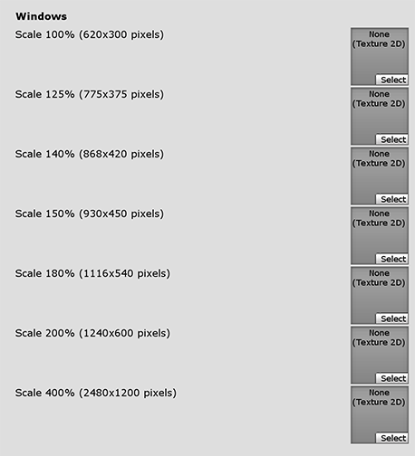


<a name="Holographic"></a>

### Windows Holographic

Use these settings to customize the holographic splash image for [Mixed Reality](wmr_sdk_overview) apps.

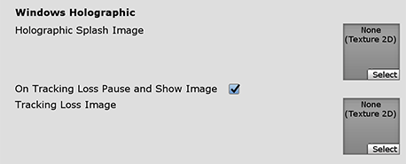


Set a **Holographic Splash Image** to appear during startup. This image appears for five seconds (or until the app finishes loading). 

#### Tracking Loss

A Mixed Reality headset needs to build [world-locked coordinate systems](https://docs.microsoft.com/en-us/windows/mixed-reality/coordinate-systems-in-unity) from its environment, in order to allow holograms to stay in position. Tracking loss occurs when the headset loses track of where it is (can't locate itself) in the world. This leads to a breakdown in spatial systems (spatial mapping, spatial anchors, spatial stages). 

When this happens, Unity stops rendering holograms, pauses the game, and displays a notification. You can customize the notification image that appears by enabling the __On Tracking Loss Pause and Show Image__ property, and then selecting the image to display with the __Tracking Loss Image__ property.

For more information, see [Recommended settings for Unity](https://docs.microsoft.com/en-us/windows/mixed-reality/recommended-settings-for-unity).


<a name="Overwrite"></a>

### Overwrite background color

The common Splash Screen settings allow you to set the [Background Color](class-PlayerSettingsSplashScreen#Background) for when no background image is set, which applies to all platforms. 


To override this for the Universal Windows platform, you can enable the __Overwrite background color__ property and then use the __Background color__ setting to choose a different color.


<a name="Other"></a>

## Other Settings

This section allows you to customize a range of options organized into the following groups:

* [Rendering](#Rendering)
* [Configuration](#Configuration)
* [Optimization](#Optimization)
* [Logging](#Logging) 
* [Legacy](#Legacy)


<a name="Rendering"></a>

### Rendering

Use these settings to customize how Unity renders your game for the Univeral Windows platform.

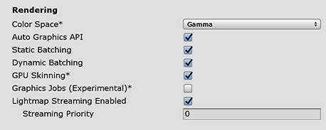


|**Setting** |**Function** |
|:---|:---|
|__Color Space__|Choose which color space should be used for rendering: __Gamma__ or __Linear__. <br />See the [Linear rendering overview](LinearLighting) for an explanation of the difference between the two.|
|__Auto Graphics API__ | Disable this option to manually pick and reorder the graphics APIs. By default this option is enabled, and Unity uses Direct3D11. |
|__Static Batching__ |Enable this option to use Static batching.|
|__Dynamic Batching__ |Enable this option to use Dynamic Batching (activated by default). |
|__GPU Skinning__ |Enable this option to use DX11/ES3 GPU skinning.|
|__Graphics Jobs (Experimental)__ |Enable this option to instruct Unity to offload graphics tasks (render loops) to worker threads running on other CPU cores. This is intended to reduce the time spent in `Camera.Render` on the main thread, which is often a bottleneck. <br />**Note:** This feature is experimental. It may not deliver a performance improvement for your project, and may introduce new crashes. |
|__Lightmap Streaming Enabled__ |Enable this option to load only the lightmap mip maps as needed to render the current game Cameras. This value applies to the lightmap textures as they are generated.<br />**Note:** To use this setting, you must enable the [Texture Streaming Quality](class-QualitySettings#texStream) setting.|
|__Streaming Priority__ |Set the lightmap mip map streaming priority to resolve resource conflicts. These values are applied to the light map textures as they are generated.<br />Positive numbers give higher priority. Valid values range from -128 to 127.|


<a name="Configuration"></a>

### Configuration

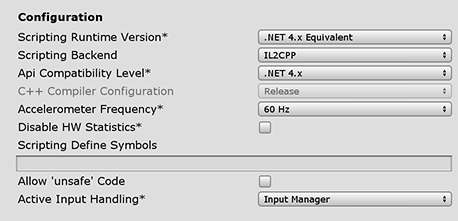


|**Setting** ||**Function** |
|:---|:---|:---|
|__Scripting Runtime Version__ ||Choose which .NET runtime to use in your project. For more details, see Microsoft's [.NET documentation](https://docs.microsoft.com/en-us/dotnet/).|
||_.NET 3.5 Equivalent (Deprecated)_|A .NET runtime which implements the .NET 3.5 API. This functionality is deprecated, and should no longer be used. Please use .NET 4.|
||_.NET 4.x Equivalent_|A .NET runtime which implements the .NET 4 API. This API is newer than .NET 3.5, and as such, it offers access to more APIs, is compatible with more external libraries, and supports C# 6. This is the default scripting runtime.|
|<a name="backend"></a>__Scripting Backend__ ||Choose the scripting backend you want to use. |
||_.NET_|The standard .NET runtime. |
||_IL2CPP_|Unity's .NET runtime. This is the default. |
|__API Compatibility Level__ ||There are two options for API compatibility level: _.NET 4.0_, or _.NET Standard 2.0_.<br />**Tip:** If you are having problems with a third-party assembly, you can try the suggestion in the [API Compatibility Level](#apiComp) section below.|
|__C++ Compiler Configuration__ ||Choose the C++ compiler configuration used when compiling IL2CPP generated code.<br />**Note:** This property is disabled for the Universal Windows platform.|
|__Accelerometer Frequency__||Define how often to sample the accelerometer. If you choose _Disabled_, then no samples are taken. Otherwise, you can choose from _15Hz_, _30Hz_, _60Hz_ and _100Hz_ frequencies. |
|__Disable HW Statistics__ ||Enable this option to instruct the application not to send information about the hardware to Unity. For more details, see [Unity Hardware Statistics](http://hwstats.unity3d.com/).|
|__Scripting Define Symbols__||Set custom compilation flags. For more details, see [Platform dependent compilation](PlatformDependentCompilation).|
|__Allow 'unsafe' Code__|| Enable support for compiling [‘unsafe’ C# code](https://docs.microsoft.com/en-us/dotnet/csharp/language-reference/keywords/unsafe) in a pre-defined assembly (for example, `Assembly-CSharp.dll`). <br />For Assembly Definition Files (`.asmdef`), click on one of your `.asmdef` files and enable the option in the Inspector window  that appears. |
|__Active Input Handling__|| Choose how you want to handle input from users. |
||_Input Manager_| Use the traditional [Input](#class-InputManager) settings. |
||_Input System (Preview)_| Use the newer [Input](ScriptRef:Input.html) system. The Input System is under development. To try an early preview of the Input System, install the [InputSystem package](https://github.com/Unity-Technologies/InputSystem). If you select the __Input System (Preview)__ option without having that package installed, nothing happens except for some extra processing. |
||_Both_| Use both systems side by side. |


<a name="Optimization"></a>

### Optimization

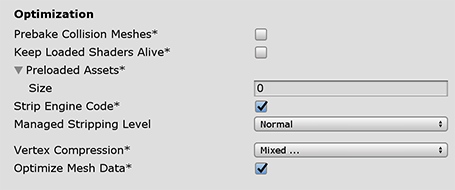

|**Setting** ||**Function** |
|:---|:---|:---|
|**Prebake Collision Meshes**||Enable this option to add collision data to Meshes at build time. |
|**Keep Loaded Shaders Alive**||Enable this option to prevent shaders from being unloaded. |
|__Preloaded Assets__||Set an array of Assets for the player to load on startup. <br />To add new Assets, increase the value of the __Size__ property and then set a reference to the Asset to load in the new __Element__ box that appears.|
|__Strip Engine Code__ ||Enable code stripping. This setting is only available with the _IL2CPP_ [Scripting Backend](#backend). <br/>Most games don't use all necessary DLLs. With the __Strip Engine Code__ option enabled, you can strip out unused parts to reduce the size of the built player on iOS devices. If your game is using classes that would normally be stripped out by the option you currently have selected, you'll be presented with a Debug message when you make a build.|
|__Managed Stripping Level__||Choose how aggressively Unity strips unused managed (C#) code.|
||_Normal_|Remove unreachable managed code to reduce build size and .NET/IL2CPP build times.|
||_Aggressive_|Run UnityLinker in a less conservative mode than normal, reducing code size even further than what Normal can achieve. However, this additional reduction may come with tradeoffs. For more information, see [ManagedStrippingLevel](ScriptRef:ManagedStrippingLevel.html). |
|__Vertex Compression__||Set vertex compression per channel. For example, you can enable compression for everything except positions and lightmap UVs. Whole Mesh compression set per imported object overrides where vertex compression is set on objects. Everything else obeys these vertex compression settings. |
|__Optimize Mesh Data__||Enable this option to remove any data from Meshes that is not required by the Material applied to them (such as tangents, normals, colors, and UVs).|


<a name="Logging"></a>

### Logging

Select what type of logging to allow in specific contexts.

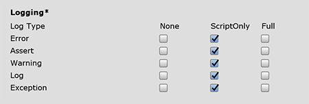

Check one box that corresponds to each Log Type (__Error__, __Assert__, __Warning__, __Log__, and __Exception__) when running scripts (__ScriptOnly__) , all the time (__Full__), or never (__None__).


<a name="Legacy"></a>

### Legacy

Enable the __Clamp BlendShapes (Deprecated)__ option to clamp the range of Blend Shape weights in [SkinnedMeshRenderers](class-SkinnedMeshRenderer).


<a name="Publishing"></a>

## Publishing Settings

Use these settings to customize building your Universal Windows app. These options are organized into the following groups:

* [Packaging](#Packaging)
* [Certificate](#Certificate)
* [Streaming Install](#Streaming)
* [Application UI](#AppUI)
* [File and Protocol Associations](#FileAssoc) 
* [Compilation](#Compilation)
* [Misc](#Misc)
* [Capabilities](#Capabilities)
* [Supported Device Families](#Supported)

Unity stores these settings in the _Package.appxmanifest_ file when creating a Visual Studio solution for the first time.

**Note:** If you build your project on top of the existing one, Unity doesn’t overwrite the _Package.appxmanifest_ file if it’s already present. That means if you change any of the **Player** settings, you need to check _Package.appxmanifest_. If you want to regenerate _Package.appxmanifest_, delete it and rebuild your project from Unity.

For more information, see Microsoft's documentation on [App package manifest](http://msdn.microsoft.com/en-us/library/windows/apps/br211474.aspx).

[Supported orientations](#supportedOris) from Player Settings are also populated to the manifest (*Package.appxmanifest* file in Visual Studio solution). On Universal Windows Apps, Unity resets the orientation to the one you used in the **Player** settings, regardless of what you specify in the manifest. This is because Windows itself ignores those settings on desktop and tablet computers. 

**Tip:** You can always change supported orientations using Unity scripting API.


<a name="Packaging"></a>

### Packaging

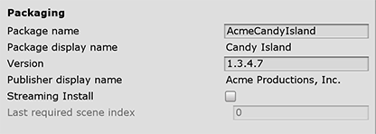

|**Setting**|**Function**|
|:---|:---|
|<a name="PackageName"></a>__Package name__| Enter the name to identify the package on the system. The name must be unique. |
|__Package display name__| The __Product Name__ value that you set at the [top of the Player settings](class-PlayerSettings#ProductName) appears here. This is the name of the app as it will appear on the Windows Store. |
|__Version__| Enter the version for the package using a string in quad notation: **Major.Minor.Build.Revision**. |
|__Publisher display name__| The __Company Name__ value that you set at the [top of the Player settings](class-PlayerSettings#CompanyName) appears here. This is the user-friendly name of the publisher. |
|__Streaming Install__| Enable this option to create a `AppxContentGroupMap.xml` manifest file containing streamable Assets for the Scene. To include Scene Assets by default, use the **Last required scene index** setting. Assets in Scenes with a scene index above the **Last required scene index** are specified as streamable in the manifest file.<br />***Note:*** This setting is only available with the _IL2CPP_ [Scripting Backend](#backend). |
|__Last required scene index__| Enter the index number from the __Scenes In Build__ list on the [Build Settings window](BuildSettings) that corresponds to the last scene in that list that must be present in the game build. For an application to start, Unity requires any scene index at or less than the specified index. To require all files in the list, use the index of the last scene in the list. <br />Scenes with a greater scene index must include shared Assets for Scenes with a lesser index. The order of scenes in the Build Settings dialog may be important to allow the application to locate the required assets.<br />***Note:*** By default, the __Streaming Install__ option is disabled, which means that this setting is not available. To make this property editable, enable the __Streaming Install__ option first. |


<a name="Certificate"></a>

###Certificate

Every Universal Windows App needs a certificate which identifies a developer. 


You can click the __Select__ button to choose your certificate file (`.pfx`) from your local computer. The name of the file you selected appears on the __Select__ button. 

If you don’t have a certificate file already, you can generate a file in Unity:

1. Click the __Create__ button. The __Create Test Certificate for Windows Store__ dialog window appears.

	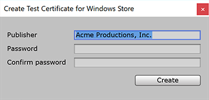

2. Enter the name of the package publisher in the __Publisher__ text box.

3. Enter the password for the certificate in the __Password__ text box and then again in the __Confirm password__ text box.

4. Click the __Create__ button. 

	The window closes and the __Certificate__ section displays the name you entered for both the __Publisher__ and __Issued by__ values. The __Expiration date__ is set to one year from the time you created the certificate.


<a name="Streaming"></a>
### Streaming Install
Your Microsoft UWP application supports **Streaming Install** if the [Scripting Backend](#backend) is using *IL2CPP*. 

If you enable Streaming Install, Unity generates an `AppxContentGroupMap.xml` file containing streamable Assets.  To include Scene Assets in the AppxContentGroupMap.xml file by default, use the Last required scene index setting, which uses the scene index in the Build Settings dialog. Assets in Scenes with a scene index above the Last required scene index are specified as streamable in the generated manifest. For an application to start, Unity requires any scene index at or less than the specified index.

Scenes with a greater scene index must include shared assets for Scenes with a lesser index. The order of scenes in the Build Settings dialog may be important to allow the application to locate the required assets.


<a name="AppUI"></a>

### Application UI

Unity copies these options directly to the *Package.appxmanifest* file.


The __Dispay name__ value that you set at the [top of the Player Settings settings](class-PlayerSettings#ProductName) appears in this section. This is the full name of the app.

Enter the text you want to appear on the app's tile on the Windows Store in the __Description__ text box. This defaults to the [Package display name](#ProductName) value.


<a name="FileAssoc"></a>

### File and Protocol Associations

The settings under the __File Type Associations__, __File Types__, and __Protocol__ sections allow you to set up your Windows Store app as the default handler for a certain file type or URI scheme.

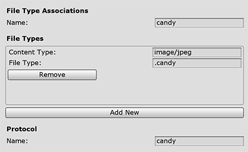

Under the __File Type Associations__ section, enter the name (lowercase only) for a group of file types in the __Name__ text box. These are files that share the same display name, logo, info tip, and edit flags. Choose a group name that can stay the same across app updates.

If you are setting this up as a file association: 

* Click the __Add New__ button. An empty entry appears in the __File Types__ list. You can add multiple file types.
* Enter the MIME content type in the __Content Type__ text box for a particular file type. For example, **image/jpeg**.
* Enter the file type to register for in the __File Type__ text box, preceded by a period (for example, **.jpeg**).

If you are setting this up as an association with a URI scheme, enter the protocol in the __Name__ text box. 

For more information, see [Auto-launching with file and URI associations (XAML)](https://docs.microsoft.com/en-us/previous-versions/windows/apps/hh779673(v%3dwin.10))


<a name="Compilation"></a>

### Compilation


Unity uses Mono when compiling script files, and you can use the API located in .NET 4.x. To use .NET for Universal Windows Platform (also known as .NET Core) in your C# files, choose one of these values from the __Compilation Overrides__ setting:


|**Value**|**Function**|
|:---|:---|
|__None__| Use the Mono compiler to compile C# files.|
|__Use .Net Core__| Use the Microsoft compiler and .NET Core to compile C# files. You can use Windows Runtime API, but classes implemented in C# files aren’t accessible from the JS language. <br/>**Note:** When using API from Windows Runtime, it’s advisable to wrap the code with the ENABLE_WINMD_SUPPORT define, because the API is only available when building for the Universal Windows Platform, and it’s not available in Unity Editor.|
|__Use .Net Core Partially__| Use the Microsoft compiler and .NET Core to compile any C# files not located in Plugins, Standard Assets, and Pro Standard Assets folders. For all other C# files, use the Mono compiler. The advantage is that classes implemented in C# are accessible from the JS language.<br/>**Note:** You can’t test the .NET Core API in Unity Editor, because it doesn’t have access to .NET Core, which means you can only test the API only when running Universal Windows App.|

**Note:** You cannot use .NET Core API in JS scripts.

Here’s a simple example of how to use .NET Core API in scripts.

````
string GetTemporaryFolder()
{
#if ENABLE_WINMD_SUPPORT
    return Windows.Storage.ApplicationData.Current.TemporaryFolder.Path;
#else
    return "LocalFolder";
#endif
}
````


<a name="Misc"></a>

###Misc

Unity receives input by subscribing to events. The __Input Source__ setting defines where (which sources) to get input from. Currently this only applies to mouse and touch input, as keyboard input always comes from __CoreWindow__.


|**Value**|**Function**|
|:---|:---|
|__CoreWindow__|Subscribe to CoreWindow events. This is the default.|
|__Independent Input Source__|Create Independent Input Source and receive input from it.|
|__SwapChainPanel__|Subscribe to SwapChainPanel events.|


<a name="Capabilities"></a>

###Capabilities
Use the __Capabilities__ section to enable APIs or resources you want your app to access. These could be pictures, music, or devices such as the camera or the microphone.

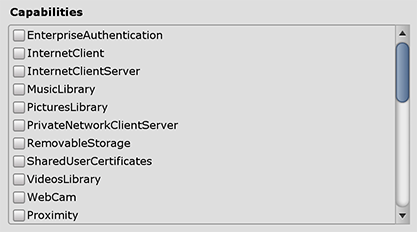

|**Capability**|**Function**|
|:---|:---|
|__EnterpriseAuthentication__|Windows domain credentials enable a user to log into remote resources using their credentials, and act as if a user provided their user name and password.|
|__InternetClient__|Apps can receive incoming data from the Internet. Cannot act as a server. No local network access.|
|__InternetClientServer__|Same as __InternetClient__ but also enables peer-to-peer (P2P) scenarios where the app needs to listen for incoming network connections.|
|__MusicLibrary__|Accesses the user's Music, allowing the app to enumerate and access all files in the library without user interaction. This capability is typically used in jukebox apps that make use of the entire Music library.|
|__PicturesLibrary__|Accesses the user's Pictures, allowing the app to enumerate and access all files in the library without user interaction. This capability is typically used in photo apps that make use of the entire Pictures library.|
|__PrivateNetworkClientServer__|Provides inbound and outbound access to home and work networks through the firewall. This capability is typically used for games that communicate across the local area network (LAN), and for apps that share data across a variety of local devices.|
|__RemovableStorage__|Accesses files on removable storage, like USB keys and external hard drives.|
|__SharedUserCertificates__|Allows your app to add and access software and hardware-based certificates in the Shared User store, such as certificates stored on a smart card. This capability is typically used for financial or enterprise apps that require a smart card for authentication.|
|__VideosLibrary__|Accesses the user's Videos, allowing the app to enumerate and access all files in the library without user interaction. This capability is typically used in movie-playback apps that make use of the entire Videos library.|
|__WebCam__|Accesses the video feed of a built-in camera or external webcam, which allows the app to capture photos and videos.<br/>**Note:** This only grants access to the video stream. In order to grant access to the audio stream as well, the __Microphone__ capability must be added.|
|__Proximity__|Enables multiple devices in close proximity to communicate with one another. This capability is typically used in casual multi-player games and in apps that exchange information. Devices attempt to use the communication technology that provides the best possible connection, including Bluetooth, Wi-Fi, and the Internet.|
|__Microphone__|Accesses the microphone’s audio feed, which allows the app to record audio from connected microphones.|
|__Location__|Accesses location functionality that retrieved from dedicated hardware like a GPS sensor in the PC or derived from available network info.|
|__HumanInterfaceDevice__|Enables access to Human Interface Device APIs. See [How to specify device capabilities for HID](https://docs.microsoft.com/en-us/uwp/schemas/appxpackage/how-to-specify-device-capabilities-for-hid) for details.|
|__AllJoyn__|Allows AllJoyn-enabled apps and devices on a network to discover and interact with each other.|
|__BlockedChatMessages__|Allows apps to read SMS and MMS messages that have been blocked by the Spam Filter app.|
|__Chat__|Allows apps to read and write all SMS and MMS messages.|
|__CodeGeneration__|Allows apps to access the following functions which provide JIT capabilities to apps<br />[VirtualProtectFromApp](https://msdn.microsoft.com/library/windows/desktop/Mt169846)<br/>[CreateFileMappingFromApp](https://msdn.microsoft.com/library/windows/desktop/Hh994453)<br />[OpenFileMappingFromApp](https://msdn.microsoft.com/library/windows/desktop/Mt169844)<br />[MapViewOfFileFromApp](https://msdn.microsoft.com/library/windows/desktop/Hh994454)|
|__Objects3D__|Allows apps to have programmatic access to the 3D object files. This capability is typically used in 3D apps and games that need access to the entire 3D objects library.|
|__PhoneCall__|Allows apps to access all of the phone lines on the device and perform the following functions.<br />Place a call on the phone line and show the system dialer without prompting the user.<br/>Access line-related metadata.<br />Access line-related triggers.<br />Allows the user-selected spam filter app to set and check block list and call origin information.|
|__UserAccountInformation__|Accesses the user's name and picture.|
|__VoipCall__|Allows apps to access the VOIP calling APIs in the [Windows.ApplicationModel.Calls](https://msdn.microsoft.com/library/windows/apps/Dn297266) namespace.|
|__Bluetooth__|Allows apps to communicate with already paired bluetooth devices over both Generic Attribute (GATT) or Classic Basic Rate (RFCOMM) protocol.|
|__SpatialPerception__|Provides programmatic access to spatial mapping data, giving mixed reality apps information about surfaces in application-specified regions of space near the user. Declare the spatialPerception capability only when your app will explicitly use these surface meshes, as the capability is not required for mixed reality apps to perform holographic rendering based on the user’s head pose.|
|__InputInjectionBrokered__|Allows apps to inject various forms of input such as HID, touch, pen, keyboard or mouse into the system programmatically. This capability is typically used for collaboration apps that can take control of the system.|
|__Appointments__|Accesses the user’s appointment store. This capability allows read access to appointments obtained from the synced network accounts and to other apps that write to the appointment store. With this capability, your app can create new calendars and write appointments to calendars that it creates.|
|__BackgroundMediaPlayback__|Changes the behavior of the media-specific APIs like the [MediaPlayer](https://msdn.microsoft.com/library/windows/apps/windows.media.playback.mediaplayer.aspx) and [AudioGraph](https://msdn.microsoft.com/library/windows/apps/windows.media.audio.audiograph.aspx) classes to enable media playback while your app is in the background. All active audio streams will no longer mute, but will continue to be audible when an app transitions to the background. Additionally, app lifetime will be extended automatically while playback is occurring.|
|__Contacts__|Accesses the aggregated view of the contacts from various contacts stores. This capability gives the app limited access (network permitting rules apply) to contacts that were synced from various networks and the local contact store.|
|__LowLevelDevices__|Allows apps to access custom devices when a number of additional requirements are met.|
|__OfflineMapsManagement__|Allows apps to access offline maps.|
|__PhoneCallHistoryPublic__|Allows apps to read cellular and some VOIP call history information on the device. This capability also allows the app to write VOIP call history entries.|
|__PointOfService__|Enables access to APIs in the [Windows.Devices.PointOfService](https://msdn.microsoft.com/library/windows/apps/Dn298071) namespace. This namespace lets your app access Point of Service (POS) barcode scanners and magnetic stripe readers. The namespace provides a vendor-neutral interface for accessing POS devices from various manufacturers from a UWP app.|
|__RecordedCallsFolder__|Allows apps to access the recorded calls folder.|
|__RemoteSystem__|Allows apps to have access to a list of devices associated with the user's Microsoft Account. Access to the device list is necessary to perform any operations that persist across devices.|
|__SystemManagement__|Allows apps to have basic system administration privileges such as shutting down or rebooting, locale, and timezone.|
|__UserDataTasks__|Allows apps to have access to the current state of the tasks setting.|
|__UserNotificationListener__|Allows apps to have access to the current state of the notifications setting.|

For more information, see [App capability declarations](https://docs.microsoft.com/en-us/windows/uwp/packaging/app-capability-declarations)

Unity copies these options directly to the `Package.appxmanifest` file.

**Note:** If you build your game on top of previous package, `Package.appxmanifest` won’t be overwritten.


<a name="Supported"></a>

### Supported Device Families

A device family identifies the APIs, system characteristics, and behaviors across a class of devices. It also determines the set of devices on which your app can be installed from the Store. See Microsoft's [Device families overview](https://docs.microsoft.com/en-ca/uwp/extension-sdks/device-families-overview) for more information.

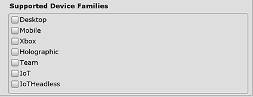


|**Setting**|**Function**|
|:---|:---|
|__Desktop__|[Windows Desktop Extension SDK API contracts for UWP](https://docs.microsoft.com/en-us/uwp/extension-sdks/windows-desktop-extension-sdk)|
|__Mobile__|[Windows Mobile Extension SDK API contracts for UWP](https://docs.microsoft.com/en-us/uwp/extension-sdks/windows-mobile-extension-sdk)|
|__Xbox__|[Xbox Live Extension SDK API contracts for UWP](https://docs.microsoft.com/en-us/uwp/extension-sdks/xbox-live-extensions)|
|__Holographic__|Hololens (self-contained, holographic computer) used for Mixed Reality apps|
|__Team__|[Windows Team Extension SDK API contracts for UWP](https://docs.microsoft.com/en-us/uwp/extension-sdks/windows-team-extension-sdk). This is commonly used for Microsoft Surface Hub devices.|
|__IoT__|[Windows IoT Extension SDK API contracts for UWP](https://docs.microsoft.com/en-us/uwp/extension-sdks/windows-iot-extension-sdk). <br />**Note** Currently, apps targeting IoT or IoTHeadless are not valid in the app store and should be used for development purposes only.|
|__IoTHeadless__|Similar to IoT but without any UI. <br />**Note** Currently, apps targeting IoT or IoTHeadless are not valid in the app store and should be used for development purposes only.|

For more information, see [Device family availability](https://docs.microsoft.com/en-us/windows/uwp/publish/device-family-availability).


<a name="XR"></a>

## XR Settings

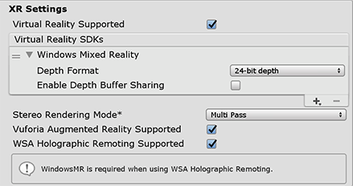 

|**_Property:_**||**_Function:_**|
|:---|:---|:---|
|__Virtual Reality Supported__|| Enable native VR support for the Unity Editor and your game builds. |
|__Virtual Reality SDKs__|| Add and remove Virtual Reality SDKs from the list. This list is only available available when the __Virtual Reality Supported__ is enabled.<br />To add an SDK to the list, click the plus (+) button.<br />To remove an SDK from the list, select it and then click the minus (-) button. <br />Some of the SDKs provide extra settings that appear here. For details, see [XR SDKs](XR-SDK_overviews). |
|__Stereo Rendering Mode__|| Choose how you want to render for a virtual reality device.  |
||_Multi Pass_| This is the normal rendering mode. Unity renders the Scene twice: first to render the left-eye image; and then again for the right-eye image. |
||_Single Pass_| Render both eye images at the same time into one packed Render Texture. This means that the whole Scene is only rendered once, which significantly reduces CPU processing time. |
||_Single Pass Instanced (Preview)_ | The GPU performs a single render pass, replacing each draw call with an instanced draw call. This heavily decreases CPU use, and slightly decreases GPU use, due to the cache coherency between the two draw calls. Using this mode significantly reduces the power consumption of your application. |
|__Vuforia Augmented Reality Supported__ || Enable this option to use Vuforia Augmented Reality SDK, which is required when using the Vuforia __Virtual Reality SDK__. |
|__WSA Holographic Remoting Supported__  || Enable this option to use WSA Holographic Remoting. To use this, you must add the Windows Mixed Reality SDK. |

<br/>


---
* <span class="page-edit">2018-10-15  <!-- include IncludeTextAmendPageSomeEdit --></span>
* <span class="page-history">Support for Universal Windows Platform streaming install added in [2018.3] (https://docs.unity3d.com/2018.3/Documentation/Manual/30_search.html?q=newin20183) <span class="search-words">NewIn20183</span></span>
