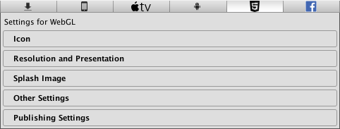
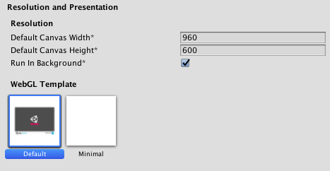
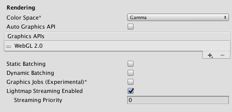
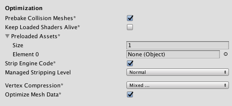

#Player settings for the WebGL platform

This page details the __Player__ settings specific to the WebGL platform. For a description of the general __Player__ settings, see [Player](class-PlayerSettings#general).

You can find documentation for the properties in the following sections:

* [Resolution and Presentation](#Resolution)
* [Other Settings](#Other)
* [Publishing Settings](#Publishing)

**Note:** Although the __Icon__ panel appears on the WebGL **Player** window, there are no icon settings because WebGL games don't use icons. Also, the only settings on the __Splash Image__ panel are the [common Splash Screen](class-PlayerSettingsSplashScreen) settings.

For more information about WebGL **Publishing Settings**, see the [WebGL Building and Running](webgl-building) page.

## Resolution and Presentation

This section allows you to customize the size and style.

### Resolution

|**Setting** |**Function** |
|:---|:---|
|__Default Canvas Width__|Set the width of the WebGL canvas element.|
|__Default Canvas Height__|Set the width of the WebGL canvas element.|
|__Run In Background__|Enable this option to allow your content to continue to run when the canvas or the browser window loses focus.|

### WebGL Template

Select a template to use for your WebGL Project:

* The __Default__ page is a simple white page with a loading bar on a grey canvas.
* The __Minimal__ page has only the necessary boilerplate code to run the WebGL content.

You can specify your own template so that you can run your game in a similar environment to the finished game. Follow the instructions in [Using WebGL Templates](webgl-templates).

##Other Settings

This section allows you to customize a range of options organized into the following groups:

* [Rendering](#Rendering)
* [Configuration](#Configuration)
* [Optimization](#Optimization)
* [Logging](#Logging) 
* [Legacy](#Legacy)

### Rendering

Use these settings to customize how Unity renders your game for the WebGL platform.

|**Property** |**Function** |
|:---|:---|
|__Color Space__|Choose which color space should be used for rendering: _Gamma_ or _Linear_.  See the [Linear rendering overview](LinearLighting) for an explanation of the difference between the two.|
|__Auto Graphics API__|Disable this option to manually pick and reorder the graphics APIs. By default this option is enabled, and Unity includes WebGL2.0, with WebGL1.0 as a fallback for devices where WebGL2.0 is not supported. |
|__Static Batching__|Enable this option to use [Static batching](DrawCallBatching).|
|__Dynamic Batching__|Enable this option to use [Dynamic Batching](DrawCallBatching) on your build (enabled by default). **Note:** Dynamic batching has no effect when a [Scriptable Render Pipeline](ScriptableRenderPipeline) is active, so this setting is only visible when nothing is set in the **Scriptable Render Pipeline Asset** [Graphics](class-GraphicsSettings#SRLoop) setting.|
|__Graphics Jobs (Experimental)__|Enable this option to instruct Unity to offload graphics tasks (render loops) to worker threads running on other CPU cores. This is intended to reduce the time spent in `Camera.Render` on the main thread, which is often a bottleneck.  **Note:** This feature is experimental. It may not deliver a performance improvement for your project, and may introduce instability. Unity currently only supports Graphics Jobs when using [Vulkan](https://www.khronos.org/vulkan/) and this setting has no effect when using [OpenGL](https://developer.android.com/guide/topics/graphics/opengl.html) ES.|
|__Lightmap Streaming Enabled__|Enable this option to load only the lightmap mip maps as needed to render the current game Cameras. This value applies to the lightmap textures as they are generated. **Note:** To use this setting, you must enable the [Texture Streaming Quality](class-QualitySettings#texStream) setting.|
|__Streaming Priority__|Set the lightmap mip map streaming priority to resolve resource conflicts. These values are applied to the light map textures as they are generated. Positive numbers give higher priority. Valid values range from -128 to 127.|

### Configuration

|**Setting** ||**Function** |
|:---|:---|:---|
|__Scripting Runtime Version__ ||Choose which .NET implementation to use in your project. For more details, see Microsoft's [.NET documentation](https://docs.microsoft.com/en-us/dotnet/).|
||_.NET 3.5 Equivalent (Deprecated)_|A .NET runtime which implements the .NET 3.5 API. This functionality is deprecated, and should no longer be used. Please use .NET 4.|
||_.NET 4.x Equivalent_|A .NET runtime which implements the .NET 4 API. This API is newer than .NET 3.5, and as such, it offers access to more APIs, is compatible with more external libraries, and supports C# 6. This is the default scripting runtime.|
|__Scripting Backend__ ||This option is not available for WebGL because WebGL always uses the [IL2CPP](IL2CPP) Scripting backend.|
|__API Compatibility Level__ ||Choose which .NET APIs you can use in your Project. This setting can affect compatibility with 3rd-party libraries. **Tip:** If you are having problems with a third-party assembly, you can try the suggestion in the [API Compatibility Level](#apiComp) section below.|
||_.Net 2.0_|Maximum .net compatibility, biggest file sizes. Part of the deprecated .NET 3.5 runtime.|
||_.Net 2.0 Subset_|Subset of full .net compatibility, smaller file sizes. Part of the deprecated .NET 3.5 runtime.|
||_.Net Standard 2.0_|Compatible with [.NET Standard 2.0](https://docs.microsoft.com/en-us/dotnet/standard/net-standard). Produces smaller builds and has full cross-platform support.|
||_.Net 4.x_|Choose this option when using libraries that access APIs not included in .NET Standard 2.0. This option is compatible with the .NET Framework 4, which includes everything in the .NET Standard 2.0 profile as well as additional APIs. Produces larger builds and any additional APIs available are not necessarily supported on all platforms. See [Referencing additional class library assemblies](dotnetProfileAssemblies) for more information.|
|__Disable HW Statistics__ ||Enable this option to instruct the application not to send information about the hardware to Unity. By default, Unity Android applications send anonymous HW statistics to Unity. This provides you with aggregated information to help you make decisions as a developer. |
|__Scripting Define Symbols__||Set custom compilation flags. For more details, see [Platform dependent compilation](PlatformDependentCompilation).|
|__Allow 'unsafe' Code__|| Enable support for compiling [‘unsafe’ C# code](https://docs.microsoft.com/en-us/dotnet/csharp/language-reference/keywords/unsafe) in a pre-defined assembly (for example, `Assembly-CSharp.dll`).  For Assembly Definition Files (`.asmdef`), click on one of your `.asmdef` files and enable the option in the Inspector window  that appears. |
|__Active Input Handling__|| Choose how you want to handle input from users. |
||_Input Manager_| Use the traditional [Input](#class-InputManager) window. |
||_Input System (Preview)_| Use the newer [Input](ScriptRef:Input.html) system. The Input System is under development. To try an early preview of the Input System, install the [InputSystem package](https://github.com/Unity-Technologies/InputSystem). If you select the __Input System (Preview)__ option without having that package installed, nothing happens except for some extra processing. |
||_Both_| Use both systems side by side. |

#### API Compatibility Level

You can choose your mono API compatibility level for all targets. Sometimes a 3rd-party .NET library uses functionality that is outside of your .NET compatibility level. In order to understand what is going on in such cases, and how to best fix it, try following these suggestions: 

1. Install [Reflector](http://www.airsquirrels.com/reflector/) for Windows. 
2. Drag the .NET assemblies for the API compatilibity level you are having issues with into Reflector. You can find these under `Frameworks/Mono/lib/mono/YOURSUBSET/`.
3. Drag in your 3rd-party assembly.
4. Right-click your 3rd-party assembly and select **Analyze**.
5. In the analysis report, inspect the **Depends on** section. The report highlights anything that the 3rd-party assembly depends on, but that is not available in the .NET compatibility level of your choice in red.

### Optimization

|**Setting** ||**Function** |
|:---|:---|:---|
|**Prebake Collision Meshes** ||Enable this option to add collision data to Meshes at build time. |
|**Keep Loaded Shaders Alive** ||Enable this option to prevent shaders from being unloaded. |
|__Preloaded Assets__ ||Set an array of Assets for the player to load on startup.  To add new Assets, increase the value of the __Size__ property and then set a reference to the Asset to load in the new __Element__ box that appears.|
|__Strip Engine Code__ ||Enable code stripping. This setting is only available with the _IL2CPP_ [Scripting Backend](#backend).  Most games don't use all necessary DLLs. With the __Strip Engine Code__ option enabled, you can strip out unused parts to reduce the size of the built player on iOS devices. If your game is using classes that would normally be stripped out by the option you currently have selected, you'll be presented with a Debug message when you make a build.|
|__Managed Stripping Level__ ||Choose how aggressively Unity strips unused managed (C#) code.  When Unity builds your game or application, the Unity Linker process can strip unused code from the managed dynamically linked libraries used in the project. Stripping code can make the resulting executable significantly smaller, but can sometimes mistakenly remove code that is actually used.|
||_Normal_ |Remove unreachable managed code to reduce build size and .NET/IL2CPP build times.|
||_Aggressive_ |Remove code more aggressively than under the normal option. Code size is further reduced, but this additional reduction may have side effects. For example, some methods may no longer be visible in the debugger and code accessed through reflection can be stripped. You can create a custom `link.xml` file to preserve specific classes and methods. See [Managed bytecode stripping with IL2CPP](IL2CPP-BytecodeStripping) for more information |
|__Vertex Compression__ ||Select which vertex channels should be compressed. For example, you can enable compression for everything except positions and lightmap UVs.  Compression can save memory and bandwidth but lowers precision. Whole Mesh compression set per imported object overrides where vertex compression is set on objects. Everything else obeys these vertex compression settings. |
|__Optimize Mesh Data__ ||Enable this option to remove any data from Meshes that is not required by the Material applied to them (such as tangents, normals, colors, and UVs).|

### Logging

Select what type of logging to allow in specific contexts.

 Check one box that corresponds to each Log Type (__Error__, __Assert__, __Warning__, __Log__, and __Exception__) when running scripts (__ScriptOnly__) , all the time (__Full__), or never (__None__).

### Legacy

Enable the __Clamp BlendShapes (Deprecated)__ option to clamp the range of Blend Shape weights in [SkinnedMeshRenderers](class-SkinnedMeshRenderer).

##Publishing settings

|**Setting** |**Function** |
|:---|:---|
|__Memory Size__ |Set the memory available to the WebGL runtime, given in megabytes. You should choose this value carefully: if it is too low, you will get out-of-memory errors because your loaded content and scenes won't fit into the available memory. However, if you request too much memory then some browser/platform combinations might not be able to provide it and consequently fail to load the player. See [Memory in WebGL](webgl-memory) for details. |
|__Enable Exceptions__|Choose how to handle unexpected code behavior (generally considered errors) at run time. The options are: _None_, _Explicitly Thrown Exceptions Only_, _Full Without Stacktrace_, and _Full With Stacktrace_. See the [Building and running a WebGL project](webgl-building) page for details. |
|__Compression Format__|Choose the compression format to use for release build files. The options are: _Gzip_, _Brotli_, or _Disabled_ (none). Note that this option does not affect development builds. |
|__Name Files As Hashes__|Enable this option to use an MD5 hash of the uncompressed file contents as a filename for each file in the build.|
|__Data caching__|Enable this option to automatically cache your contents Asset data on the user's machine so it doesn't have to be re-downloaded on subsequent runs (unless the contents have changed).  Caching is implemented using the IndexedDB API provided by the browser. Some browsers may implement restrictions around this, such as asking the user for permission to cache data over a specific size.|
|__Debug Symbols__|Enable this option to preserve debug symbols and perform demangling of the stack trace when an error occurs. For release builds, all the debug information is stored in a separate file which is downloaded from the server on demand when an error occurs. Development builds always have demangling support embedded in the main module and therefore are not affected by this option.|
|__Linker Target__|Choose the build type to generate: _asm.js_,  _WebAssembly_, or _Both_. __asm.js__ is widely supported across browsers, while __WebAssembly__ is a new and efficient format for the web. If you choose _Both_, Unity generates both WebAssembly and asm.js formats. Then at run time, WebAssembly is used if it's supported by the browser; otherwise it falls back to asm.js.|

---

* .Net 3.5 scripting runtime deprecated in Unity [2018.3](../Manual/30_search.html?q=newin20183) NewIn20183

* 2018-08-16  <!-- include IncludeTextAmendPageNoEdit -->

* Publishing settings updated in Unity [2017.3](https://docs.unity3d.com/2017.3/Documentation/Manual/30_search.html?q=newin20171) NewIn20173
* Allow 'unsafe' code checkbox added in Unity 2018.1
* .NET 4.x runtime added in 2018.1
