#Player settings for the iOS platform

This page details the __Player__ settings specific to iOS. For a  description of the general __Player__ settings, see [Player](class-PlayerSettings#general) settings.

**Note:** Unity iOS requires iOS 7.0 or higher. Unity does not support iOS 6.0 or earlier versions.

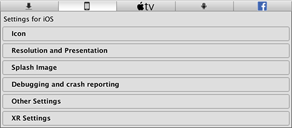

You can find documentation for the properties in the following sections:

* [Icon](#Icon)
* [Resolution and Presentation](#Resolution)
* [Splash Image](#Splash)
* [Debugging and crash reporting](#Debugging)
* [Other Settings](#Other)
* [XR Settings](#XR)

##Icon

Use the **Icon** settings to customize the branding for your app on the Apple Store.

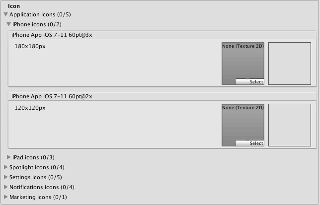 

**Note**: If any icon textures are omitted, the icon texture with the nearest size is scaled accordingly (with a preference towards larger resolution textures).

|**Setting** |**Function** |
|:---|:---|
|__Application icons__ |Assign the custom icon that you would like to appear on your app for each iOS device. |
|__Spotlight icons__ |Assign the custom icon that you would like to appear in the Spotlight search results for your game for each iOS device.|
|__Settings icons__ |Assign the custom icon that you would like to appear on the phone’s main Settings page for each iOS device.|
|__Notification icons__ |Assign the custom icon that you would like to appear when sending notifications from your game for each iOS device.|
|__Marketing icons__ |Assign the custom icon that you would like to appear for your game in the App Store for each iOS device.|

##Resolution and Presentation

Use the __Resolution and Presentation__ section to customize aspects of the screen's appearance:

* [Resolution Scaling](#Scaling)
* [Orientation](#Orientation)
* [Allowed Orientations for Auto Rotation](#supportedOris)
* [Multitasking Support](#Multitasking)
* [Status Bar](#Status)

### Resolution Scaling

The __Resolution Scaling Mode__ allows you to set the scaling to be equal to or below the native screen resolution:

|**Value** |**Function** |
|:---|:---|
| __FixedDPI__ |Allows you to scale the device’s screen resolution below its native resolution and show the __Target DPI__ property. Use this to optimize performance and battery life or target a specific DPI setting. |
|__Disabled__|Ensures that scaling is not applied and the game renders to its native screen resolution. |

Set the __Target DPI__ of the game screen. Unity downscales the game screen to match this setting if the device's native screen DPI is higher than this value. The scale is calculated as `min(Target DPI * Factor / Screen DPI, 1)`. The __Factor__ is controlled by the __Resolution Scaling Fixed DPI Factor__ on the [Quality](class-QualitySettings) settings.

**Note:** This option only appears when the __Resolution Scaling Mode__ is set to __Fixed DPI__.

### Orientation

Choose the game's screen orientation from the __Default Orientation__ drop-down menu: 

|**Setting** |**Function** |
|:---|:---|
|__Portrait__|Home button appears at the bottom. |
|__Portrait Upside Down__|Home button appears at the top. |
|__Landscape Left__|Home button appears on the right side. |
|__Landscape Right__|Home button appears on the left side. |
|__Auto Rotation__|Screen orientation changes with device orientation. This is the default.|

**Note:** This setting is shared between iOS and Android devices.

When you set the orientation to __Auto Rotation__, the __Allowed Orientations for Auto Rotation__ section appears.

Enable the __Use Animated Autorotation__ setting if you want orientation changes to animate the screen rotation rather than just switch. This is only visible when __Default Orientation__ is set to __Auto Rotation__.

### Allowed Orientations for Auto Rotation

This section is only visible when __Default Orientation__ is set to __Auto Rotation__. 

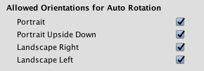

Because __Auto Rotation__ changes screen orientation to match the device, you may want to limit the screen orientations allowed (for example, locking a device to landscape). 

Enable each orientation you want to allow by checking its box in this section:

|**Setting** |**Function** |
|:---|:---|
|__Portrait__ |Allow portrait orientation. |
|__Portrait Upside Down__|Allow portrait upside-down orientation. |
|__Landscape Right__|Allow landscape right orientation (home button on the **left** side).|
|__Landscape Left__|Allow landscape left orientation (home button is on the **right** side). |

### Multitasking Support

Enable the __Requires Fullscreen__ option if your game needs to run in Fullscreen mode.

### Status Bar

|**Setting** |**Function** |
|:---|:---|
|__Status Bar Hidden__ |Enable this option to hide the the status bar when the application launches.|
|__Status Bar Style__ |Define the style of the status bar when the application launches. The options are __Default__, __Black Translucent__ and __Black Opaque__. |
|__Disable Depth and Stencil__ |Enable this option to disable the depth and stencil buffers. |
|__Show Loading Indicator__|Select how the loading indicator should appear. The options are __Don't Show__, __White Large__, __White__, and __Gray__. |

##Splash Image

Above the [common Splash Screen](class-PlayerSettingsSplashScreen) settings, the **Player** settings allow you to specify splash images for the iOS platform.

Use the __Virtual Reality Splash Image__ property to select a custom splash image to be displayed in [Virtual Reality](XR) displays.

Below the common Splash Screen settings, you can enable the __Use Storyboard for Launch__ to show the __Custom Storyboard__ button. 

Click the button to select a storyboard to show when your game starts up on the device. For your storyboard to appear here, you first need to create the storyboard in Xcode and copy it to your Project.

Alternatively, you can leave the __Use Storyboard for Launch__ option disabled and implement splash images with one of these methods: [Launch Screens](#LaunchScreens) or [Legacy Launch Images](#LaunchImages).

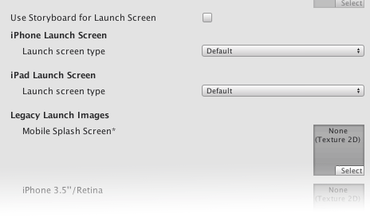

###Launch Screens
A __Launch Screen__ is an XIB file from which iOS creates a splash screen dynamically on the device. However, there are some limitations:

* You can't display different content depending on iPad device orientation. 

* All iPhones support landscape __Launch Screens__; however, due to a bug in iOS, __Landscape Left__ is shown instead of __Landscape Right__ on certain iOS versions. 

Each the __iPhone Launch Screen__ and __iPad Launch Screen__ sections allow you to select the launch screen type from the __Launch Screen type__ drop-down menu:

|**Value** |**Function** |
|:---|:---|
| __Default__ |A launch screen that is very much like a launch image. One image is selected for portrait and landscape. The selection order: iPhone 6+ launch images, shared mobile launch image, default Unity launch image for iPhone 6+. The images are displayed using aspect-fill mode.|
| __None__ |The behavior is as if only launch images are used.|
| __Image and background (relative size)__ |Displays a center-aligned image, with the rest of area filled with solid color. The image size is user-specified percentage of the screen size, computed in the smaller dimension (vertical on landscape, horizontal in portrait orientations). User also specifies background color and images for portrait and landscape orientations. Image selection order: the user-specified image, shared mobile launch image, default Unity launch image for iPhone 6+. The images are displayed using aspect-fill mode.|
| __Image and background (constant size)__ |Same as relative size option except that the size of the image is defined by user-specified number of points.|
| **Custom XIB** |A user-specified XIB file from any location.|

**Note:** In Unity Personal Edition the [Unity Splash Screen](class-PlayerSettingsSplashScreen) displays as soon as engine initializes, in addition to your chosen splash screen.

### Legacy Launch Images

__Launch Images__ are static splash screen images that occupy the entire screen. You can define them in an Asset catalog (`Images.xcassets/LaunchImage`). Always add a __Launch Screen__ for each supported size and orientation combination:

|**Setting** |**Function** |
|:---|:---|
|__Mobile Splash Screen__|Specifies texture which should be used for iOS Splash Screen. Standard Splash Screen size is 320x480.(This is shared between Android and iOS.)|
|__iPhone 3.5\"/Retina__|Specifies texture which should be used for iOS 3.5\" Retina Splash Screen. Splash Screen size is 640x960.|
|__iPhone 4\"/Retina__|Specifies texture which should be used for iOS 4\" Retina Splash Screen. Splash Screen size is 640x1136.|
|__iPhone 4.7\"/Retina__|Specifies texture which should be used for iOS 4.7\" Retina Splash Screen. Splash Screen size is 750x1334.|
|__iPhone 5.5\"/Retina__|Specifies texture which should be used for iOS 5.5\" Retina Splash Screen. Splash Screen size is 1242x2208.|
|__iPhone 5.5\" Landscape/Retina__|Specifies texture which should be used for iOS 5.5\" Landscape/Retina Splash Screen. Splash Screen size is 2208x1242.|
|__iPhone X\Retina__|Specifies texture which should be used for iPhone X Retina Splash Screen. Splash Screen size is 1125x2436.|
|__iPhone X Landscape\Retina__|Specifies texture which should be used for iPhone X Landscape/Retina Splash Screen. Splash Screen size is 2436x1125.|
|__iPad Portrait__|Specifies texture which should be used as iPad Portrait orientation Splash Screen. Standard Splash Screen size is 768x1024.|
|__iPad Landscape__|Specifies texture which should be used as iPad Landscape orientation Splash Screen. Standard Splash Screen size is 1024x768.|
|__iPad Portrait/Retina__|Specifies texture which should be used as the iPad Retina Portrait orientation Splash Screen. Standard Splash Screen size is 1536x2048.|
|__iPad Landscape/Retina__|Specifies texture which should be used as the iPad Retina Landscape orientation Splash Screen. Standard Splash Screen size is 2048x1536.|

Only iPhone 6+ supports landscape orientation; other iPhones can only use portrait. 

Launch Images are selected in the following order:

* The specific __Launch Image__ override, if the texture is set
* Default Unity splash screen launch image, which is a solid blue-black color

You need to set all __Launch Images__ for your build.

##Debugging and crash reporting

|**Setting** |**Function** |
|:---|:---|
|**Enable Internal Profiler (Deprecated)** |Enables an internal profiler which collects performance data of the application and prints a report to the console. The report contains the number of milliseconds that it took for each Unity subsystem to execute on each frame. The data is averaged across 30 frames. |
|__On .Net UnhandledException__ |The action taken on .NET unhandled exception. The options are __Crash__ (the application crashes hardly and forces iOS to generate a crash report that can be submitted to iTunes by app users and inspected by developers), __Silent Exit__ (the application exits gracefully). |
|__Log Obj-C Uncaught Exceptions__ |Enables a custom Objective-C Uncaught Exception handler, which prints exception information to console. |
|__Enable Crash Report API__|Enables a custom crash reporter to capture crashes. Crash logs are available to scripts via CrashReport API. |

##Other Settings

This section allows you to customize a range of options organized into the following groups:

* [Rendering](#Rendering)
* [Identification](#Identification)
* [Configuration](#Configuration)
* [Optimization](#Optimization)
* [Logging](#Logging) 
* [Legacy](#Legacy)

### Rendering

Use these settings to customize how Unity renders your game for the iOS platform.

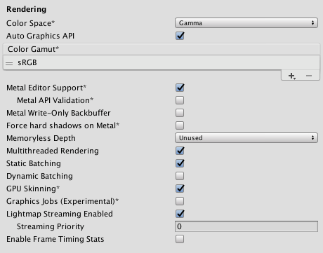

|**Setting**||**Function** |
|:---|:---|:---|
|__Color Space__||Choose which color space should be used for rendering: _Gamma_ or _Linear_.  See the [Linear rendering overview](LinearLighting) for an explanation of the difference between the two. |
|__Auto Graphics API__||Disable this option to manually pick and reorder the graphics APIs. By default this option is enabled, and Unity includes Metal, and GLES2 as a fallback for devices where Metal is not supported. |
|__Color Gamut__||You can add or remove [color gamuts](https://color.viewsonic.com/zh-cn/explore/content/Color-gamut_6.html) for the iOS platform to use for rendering. Click the plus (+) icon to see a list of available gamuts. A color gamut defines a possible range of colors available for a given device (such as a monitor or screen). The sRGB gamut is the default (and required) gamut. When targeting recent iOS devices with wide color gamut displays, use __DisplayP3__ to utilize full display capabilities. Use __Metal Editor Support__ as a fallback for older devices. |
|__Metal Editor Support__||Enable this option to use the Metal API in the Unity Editor and unlock faster Shader iteration for targeting the Metal API. |
|__Metal API Validation__||Enable this option when you need to debug Shader issues. **Note:** Validation increases CPU usage, so use it only for debugging. |
|__Metal Write-Only Backbuffer__||Allow improved performance in non-default device orientation. This sets the frameBufferOnly flag on the back buffer, which prevents readback from the back buffer but enables some driver optimization. |
|__Force hard shadows on Metal__||Enable this option to force Unity to use point sampling for shadows on Metal. This reduces shadow quality, which should give better performance. |
|__Memoryless Depth__||Choose when to use [memoryless render textures](ScriptRef:RenderTextureMemoryless.Depth.html). Memoryless render textures are temporarily stored in the on-tile memory when rendered, not in CPU or GPU memory. This reduces memory usage of your app but you cannot read or write to these render textures. **Note:** Memoryless render textures are only supported on iOS, tvOS 10.0+ Metal and Vulkan. Render textures are read/write protected and stored in CPU or GPU memory on other platforms. |
||__Unused__|Never use memoryless framebuffer depth.                     |
||__Forced__|Always use memoryless framebuffer depth.                    |
||__Automatic__|Let Unity decide when to use memoryless framebuffer depth.|
|__Multithreaded Rendering__|| Enable this option to use multithreaded rendering. This is only supported on Metal. |
|__Static Batching__||Enable this option to use [Static batching](DrawCallBatching).|
|__Dynamic Batching__||Enable this option to use [Dynamic Batching](DrawCallBatching) on your build (enabled by default). **Note:** Dynamic batching has no effect when a [Scriptable Render Pipeline](ScriptableRenderPipeline) is active, so this setting is only visible when nothing is set in the **Scriptable Render Pipeline Asset** [Graphics](class-GraphicsSettings#SRLoop) setting.|
|__GPU Skinning__||Enable this option to use DX11/ES3 GPU skinning. To learn more about GPU skinning, see the [Wikipedia page on skeletal animation](https://en.wikipedia.org/wiki/Skeletal_animation).|
|__Graphics Jobs (Experimental)__||Enable this option to instruct Unity to offload graphics tasks (render loops) to worker threads running on other CPU cores. This is intended to reduce the time spent in `Camera.Render` on the main thread, which is often a bottleneck.  **Note:** This feature is experimental. It may not deliver a performance improvement for your project, and may introduce instability. Unity currently only supports Graphics Jobs when using [Vulkan](https://www.khronos.org/vulkan/) and this setting has no effect when using [OpenGL](https://developer.android.com/guide/topics/graphics/opengl.html) ES.|
|__Lightmap Streaming Enabled__||Enable this option to load only the lightmap mip maps as needed to render the current game Cameras. This value applies to the lightmap textures as they are generated. **Note:** To use this setting, you must enable the [Texture Streaming Quality](class-QualitySettings#texStream) setting.|
|__Streaming Priority__||Set the lightmap mip map streaming priority to resolve resource conflicts. These values are applied to the light map textures as they are generated. Positive numbers give higher priority. Valid values range from -128 to 127.|
|__Enable Frame Timing Stats__||Enable this option to gather CPU/GPU frame timing statistics.|

### Identification

|**Setting** |**Function** |
|:---|:---|
|__Bundle Identifier__ |Enter the provisioning profile of the game or product you are building. The basic structure of the identifier is __com.CompanyName.ProductName__. This structure may vary internationally based on where you live, so always default to the string provided to you by Apple for your Developer Account. Your ProductName is set up in your provisioning certificates. This value appears as `CFBundleIdentifier` in the associated *info.plist* file. See the Apple developer documentation on [CFBundleIdentifier](https://developer.apple.com/library/content/documentation/General/Reference/InfoPlistKeyReference/Articles/CoreFoundationKeys.html#/apple_ref/doc/uid/20001431-102070) to learn more.  **Note:** This is shared between iOS, tvOS and Android. |
|__Version__ |Enter the release-version-number string for the bundle (for example, 4.3.6). This appears as `CFBundleShortVersionString` in the associated *info.plist* file. See the Apple developer documentation on [CFBundleShortVersionString](https://developer.apple.com/library/archive/documentation/General/Reference/InfoPlistKeyReference/Articles/CoreFoundationKeys.html#//apple_ref/doc/uid/20001431-102364) to learn more. |
|__Build__ |Enter the build number for this version of your app. This appears as `CFBundleVersion` in the associated *info.plist* file.  See the Apple developer documentation on [CFBundleVersion](https://developer.apple.com/library/archive/documentation/General/Reference/InfoPlistKeyReference/Articles/CoreFoundationKeys.html#//apple_ref/doc/uid/20001431-102364) to learn more. |
|__Signing Team ID__ |Enter your Apple Developer Team ID. You can find this on the Apple Developer website under [Xcode Help](https://help.apple.com/xcode/mac/current/#/devaf282080a?sub=dev8877b4398). This sets the Team ID for the generated Xcode project, allowing developers to use the Build and Run functionality. An Apple Developer Team ID must be set here for automatic signing of your app. For more information, see [Creating Your Team Provisioning Profile](https://help.apple.com/xcode/mac/current/#/dev60b6fbbc7).|
|__Automatically Sign__ |Enable this option to allow Xcode to automatically sign your build.|

### Configuration

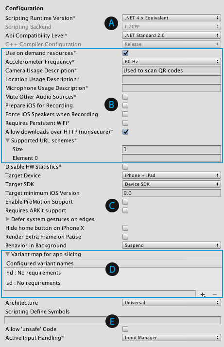

 [API configuration settings](#Config-API)

 [Apple-specific information](#Config-Apple)

 [Device information](#Config-Device)

 [Variant map for app slicing](#Config-Variant)

 [Other configuration settings](#Config-Other)

#### API configuration settings

|**Setting** ||**Function** |
|:---|:---|:---|
|__Scripting Runtime Version__ ||Choose which .NET runtime to use in your project. For more details, see Microsoft's [.NET documentation](https://docs.microsoft.com/en-us/dotnet/).|
||_.NET 3.5 Equivalent (Deprecated)_|A .NET runtime which implements the .NET 3.5 API. This functionality is deprecated, and should no longer be used. Please use .NET 4.|
||_.NET 4.x Equivalent_|A .NET runtime which implements the .NET 4 API. This API is newer than .NET 3.5, and as such, it offers access to more APIs, is compatible with more external libraries, and supports C# 6. This is the default scripting runtime.|
|__Scripting Backend__ ||The scripting backend determines how Unity compiles and executes C# code in your Project. This setting is not enabled for iOS. |
||_Mono_|To use incremental builds, choose the __Append__ option after selecting __Build__ from the __Build Settings__ dialog. The __Replace__ option will perform a clean build.Compiles C# code into .NET Common Intermediate Language (CIL) and executes that CIL using a Common Language Runtime.  **Warning:** Mono builds are no longer accepted in the Apple App store and Mono is not supported by iOS 11 and above. Mono can only be selected when using the deprecated .NET 3.5 runtime.|
||_IL2CPP_|Compiles C# code into CIL, converts the CIL to C++ and then compiles that C++ into native machine code, which executes directly at run time. See [IL2CPP](IL2CPP) for more information. **Tip:** The C++ code generated by the IL2CPP scripting backend can be updated incrementally, allowing incremental C++ build systems to compile only the changes source files. This can significantly lower iteration times.|
|__API Compatibility Level__ ||The compatibility level determines which .NET APIs you can use in your Project. This setting can affect compatibility with 3rd-party libraries. **Tip:** If you are having problems with a third-party assembly, you can try the suggestion in the [API Compatibility Level](#apiComp) section below.|
||*.Net 2.0* |Maximum .net compatibility, biggest file sizes. Part of the deprecated .NET 3.5 runtime.|
||*.Net 2.0 Subset* |Subset of full .net compatibility, smaller file sizes. Part of the deprecated .NET 3.5 runtime.|
||*.Net Standard 2.0* |Compatible with [.NET Standard 2.0](https://docs.microsoft.com/en-us/dotnet/standard/net-standard). Produces smaller builds and has full cross-platform support.|
||*.Net 4.x* |Choose this option when using libraries that access APIs not included in .NET Standard 2.0. Compatible with the .NET Framework 4 (which includes everything in the .NET Standard 2.0 profile as well as additional APIs).  Produces larger builds and any additional APIs available are not necessarily supported on all platforms. See [Referencing additional class library assemblies](dotnetProfileAssemblies) for more information. |
|__C++ Compiler Configuration__ ||Choose the C++ compiler configuration used when compiling IL2CPP generated code. This setting is not enabled for iOS.|

##### API Compatibility Level

You can choose your mono API compatibility level for all targets. Sometimes a 3rd-party .NET library uses functionality that is outside of your .NET compatibility level. In order to understand what is going on in such cases, and how to best fix it, try following these suggestions: 

1. Install [Reflector](http://www.airsquirrels.com/reflector/) for Windows. 
2. Drag the .NET assemblies for the API compatilibity level you are having issues with into Reflector. You can find these under `Frameworks/Mono/lib/mono/YOURSUBSET/`.
3. Drag in your 3rd-party assembly.
4. Right-click your 3rd-party assembly and select **Analyze**.
5. In the analysis report, inspect the **Depends on** section. The report highlights anything that the 3rd-party assembly depends on, but that is not available in the .NET compatibility level of your choice in red.

#### Apple-specific information

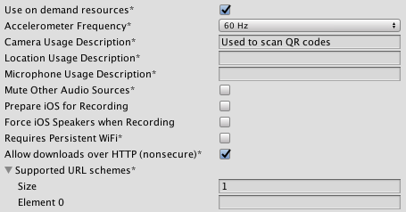

|**Setting** |**Function** |
|:---|:---|
|__Use on Demand Resource__ |Enable this option to use on-demand resources. When enabled, the [Variant map for app slicing](#Config-Variant) section appears.|
|__Accelerometer Frequency__|Define how often to sample the accelerometer. If you choose _Disabled_, then no samples are taken. Otherwise, you can choose from _15Hz_, _30Hz_, _60Hz_ and _100Hz_ frequencies. |
|__Camera Usage Description__ |Enter the reason for accessing the camera on the iOS device.|
|__Location Usage Description__ |Enter the reason for accessing the location of the iOS device.|
|__Microphone Usage Description__ |Enter the reason for accessing the microphone on the iOS device.|
|__Mute Other Audio Sources__|Enable this option if you want your Unity application to stop Audio from applications running in the background. Otherise, Audio from background applications continues to play alongside your Unity application.|
|__Prepare iOS for Recording__|Enable this option to initialize the microphone recording APIs. This makes recording latency lower, though on iPhones it re-routes audio output via earphones only.|
|__Force iOS Speakers when Recording__|Enable this option to send the phone output through the internal speakers, even when headphones are plugged in and recording.|
|__Requires Persistent WiFi__ |Enable this option to require a Wi-Fi connection. iOS maintains the active Wi-Fi connection while the application is running.|
|__Allow downloads over HTTP (nonsecure)__|Enable this option to allow downloading content over HTTP. Default and recommended is HTTPS.|
|__Supported URL schemes__|A list of [supported URL schemes](https://developer.apple.com/library/ios/documentation/iPhone/Conceptual/iPhoneOSProgrammingGuide/Inter-AppCommunication/Inter-AppCommunication.html#/apple_ref/doc/uid/TP40007072-CH6-SW1). To add new schemes, increase the value of the __Size__ property and then set a reference to the Asset to load in the new __Element__ box that appears. |

#### Device information

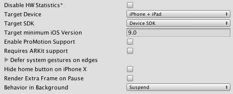

|**Setting** ||**Function** |
|:---|:---|:---|
|__Disable HW Statistics__ ||Enable this option to instruct the application not to send information about the hardware to Unity. For more details, see [Unity Hardware Statistics](http://hwstats.unity3d.com/).|
|__Target Device__ ||Select which devices the game targets. The choices are _iPhone Only_, _iPad Only_, and _iPhone + iPad_. |
|__Target SDK__ ||Select which SDK the game targets. The choices are _Device SDK_ and _Simulator SDK_. **Note:** Be sure to select the correct SDK. For example, if you select the Device SDK but then target the Simulator in Xcode then the build will fail with a lot of error messages. |
|__Target minimum iOS Version__ ||Defines the minimum version of iOS that the game works on.|
|__Enable ProMotion Support__ ||Enable this option to allow high frequency refresh rates (120 Hz) on ProMotion displays. Enabling this setting might affect battery life.|
|__Requires ARKit support__ ||Enable this option to restrict the app to iPhone 6s/iOS 11 or newer devices when publishing to the App Store.|
|__Defer system gestures on edges__ ||Enable which edges that users must swipe twice to enact system gestures: _Top Edge_, _Left Edge_, _Bottom Edge_, and _Right Edge_|
|__Hide home button on iPhone X__ ||Enable this option to hide the home button on iPhone X devices when the app is running.|
|__Render Extra Frame on Pause__ ||Enable this option to issue an additional frame after the frame when the app is paused. This allows your app to show graphics that indicate the paused state when the app is going into the background.|
|__Behavior in Background__ ||Choose what the application should do when the user presses the home button.|
||_Custom_ |You can implement your own behaviour with background processing. For an example, see the [BackgroundFetch](https://bitbucket.org/Unity-Technologies/iosnativecodesamples/src/ae6a0a2c02363d35f954d244a6eec91c0e0bf194/NativeIntegration/BackgroundTasks/BackgroundFetch/?at=5.0-dev) Bitbucket project. |
||_Suspend_ |Suspend the app but don't quit. This is the default behavior.|
||_Exit_ |Instead of suspending, let the app quit when the user presses the home button.|

#### Variant map for app slicing section

Expand the __Variant map for app slicing__ section to see the list of variant names configured in scripting. For more information on variants, see [App slicing](AppThinning#AppSlicing). 

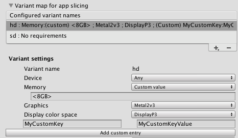

**Note:** If you don't see the section, make sure the [Use on Demand Resource](#on-demand) property is enabled.

You can add and remove new variants with the plus (+) and minus (-) icons. You can also select a variant from the list and see or modify its settings under __Variant settings__:

|**Setting** |**Function** |
|:---|:---|
|__Variant name__|Displays the name of the variant from the loading script. For any of these settings, if you choose _Custom value_, an additional property appears underneath where you can enter your own value to use. |
|__Device__|Choose which device this variant targets. Options include _Any_ (the default), _iPhone_, _iPad_, _iWatch_, and _Custom value_. |
|__Memory__|Choose the minimum memory required for this variant. Options include _Any_ (the default), _1GB_, _2GB_, _3GB_, _4GB_, and _Custom value_.|
|__Graphics__|Choose the [Metal framework](https://developer.apple.com/documentation/metal) to use. Options include _Any_ (the default), _Metal1v2_, _Metal2v2_, _Metal2v3_, _Metal3v1_, _Metal3v2_, _Metal4v1_, and _Custom value_.|
|__Display color space__|Choose the color gamut to use. Options include _Any_ (the default), _sRGB_, _DisplayP3_, and _Custom value_.|

You can also add your own setting. Click the __Add custom entry__ button and a new pair of text boxes appear. Enter the name of the setting in the box displaying &lt;*key&gt;* and the value you want to use in the box displaying *&lt;value&gt;*. 

#### Other configuration settings

|**Setting** ||**Function** |
|:---|:---|:---|
|__Architecture__||Choose which architecture to target.|
||__Universal__ | Support all architectures. This is the recommended option. |
||__Armv7__ | Support only the older 32-bit ARM architecture. |
||__Arm64__ | Support only the newer 64-bit ARM architecture. You might want to consider selecting this option if your app is only for high-end devices. |
||__x86_64__ | Support the x86_64 Intel architecture. This is the only architecture available for __Simulator SDK__. |
|__Scripting Define Symbols__||Set custom compilation flags. For more details, see [Platform dependent compilation](PlatformDependentCompilation).|
|__Allow 'unsafe' Code__|| Enable support for compiling [‘unsafe’ C# code](https://docs.microsoft.com/en-us/dotnet/csharp/language-reference/keywords/unsafe) in a pre-defined assembly (for example, `Assembly-CSharp.dll`).  For Assembly Definition Files (`.asmdef`), click on one of your `.asmdef` files and enable the option in the Inspector window that appears. |
|__Active Input Handling__|| Choose how you want to handle input from users. |
||__Input Manager__| Use the traditional [Input](#class-InputManager) settings. |
||__Input System (Preview)__| Use the newer [Input](ScriptRef:Input.html) system. The Input System is under development. To try an early preview of the Input System, install the [InputSystem package](https://github.com/Unity-Technologies/InputSystem). If you select the __Input System (Preview__ option without having that package installed, nothing happens except for some extra processing. |
||__Both__| Use both systems side by side. |

### Optimization

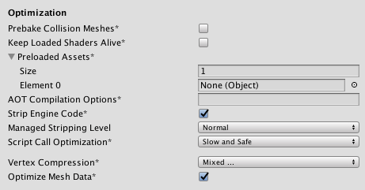

|**Setting** ||**Function** |
|:---|:---|:---|
|**Prebake Collision Meshes**||Enable this option to add collision data to Meshes at build time. |
|**Keep Loaded Shaders Alive**||Enable this option to prevent shaders from being unloaded. |
|__Preloaded Assets__||Set an array of Assets for the player to load on startup.  To add new Assets, increase the value of the __Size__ property and then set a reference to the Asset to load in the new __Element__ box that appears.|
|__AOT compilation options__ ||Additional options for Ahead of Time (AOT) compilation. This helps [optimize the size of the built iOS player](iphone-playerSizeOptimization).|
|__Strip Engine Code__ ||Enable this tool if you want the Unity Linker tool to remove code for Unity Engine features that your Project does not use. This setting is only available with the _IL2CPP_ [Scripting Backend](#backend).  Most games don't use all necessary DLLs. With the __Strip Engine Code__ option enabled, you can strip out unused parts to reduce the size of the built player on iOS devices. If your game is using classes that would normally be stripped out by the option you currently have selected, you'll be presented with a Debug message when you make a build.|
|__Managed Stripping Level__||Choose how aggressively Unity strips unused managed (C#) code. When Unity builds your game or application, the Unity Linker process can strip unused code from the managed dynamically linked libraries used in the Project. Stripping code can make the resulting executable significantly smaller, but can sometimes mistakenly remove code that is actually used. This setting allows you to choose how aggressively Unity should remove unused code.|
||*Normal*|Remove unreachable managed code to reduce build size and .NET/IL2CPP build times.|
||*Aggressive*|Remove code more aggressively than under the normal option. Code size is further reduced, but this additional reduction may have side effects. For example, some methods may no longer be visible in the debugger and code accessed through reflection can be stripped. You can create a custom `link.xml` file to preserve specific classes and methods. See [Managed bytecode stripping with IL2CPP](IL2CPP-BytecodeStripping) for more information. |
|__Script Call Optimization__ ||Choose how to optionally disable exception handling for a speed boost at runtime. See [iOS Optimization](iphone-iOS-Optimization) for details.|
||*Slow and Safe* |Use full exception handling (with some performance impact on the device when using the Mono scripting backend). |
||*Fast but no Exceptions* |No data provided for exceptions on the device (the game runs faster when using the Mono scripting backend). **Note**: Using this option with the _IL2CPP_ [Scripting Backend](#backend) does not impact performance; however, using it can avoid undefined behavior on release builds. |
|__Vertex Compression__||Set vertex compression per channel. For example, you can enable compression for everything except positions and lightmap UVs. Whole Mesh compression set per imported object overrides where vertex compression is set on objects. Everything else obeys these vertex compression settings. |
|__Optimize Mesh Data__||Enable this option to remove any data from Meshes that is not required by the Material applied to them (such as tangents, normals, colors, and UVs).|

### Logging

Select what type of logging to allow in specific contexts.

 Check one box that corresponds to each Log Type (__Error__, __Assert__, __Warning__, __Log__, and __Exception__) when running scripts (__ScriptOnly__) , all the time (__Full__), or never (__None__).

### Legacy

Enable the __Clamp BlendShapes (Deprecated)__ option to clamp the range of Blend Shape weights in [SkinnedMeshRenderers](class-SkinnedMeshRenderer).

##XR Settings

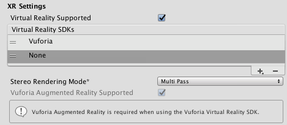 

|**Setting** ||**Function** |
|:---|:---|:---|
|__Virtual Reality Supported__||Enable this if your application is a virtual reality application, then add the required VR SDKs to the list.|
|__Virtual Reality SDKs__||Add and remove Virtual Reality SDKs from the list. This list is only available available when the __Virtual Reality Supported__ is enabled. To add an SDK to the list, click the plus (+) button. To remove an SDK from the list, select it and then click the minus (-) button.  Some of the SDKs provide extra settings that appear here. For details, see [XR SDKs](XR-SDK_overviews).|
|__Stereo Rendering Mode__||Choose how you want to render for a virtual reality device.|
||__Multi Pass__|This is the normal rendering mode. Unity renders the Scene twice: first to render the left-eye image; and then again for the right-eye image.|
||__Single Pass__|Render both eye images at the same time into one packed Render Texture. This means that the whole Scene is only rendered once, which significantly reduces CPU processing time.|
|__Vuforia Augmented Reality Supported__||Enable this option to use Vuforia Augmented Reality SDK, which is required when using the Vuforia __Virtual Reality SDK__.|

### XR Support Installers

You can click the __Vuforia Augmented Reality__ link to enable the [Vuforia Software Development Kit](vuforia-sdk-overview). You must have a Vuforia Software License and agree to the terms of that license before the __Vuforia Augmented Reality Supported__ property is enabled.

 

---
* 2018-08-16  <!-- include IncludeTextAmendPageYesEdit -->

* Mute Other Audio Sources added in 5.5

* iOS Player Settings documentation updated in Unity 2018.1

* Allow 'unsafe' Code checkbox added in Unity 2018.1

* .NET 4.x runtime added in 2018.1

* .Net 3.5 scripting runtime deprecated in Unity [2018.3](../Manual/30_search.html?q=newin20183) NewIn20183

* Minimum iOS version increased to 9 in Unity [2018.3](../Manual/30_search.html?q=newin20183) NewIn20183
