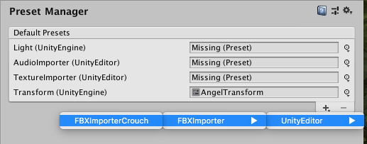

# Preset Manager

Use [Presets](Presets) to specify default properties for new components and Assets. You cannot set the default properties for Settings windows.

When you add a component to a GameObject or a new Asset to your Project, Unity uses a default Preset to set the properties of the new item. Default Presets override the Unity factory default settings.

Unity also uses default Presets when you use the __Reset__ command in the Component Context Menu in the [Inspector](UsingTheInspector) window.

For [Transform components](class-Transform), Unity does not use the position in a default Preset when you add a new GameObject to a scene. In this case, the default position is the middle of the [Scene](UsingTheSceneView) view. Use the __Reset__ command to apply the position, as well as the rotation and scale, of a default Preset for a Transform.

## Specifying a Preset to use for default settings

You can specify a Preset to use for default settings with the __Inspector__ window, the __Preset Manager__, or by dragging and dropping.

To specify default settings with the __Inspector__ window:

1. Select a Preset in the __Project__ window.

2. In the __Inspector__ window, click __Set as Default__.

To specify default settings with the __Preset Manager__:

1. If you don’t already have a Preset in your project to use for default settings, [create one](Presets).

2. Open the Preset Manager by choosing __Edit > Project Settings__, then selecting the __Preset Manager__ category.

3. Click __+__ and select the item that you want to use with a default Preset. A default Preset for the selected item appears in the __Preset Manager__ list.

Drag and drop a Preset from the __Project__ window to the __Preset Manager__ to add a new default Preset or change an existing default Preset.

## Changing and removing default Presets

Use __Preset Manager__ to change a default Preset. You can also drag and drop a Preset from the __Project__ window to the __Preset Manager__ to change an existing default Preset.

There are two ways to remove a default Preset: from __Preset Manager__ or from the [Inspector](UsingTheInspector) window.

To change a default Preset in __Preset Manager__:

1. Open the Preset Manager by choosing __Edit > Project Settings__, then selecting the __Preset Manager__ category.
2. Click the drop-down menu next to the default Preset of an object type to select a Preset. The selected Preset becomes the new default Preset. 

To remove a default Preset in the __Inspector__:

1. Select a Preset in the Project window.
2. In the Inspector window, click __Remove From__.

To remove a default Preset in __Preset Manager__:

1. Open the Preset Manager by choosing __Edit > Project Settings__, then select the __Preset Manager__ category.
2. Select the default Preset that you want to remove from the list of default Presets.
3. Click __-__ to remove the selected default Preset.

---

*  2017-03-27  <!-- include IncludeTextNewPageSomeEdit -->
* New feature in [2018.1](https://docs.unity3d.com/2018.1/Documentation/Manual/30_search.html?q=newin20181) NewIn20181