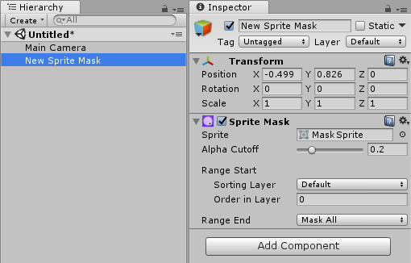
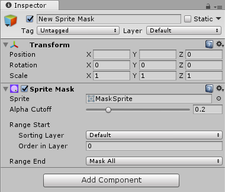
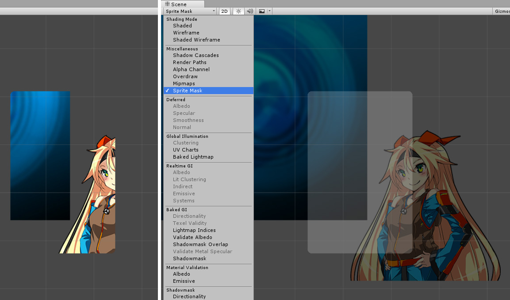
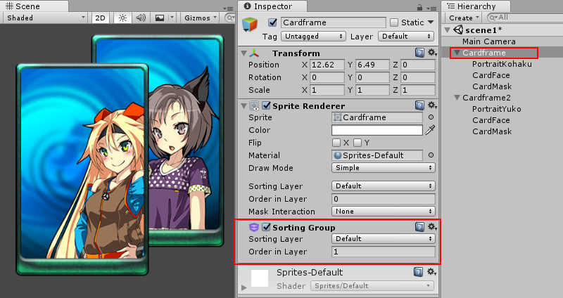
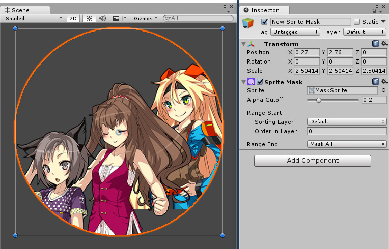

# Sprite Masks

Sprite Masks are used to either hide or reveal parts of a Sprite or group of Sprites. The Sprite Mask only affects objects using the Sprite Renderer Component.

### Creating a Sprite Mask

To create a Sprite Mask select from the main menu GameObject > 2D Object > Sprite Mask.

### Properties

| Property| Function |
|:---|:---| 
| Sprite| The sprite to be used as a mask.|
| Alpha Cutoff| If the alpha contains a blend between transparent and opaque areas, you can manually determine the cutoff point for which areas will be shown. You change this cutoff by adjusting the Alpha Cutoff slider.|
| __Range Start__ | The Range Start is the Sorting Layer which the mask starts masking from.|
| Sorting Layer| The Sorting Layer for the mask.|
| Order in Layer| The order within the Sorting Layer.|
| __Range End__ |  |
| Mask All| By default the mask will affect all sorting layers behind it (lower sorting order).|
| Custom| The range end can be set to a custom Sorting Layer and Order in Layer.|

### Using Sprite Masks

The Sprite Mask GameObject itself will not be visible in scene, only the resulting interactions with Sprites. To view Sprite Masks in the scene, select the Sprite Mask option in the Scene Menu.

Sprite Masks are always in effect. Sprites to be affected by a Sprite Mask need to have their Mask Interaction set in the Sprite Renderer.

By default a Sprite Mask will affect any sprite in the scene that has their Mask Interaction set to Visible or Not Visible Under Mask. Quite often we want the mask to only affect a particular sprite or a group of sprites.

One method of ensuring the mask is interacting with particular sprites is to use a Sorting Group Component.

An alternative method of controlling the effect of the mask is to use the Custom Range Settings of a Sprite Mask.

The Range Start and Range End provides the ability to selectively mask sprites based on their Sorting Layer or Order in Layer.

  

----

* 2017-05-26 <!-- include IncludeTextNewPageNoEdit -->
 
* New feature in Unity [2017.1](../Manual/30_search.html?q=newin20171) NewIn20171

