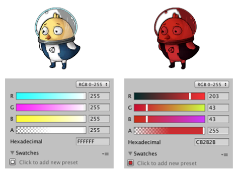
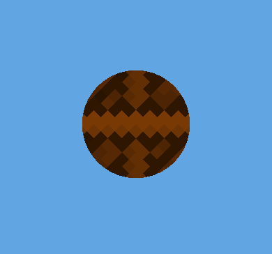
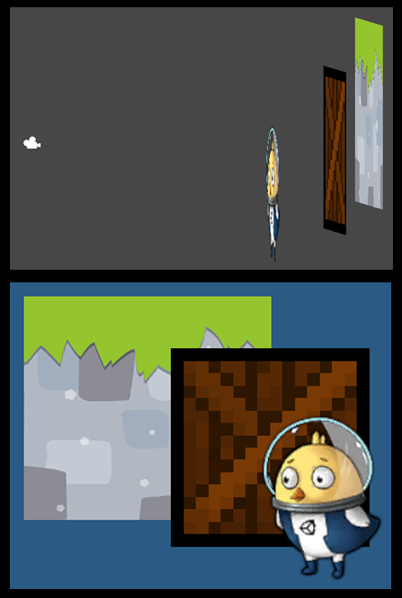

#
Sprite Renderer
---------------

The __Sprite Renderer__ component renders the __Sprite__ and controls how it visually appears in a Scene for both [2D and 3D projects](https://docs.unity3d.com/Manual/2Dor3D.html).

When you create a Sprite (__GameObject &gt; 2D Object &gt; Sprite__), Unity automatically creates a GameObject with the __Sprite Renderer__ component attached. You can also add the component to an existing GameObject via the __Components__ menu (__Component &gt; Rendering &gt; Sprite Renderer__). 

## Properties

|**_Property_** |**_Function_** |
|:---|:---|
|__Sprite__ |Define which Sprite texture the component should render. Click the small dot to the right to open the object picker window, and select from the list of available Sprite Assets.|
|__Color__ |Define the vertex color of the Sprite, which tints or recolors the Sprite’s image. Use the color picker to set the vertex color of the rendered Sprite texture. See the [Color](#color) section below this table for examples. |
|__Flip__ |Flips the Sprite texture along the checked axis. This does not flip the Transform position of the GameObject.|
|__Material__ |Define the [Material](#material) used to render the Sprite texture.|
| __Draw Mode__ | Define how the Sprite scales when its dimensions change. Select one of the following options from the drop-down box.|
|&nbsp; &nbsp;Simple| The entire image scales when its dimensions change. This is the default option.|
|&nbsp; &nbsp;Sliced| Select this mode if the Sprite is [9-sliced](https://docs.unity3d.com/Manual/9SliceSprites.html).|
|&nbsp; &nbsp; &nbsp; &nbsp;Size &nbsp; &nbsp; &nbsp; &nbsp; &nbsp;*(‘Sliced’ or ‘Tiled’)*| Enter the Sprite's new Width and Height to scale the 9-sliced Sprite correctly. You can also use the [Rect Transform Tool](https://docs.unity3d.com/Manual/9SliceSprites.html) to scale the Sprite while applying 9-slicing properties.|
|&nbsp; &nbsp;Tiled| By default, this mode causes the middle of the 9-Sliced Sprite to tile instead of scale when its dimensions change. Use __Tile Mode__ to control the tiling behavior of the Sprite.|
|&nbsp; &nbsp; &nbsp; &nbsp;Continuous| This is the default __Tile Mode__. In Continuous mode, the midsection tiles evenly when the Sprite dimensions change. |
|&nbsp; &nbsp; &nbsp; &nbsp;Adaptive| In Adaptive mode, the Sprite texture stretches when its dimensions change, similar to Simple mode. When the scale of the changed dimensions meets the Stretch Value, the midsection begins to tile.|
|&nbsp; &nbsp; &nbsp; &nbsp; Stretch Value|Use the slider to set the value between 0 and 1. The maximum value is 1, which represents double the original Sprite’s scale.|
|__Sorting Layer__ |Set the [Sorting Layer](https://docs.unity3d.com/Manual/class-TagManager.html) of the Sprite, which controls its priority during rendering. Select an existing Sorting Layer from the drop-down box, or create a new Sorting Layer.|
|__Order In Layer__ |Set the render priority of the Sprite within its [Sorting Layer](https://docs.unity3d.com/Manual/class-TagManager.html). Lower numbered Sprites are rendered first, with higher numbered Sprites overlapping those below. |
|__Mask Interaction__ |Set how the Sprite Renderer behaves when interacting with a [Sprite Mask](https://docs.unity3d.com/Manual/class-SpriteMask.html). See examples of the different options in the [Mask Interaction](#maskinteract) section below.|
|&nbsp; &nbsp;None|The Sprite Renderer does not interact with any Sprite Masks in the Scene. This is the default option.|
|&nbsp; &nbsp;Visible Inside Mask|The Sprite is visible where the Sprite Mask overlays it, but not outside of it.|
|&nbsp; &nbsp;Visible Outside Mask|The Sprite is visible outside of the Sprite Mask, but not inside it. The Sprite Mask hides the sections of the Sprite it overlays.|
|__Sprite Sort Point__ |Choose between the Sprite’s Center or its Pivot Point when calculating the distance between the Sprite and the camera. See the section on [Sprite Sort Point](#sortpoint) for further details.|

##Details

###Color

The image below demonstrates the effect of changing the RGB values on the __Sprite Renderer’s__ Color setting. To change a Sprite’s opacity, change the value of its Color property’s Alpha (A) channel.  

###Material

Use a Material’s [Material and Shader settings](https://docs.unity3d.com/Manual/Materials.html) to control how Unity renders it. Refer to[ Materials, Shaders & Textures](https://docs.unity3d.com/Manual/Shaders.html) for further information on these settings.

The default Material for newly created Sprites is __Sprites - Default__. Scene lighting does not affect this default Sprite. To have the Sprite react to lighting, assign the Material **Default - Diffuse** instead. To do this, click the small circle next to the Material field to bring up the object picker window, and select the __Default-Diffuse__ Material.

###Mask Interaction

Mask Interaction controls how the Sprite Renderer interacts with [Sprite Masks](https://docs.unity3d.com/Manual/class-SpriteMask.html). Select either __Visible Inside Mask__ or __Visible Outside Mask__ from the drop-down menu. The examples below demonstrate the effect of each option with a square Sprite and a circle Mask:

To interact with a Sprite Mask, select __Visible Inside Mask__ or __Visible Outside Mask__ from the drop-down menu.

###Sprite Sort Point

This property is only available when the Sprite Renderer’s __Draw Mode__ is set to __Simple__.

In a 2D project, the Main Camera is set to [Orthographic Projection mode](https://docs.unity3d.com/Manual/class-Camera.html) by default. In this mode, Unity renders Sprites in the order of their their distance to the camera, along the direction of the Camera's view.

By default, a Sprite’s __Sort Point__ is set to its **Center**, and Unity measures the distance between the camera’s Transform position and the Center of the Sprite to determine their render order. 

To set to a different __Sort Point__ from the Center, select the __Pivot__ option. Edit the Sprite’s Pivot position in the [Sprite Editor](https://docs.unity3d.com/Manual/SpriteEditor.html).

----
* 2018-10-05 Added definition for new functionality.
* Ability to sort Sprite-based renderers using the pivot position added in [2017.3](https://docs.unity3d.com/2017.3/Documentation/Manual/30_search.html?q=newin20173) New in 2017.3
