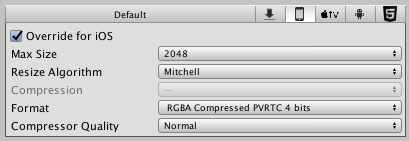

#iOS 2D Texture Overrides

When you are building for different platforms, you have to think about the resolution of your textures for the target platform, the size and the quality. You can set default options and then override the defaults for a specific platform.

This page details the __Texture Overrides__ specific to iOS. A description of the general Texture Overrides can be found [here](class-TextureImporter).

 

|**_Property_** ||**_Function_** |
|:---|:---|:---|
|__Format__ ||What internal representation is used for the texture. This is a tradeoff between size and quality. In the examples below we show the final size of an in-game texture of 256 by 256 pixels:|
||__RGB Compressed PVRTC 4 bits__ |Compressed RGB texture. This is the most common format for diffuse textures. 4 bits per pixel (32 KB for a 256x256 texture). |
||__RGBA Compressed PVRTC 4 bits__ |Compressed RGBA texture. This is the main format used for diffuse and specular control textures or diffuse textures with transparency. 4 bits per pixel (32 KB for a 256x256 texture). |
||__RGB Compressed PVRTC 2 bits__ |Compressed RGB texture. Lower quality format suitable for diffuse textures. 2 bits per pixel (16 KB for a 256x256 texture). |
||__RGBA Compressed PVRTC 2 bits__ |Compressed RGBA texture. Lower quality format suitable for diffuse & specular control textures. 2 bits per pixel (16 KB for a 256x256 texture). |
||__RGB Compressed ASTC 4x4 block__   __RGB Compressed ASTC 5x5 block__   __RGB Compressed ASTC 6x6 block__   __RGB Compressed ASTC 8x8 block__   __RGB Compressed ASTC 10x10 block__   __RGB Compressed ASTC 12x12 block__ | Compressed RGB texture. Supported by all Metal, OpenGL ES 3.2 and OpenGL ES 3.1+AEP GPUs, as well as by some OpenGL ES 3.0 GPUs. This compression type uses fixed 128-bit block size, and depending on the pixel block size (4x4 to 12x12), it may utilize 8 to 0.89 bits per pixel. The size of the compressed texture varies from 64 KB for a 256x256 texture (4x4 block, highest quality) to 7.6 KB for a 256x256 texture (12x12 block, highest compression rate).|
||__RGBA Compressed ASTC 4x4 block__   __RGBA Compressed ASTC 5x5 block__   __RGBA Compressed ASTC 6x6 block__   __RGBA Compressed ASTC 8x8 block__   __RGBA Compressed ASTC 10x10 block__   __RGBA Compressed ASTC 12x12 block__ | Compressed RGBA texture. Supported by all Metal, OpenGL ES 3.2 and OpenGL ES 3.1+AEP GPUs, as well as by some OpenGL ES 3.0 GPUs. This compression type uses fixed 128-bit block size, and depending on the pixel block size (4x4 to 12x12), it may utilize 8 to 0.89 bits per pixel. The size of the compressed texture varies from 64 KB for a 256x256 texture (4x4 block, highest quality) to 7.6 KB for a 256x256 texture (12x12 block, highest compression rate).|
||__RGB Compressed ETC 4 bits__ |Compressed RGB texture. This is the default texture format for Android projects in Unity. ETC_RGB4 is a part of OpenGL ES 2.0 and is supported by all OpenGL ES 2.0 GPUs. It does not support alpha. 4 bits per pixel (32 KB for a 256x256 texture). |
||__RGB Crunched ETC__ |Compressed RGB texture. Crunch is a lossy compression format on top of ETC texture compression. Textures are decompressed to ETC_RGB4 by the CPU and then uploaded to the GPU at runtime. Crunch produces smaller textures than by regular ETC_RGB4 compression, but with lower quality. Crunch textures can take a long time to compress, but decompression at runtime is very fast. ETC_RGB4 is a part of OpenGL ES 2.0 and is supported by all Metal and OpenGL ES 2.0 GPUs. It does not support alpha. 4 bits per pixel (output size varies depending on the texture - from 1 KB for a 256x256 texture). |
||__RGBA Compressed ETC2 8 bits__ |Compressed RGBA texture. Supported by all Metal and OpenGL ES 3.0 GPUs. (64 KB for a 256x256 texture). |
||__RGBA Crunched ETC2__ |Compressed RGBA texture. Crunch is a lossy compression format on top of ETC texture compression. Textures are decompressed to ETC2_RGBA8 on the CPU and then uploaded to the GPU at runtime. Crunch compression can be used to produce significantly smaller textures than by regular ETC2_RGBA8 compression, but with lower quality. Crunch textures can take a long time to compress, but decompression at runtime is very fast. Supported by all Metal and OpenGL ES 3.0 GPUs. 8 bits per pixel (output size varies depending on the texture - from 1 KB for a 256x256 texture). |
||__RGB 16 bit__ |65 thousand colors with no alpha. Uses more memory than PVRTC formats, but could be more suitable for UI or crisp textures without gradients. 128 KB for a 256x256 texture. |
||__RGB 24 bit__ |Truecolor but without alpha. 192 KB for a 256x256 texture. |
||__Alpha 8 bit__ |High quality alpha channel but without any color. 64 KB for a 256x256 texture. |
||__RGBA 16 bit__ |Low-quality truecolor. Has 16 levels of red, green, blue and alpha. Uses more memory than PVRTC formats, but can be handy if you need exact alpha channel. 128 KB for a 256x256 texture. |
||__RGBA 32 bit__ |Truecolor with alpha - this is the highest quality. At 256 KB for a 256x256 texture, this one is expensive. Most of the time, **PVRTC** formats offers sufficient quality at a much smaller size. |
|__Compressor quality__ || Choose Fast for quickest performance, Best for the best image quality and Normal for a balance between the two. |

---

* 2018-06-14  <!-- include IncludeTextAmendPageSomeEdit -->

* Crunch compression format updated in Unity 2017.3
