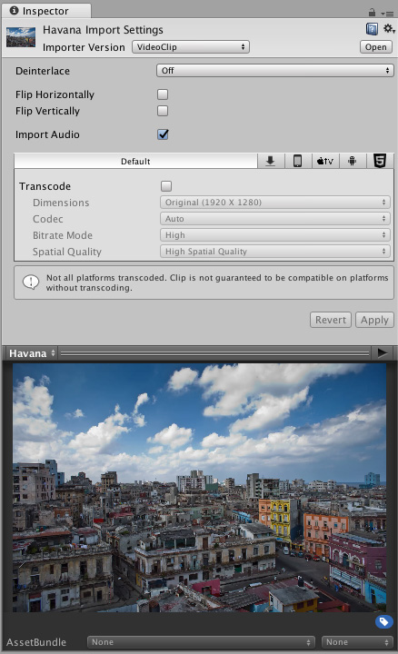
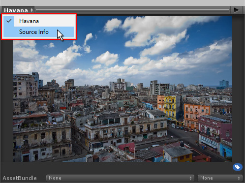
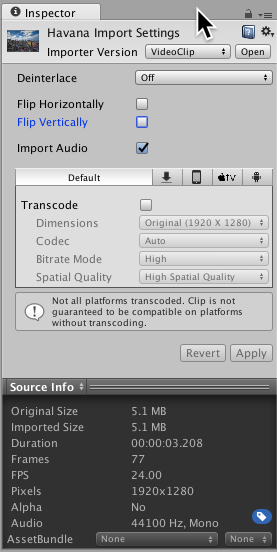
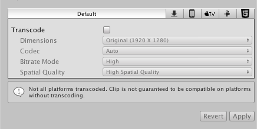

# Video Clips

A Video Clip is an imported video file, which the [Video Player component](class-VideoPlayer) uses to play video content (and accompanying audio content, if the video also has sound). Typical file extensions for video files include .mp4, .mov, .webm, and .wmv.

When you select a Video Clip, the Inspector shows the Video Clip Importer, including options, preview, and source details. Click the __Play__ button at the top-right of the preview to play the Video Clip, along with its first audio track.

To view the source information of a Video Clip, navigate to the preview pane at the bottom of the Inspector window, click the name of the Video Clip in the top-left corner, and select __Source Info__.

Platform-specific options adapt the transcode process for each target platform, allowing the selection of default options for each platform.

If transcode is disabled, the video file is used as is, meaning compatibility with the target platform must be verified manually (see documentation on video file compatibility for more information). However, choosing not to transcode can save time as well as avoid transformation-related quality loss.

## Video Clip Importer Properties

| **_Property_** | | | **_Function_** |
|:---|:---|:---|:---|
| __Importer Version__ ||| Selects which Importer version to use.|
|||__VideoClip__ | Produces Video Clips, suitable for use with [Video Player components](class-VideoPlayer]. |
||| __MovieTexture__ (Legacy) | Produces legacy [Movie Textures](class-MovieTexture). |
| __Keep Alpha__ ||| Keeps the [alpha channel](VideoTransparency) and encodes it during transcode so it can be used even if the target platform does not natively support videos with alpha.  This property is only visible for sources that have an alpha channel. |
| __Deinterlace__ ||| Controls how interlaced sources are deinterlaced during transcode. For example, you can choose to change interlacing settings due to how a video is encoded or for aesthetic reasons. Interlaced videos have two time samples in each frame: one in odd-numbered lines, and one in even-numbered lines. |
||| __Off__ | The source is not interlaced, and there is no processing to do (this is the default setting). |
||| __Even__ | Takes the even lines of each frame and interpolates them to create missing content. Odd lines are dropped. |
||| __Odd__ | Takes the odd lines of each frame and interpolates them to create missing content. Even lines are dropped. |
| __Flip Horizontally__ ||| If this tickbox is checked, the source content is flipped along a horizontal axis during transcode to make it upside-down. |
| __Flip Vertically__ ||| If this tickbox is checked, the source content is flipped along a vertical axis during transcode to swap left and right. |
| __Import Audio__ ||| If this tickbox is checked, audio tracks are imported during transcode.  This property is only visible for sources that have audio tracks. |
| __Transcode__ ||| When enabled by ticking the checkbox, the source is transcoded into a format that is compatible with the target platform.  If disabled, the original content is used, bypassing the potentially lengthy transcoding process.  **Note:** Verify that the source format is compatible with each target platform (see documentation on video file compatibility for more information). |
|| __Dimensions__ || Controls how the source content is resized.|
||| __Original__ | Keeps the original size.|
||| __Three Quarter Res__ | Resizes the source to three quarters of its original width and height.|
||| __Half Res__ | Resizes the source to half of its original width and height.|
||| __Quarter Res__ | Resizes the source to a quarter of its original width and height.|
||| __Square (1024 X 1024)__ | Resizes the source to 1024 x 1024 square images. Aspect ratio is controllable.|
||| __Square (512 X 512)__ | Resizes the source to 512 x 512 square images. Aspect ratio is controllable.|
||| __Square (256 X 256)__ | Resizes the source to to 256 x 256 square images. Aspect ratio is controllable.|
||| __Custom__ | Resizes the source to a custom resolution. Aspect ratio is controllable. |
|| __Width__ || Width of the resulting images.  This property is only visible when the Dimensions field is set to Custom. |
|| __Height__ || Height of the resulting images.  This property is only visible when the Dimensions field is set to Custom. |
|| __Aspect Ratio__ || Aspect ratio control used when resizing images.  This property is only visible when the Dimensions field is set to an option other than Original.|
||| __No Scaling__ | Black areas added as needed to preserve the aspect ratio of the original content.|
||| __Stretch__ | Stretches the original content to fill the destination resolution without leaving black areas. |
|| __Codec__ || Codec used for encoding the video track. |
||| __Auto__ | Chooses the most suitable video codec for the target platform.|
||| __H264__ | The MPEG-4 AVC video codec, supported by hardware on most platforms.|
||| __VP8__ | The VP8 video codec, supported by software on most platforms, and by hardware on a few platforms such as Android and WebGL. |
|| __Bitrate Mode__ || Low, Medium, or High bitrate, relative to the chosen codec’s baseline profile. |
|| __Spatial Quality__ || This setting dictates whether video images are reduced in size during transcoding, which means they take up less storage space. However, resizing images also results in blurriness during playback.|
||| __Low Spatial Quality__ | The image is significantly reduced in size during transcode (typically to a quarter of its original dimensions), and then expanded back to its original size upon playback. This is the highest amount of resizing, meaning it saves the most storage space but results in the largest amount of blurriness upon playback.|
||| __Medium Spatial Quality__ | The image is moderately reduced in size during transcode (typically to half of its original dimensions), and then expanded back to its original size upon playback. Although there is some resizing, images will be less blurry than those that use the Low Spatial Quality option, and there is some reduction in required storage space.|
||| __High Spatial Quality__ | No resizing takes place if this option is selected. This means the image is not reduced in size during transcode, and therefore the video’s original level of visual clarity is maintained. |

---

* 2017-06-15 <!-- include IncludeTextNewPageSomeEdit -->

* New feature in Unity 5.6
