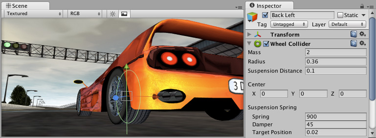
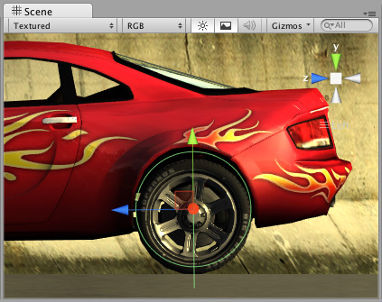
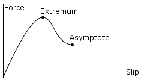

Wheel Collider
==============

The __Wheel Collider__ is a special collider for grounded vehicles. It has built-in collision detection, wheel physics, and a slip-based tire friction model. It can be used for objects other than wheels, but it is specifically designed for vehicles with wheels.

 

For guidance on using the Wheel Collider, see the [Unity Wheel Collider tutorial](WheelColliderTutorial).

Properties
----------

|**_Property:_** |**_Function:_** |
|:---|:---|
|__Mass__ |The Mass of the wheel. |
|__Radius__ |Radius of the wheel. |
|__Wheel Damping Rate__ |This is a value of damping applied to a wheel. |
|__Suspension Distance__ |Maximum extension distance of wheel suspension, measured in local space. Suspension always extends downwards through the local Y-axis. |
|__Force App Point Distance__ |This parameter defines the point where the wheel forces will applied. This is expected to be in metres from the base of the wheel at rest position along the suspension travel direction. When ``forceAppPointDistance = 0`` the forces will be applied at the wheel base at rest. A better vehicle would have forces applied slightly below the vehicle centre of mass. |
|__Center__ |Center of the wheel in object local space. |
|__Suspension Spring__ |The suspension attempts to reach a __Target Position__ by adding spring and damping forces. |
|&#160;&#160;&#160;&#160;&#160;&#160;&#160;&#160;__Spring__ |Spring force attempts to reach the __Target Position__. A larger value makes the suspension reach the __Target Position__ faster. |
|&#160;&#160;&#160;&#160;&#160;&#160;&#160;&#160;__Damper__ |Dampens the suspension velocity. A larger value makes the __Suspension Spring__ move slower. |
|&#160;&#160;&#160;&#160;&#160;&#160;&#160;&#160;__Target Position__ |The suspension's rest distance along Suspension Distance. 1 maps to fully extended suspension, and 0 maps to fully compressed suspension. Default value is 0.5, which matches the behavior of a regular car's suspension. |
|__Forward/Sideways Friction__ |Properties of tire friction when the wheel is rolling forward and sideways. See the _Wheel Friction Curves_ section below. |

 

Details
-------

The wheel's collision detection is performed by casting a ray from __Center__ downwards through the local Y-axis. The wheel has a __Radius__ and can extend downwards according to the __Suspension Distance__. The vehicle is controlled from scripting using different properties: __motorTorque__, __brakeTorque__ and __steerAngle__. See the [Wheel Collider scripting reference](ScriptRef:WheelCollider.html) for more information.

The Wheel Collider computes friction separately from the rest of physics engine, using a slip-based friction model. This allows for more realistic behaviour but also causes Wheel Colliders to ignore standard [Physic Material](class-PhysicMaterial) settings.

###Wheel collider setup

You do not turn or roll WheelCollider objects to control the car - the objects that have the WheelCollider attached should always be fixed relative to the car itself. However, you might want to turn and roll the graphical wheel representations. The best way to do this is to setup separate objects for Wheel Colliders and visible wheels:

 

Note that the gizmo graphic for the WheelCollider's position is not updated in playmode:

 

###Collision geometry

Because cars can achieve large velocities, getting race track collision geometry right is very important. Specifically, the [collision mesh](class-MeshCollider) should not have small bumps or dents that make up the visible models (e.g. fence poles). Usually a collision mesh for the race track is made separately from the visible mesh, making the collision mesh as smooth as possible. It also should not have thin objects - if you have a thin track border, make it wider in a collision mesh (or completely remove the other side if the car can never go there).

 

###Wheel Friction Curves

Tire friction can be described by the _Wheel Friction Curve_ shown below. There are separate curves for the wheel's forward (rolling) direction and sideways direction. In both directions it is first determined how much the tire is slipping (based on the speed difference between the tire's rubber and the road). Then this slip value is used to find out tire force exerted on the contact point.

The curve takes a measure of tire slip as an input and gives a force as output. The curve is approximated by a two-piece spline. The first section goes from _(0 , 0)_ to _(__ExtremumSlip__ , __ExtremumValue__)_, at which point the curve's tangent is zero. The second section goes from _(__ExtremumSlip__ , __ExtremumValue__)_ to _(__AsymptoteSlip__ , __AsymptoteValue__)_, where curve's tangent is again zero:

 

The property of real tires is that for low slip they can exert high forces, since the rubber compensates for the slip by stretching. Later when the slip gets really high, the forces are reduced as the tire starts to slide or spin. Thus, tire friction curves have a shape like in the image above.

|**_Property:_** |**_Function:_** |
|:---|:---|
|__Extremum Slip/Value__ |Curve's extremum point. |
|__Asymptote Slip/Value__ |Curve's asymptote point. |
|__Stiffness__ |Multiplier for the __Extremum Value__ and __Asymptote Value__ (default is 1). Changes the stiffness of the friction. Setting this to zero will completely disable all friction from the wheel. Usually you modify stiffness at runtime to simulate various ground materials from scripting. |

Hints
-----

* You might want to decrease physics timestep length in the [Time](class-TimeManager) window to get more stable car physics, especially if it's a racing car that can achieve high velocities.
* To keep a car from flipping over too easily you can lower its [Rigidbody](class-Rigidbody) center of mass a bit from script, and apply "down pressure" force that depends on car velocity.
