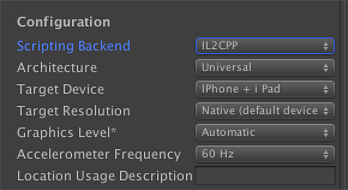

#Upgrading to 64-bit iOS

iOS 64-bit support is implemented with the scripting backend called [IL2CPP](IL2CPP). It runs with your C# code.

The IL2CPP runtime combines an ahead of time compiler with a virtual machine to convert assemblies to C++ while leveraging standard platform C++ compilers to produce native binaries. The net result is significantly higher performance, platform compatibility and maintainability.

IL2CPP is the only scripting backend to support deploying to ARM 64-bit on iOS, and is thus mandatory to deploy to the Apple App Sstore for releasing new apps.

To read more about IL2CPP, see the blog posts [The future of scripting in Unity](http://blogs.unity3d.com/2014/05/20/the-future-of-scripting-in-unity/) and [Apple iOS 64-bit support in Unity](http://blogs.unity3d.com/2014/11/20/apple-ios-64-bit-support-in-unity/).

##How to start using IL2CPP on iOS

Select __IL2CPP__ in the __Scripting Backend__ drop-down menu on the [Player](class-PlayerSettings) window.

By default it will build for __Universal__ architecture (including both _ARM64_ and _ARMv7_); if needed you can switch to specific architecture on the [Player](class-PlayerSettings) window. There are a number of things that should be done before your application is up and running in 64-bits:

* You need a 64-bit capable device to test on: all iOS devices with A7 or later chip (currently these are: iPhone 5S, iPad Air, iPad Mini Retina, iPhone 6, iPhone 6 Plus, iPad Mini 3, and all newer devices).
* You need all your native plugins to be compiled with 64-bit support (or be provided as source code). If you are using a 3rd party plugin, you should contact your plugin vendor to obtain a 64-bit capable and IL2CPP-compatible version of that plugin. At the moment all latest Prime31 plugins should work.
* If you are the plugin vendor or just have your own native plugins then you need keep couple of things in mind:
    * IL2CPP is not API-compatible (which is unexposed) with the Mono Runtime API, which means if plugin is using _mono\_\*_ functions won't link anymore. The best way to resolve this issue is to switch to a managed delegate/callback approach and pass your managed callbacks to the native side of plugin, and call them back from there when some native data or event arrives.
    * All plugins that come as precompiled static libraries (.a files) should now include _ARM64_ slice.
    * When doing native code/type conversion keep in mind that pointers and longs are now 64-bit wide and ints are still 32-bit wide.
* To minimise generated amount of C++ code IL2CPP is always (even when _Stripping level_ is set to __Disabled__) doing some sort of managed code stripping. Sometimes you will need to help it. Look for the [link.xml](iphone-playerSizeOptimization) guide in the iOS player size optimization manual.

##Troubleshooting
* Q: My code is running slower on IL2CPP than on Mono. Why?  
A: Make sure you are testing your code performance in Xcode _*Release*_ configuration. If issue still remains, please submit a bug report! 
* Q: Unity generated Xcode project fails to compile with following or similar error: `Method not found: 'Default constructor not found...ctor() of System.ComponentModel.Int64Converter'`.   
A: Deserializers and serializers often reference some types only via .NET Reflection API and in such cases these methods or even classes might be stripped from the project. You can hint managed code stripper that specific class / method is used either via [link.xml](iphone-playerSizeOptimization) or via introduction of dummy code that explicitly references it in one of your scripts.
* Q: Unity generated Xcode project fails to compile with some other error.  
A: Please verify that all your plugins support _ARM64_ and IL2CPP and if so, please submit a bug report and attach your project (or just the scripting part of it) to the bug report.

---

* 2018-06-14  <!-- include IncludeTextAmendPageSomeEdit -->

