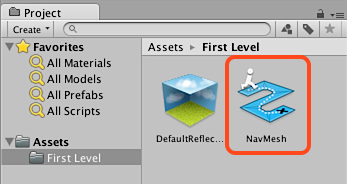
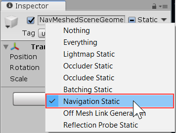

#Building a NavMesh

The process of creating a NavMesh from the level geometry is called NavMesh Baking. The process collects the Render Meshes and Terrains of all Game Objects which are marked as [Navigation Static](StaticObjects), and then processes them to create a navigation mesh that approximates the walkable surfaces of the level.

In Unity, NavMesh generation is handled from the Navigation window (menu: __Window__ &gt; __AI__ &gt; __Navigation__). 

Building a NavMesh for your scene can be done in 4 quick steps:

1. **Select** scene geometry that should affect the navigation – walkable surfaces and obstacles.
2. **Check Navigation Static** on to include selected objects in the NavMesh baking process.
3. **Adjust** the bake settings to match your agent size.
    - _Agent Radius_ defines how close the agent center can get to a wall or a ledge.  
    - _Agent Height_ defines how low the spaces are that the agent can reach.
    - _Max Slope_ defines how steep the ramps are that the agent walk up.
    - _Step Height_ defines how high obstructions are that the agent can step on.
4. **Click bake** to build the NavMesh.

The resulting NavMesh will be shown in the scene as a blue overlay on the underlying level geometry whenever the Navigation Window is open and visible.

As you may have noticed in the above pictures, the walkable area in the generated NavMesh appears shrunk. The NavMesh represents the area where the center of the agent can move. Conceptually, it doesn't matter whether you regard the agent as a point on a shrunken NavMesh or a circle on a full-size NavMesh since the two are equivalent. However, the point interpretation allows for better runtime efficiency and also allows the designer to see immediately whether an agent can squeeze through gaps without worrying about its radius.

Another thing to keep in mind is that the NavMesh is an approximation of the walkable surface. This can be seen for example in the stairs which are represented as a flat surface, while the source surface has steps. This is done in order to keep the NavMesh data size small. The side effect of the approximation is that sometimes you will need to have a little extra space in your level geometry to allows the agent to pass through a tight spot.

When baking is complete, you will find a NavMesh asset file inside a folder with the same name as the scene the NavMesh belongs to. For example, if you have a scene called _First Level_ in the Assets folder, the NavMesh will be at _Assets &gt; First Level &gt; NavMesh.asset_.

###Additional Workflows for Marking Objects for Baking

In addition to marking objects as _Navigation Static_ in the Navigation Window‚ as explained above, you can use the _Static_ menu at the top of the inspector. This can be convenient if you don't happen to have the Navigation Window open.

###Further Reading

- [Creating a NavMeshAgent](nav-CreateNavMeshAgent) – learn how to allow your characters to move.
- [Bake Settings](nav-AdvancedSettings) – full description of the NavMesh bake settings.
- [Areas and Costs](nav-AreasAndCosts) – learn how to use different Area types.