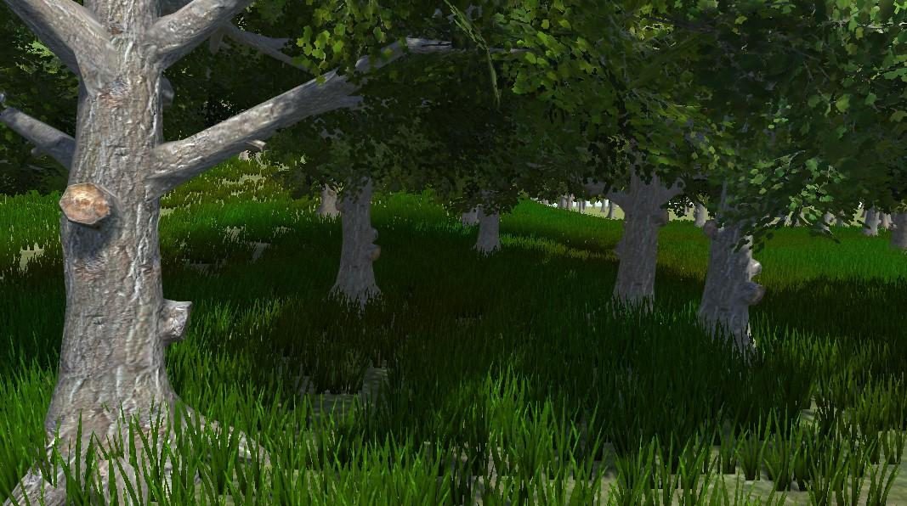
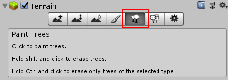
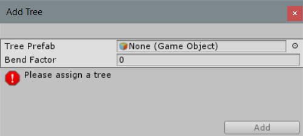
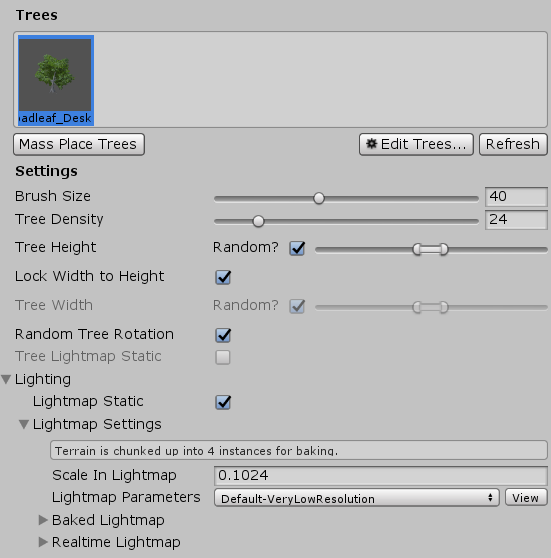
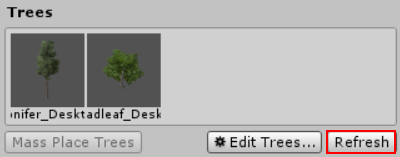

#Trees

To enhance Unity Terrains, you can paint Trees onto a Terrain in much the same way as painting height maps and textures.  However, Trees are solid 3D GameObjects that grow from the surface. Unity uses optimisations, like billboarding for distant Trees, to maintain good rendering performance. This means that you can have dense forests with thousands of trees and still keep an acceptable frame rate.

##Painting Trees

The Tree button on the toolbar enables Tree painting:

Initially, the Terrain will have no Trees available. In order to start painting onto the Terrain, you need to add a Tree. Click the __Edit Trees__ button and select __Add Tree__. From here, you can select a Tree asset from your Project and add it as a __Tree Prefab__ for use with the brush:

To help prototyping, Unity provides several sample SpeedTree Tree GameObjects in the Standard Assets package.  Alternatively, you can create your own Trees.

If the Tree GameObject that you are importing supports __Bend Factor__ , the Add Tree window shows a __Bend Factor__ property for adjusting wind responsiveness. Trees created using the SpeedTree Modeller have a __Bend Factor__. See the section on __Making Trees bend in the wind __below. 

When you have set up your Tree properties (described below), you can paint Trees onto the Terrain in the same way you paint textures or heightmaps. You can remove Trees from an area by holding the shift key while you paint, or remove just the currently selected Tree type by holding down the control key. 

## Tree properties

After you have selected which Tree to place, adjust its settings to customise Tree placement and characteristics:

| Property:| Function: |
|:---|:---| 
| __Mass Place Trees__| Create an overall covering of Trees without painting over the whole landscape. After mass placement, you can still use painting to add or remove Trees to create denser or sparser areas. |
| __Brush Size__| Controls the size of the area that you can add Trees to. |
| __Tree Density__| Tree Density controls the average number of Trees painted onto the area defined by Brush Size.|
| __Tree Height__| Control the Tree's minimal height and maximal height using a slider. Drag the slider to the left for short Trees, and right for tall Trees. If you uncheck Random, you can specify the  exact scale for the height of all newly painted Trees within the range of 0.01 to 2. |
| __Lock Width to Height__| By default, a Tree's width is locked to its height so that Trees are always scaled uniformly. However, you can disable the Lock Width to Height option and specify the width separately.  |
| __Tree Width__| If the Tree’s width is not locked to its height you can control the Tree's minimal width and maximal width using a slider. Drag the slider to the left for thin Trees, and right for wide Trees. If you uncheck Random, you can specify the exact scale for the width of all newly painted Trees within the range of 0.01 to 2. |
| __Random Tree Rotation__| Random Tree Rotation is a variation option used to help create the impression of a random, natural-looking forest rather than an artificial plantation of identical Trees. Untick this if you want to place Trees with fixed, identical rotations. |
| __Lighting__|  |
| __Lightmap Static__| Enable this check box to indicate to Unity that the GameObject’s location is fixed and it will participate in Global Illumination computations. If a GameObject is not marked as Lightmap Static then it can still be lit using Light Probes. |
| __Scale In Lightmap__| Specifies the relative size of the GameObject’ UVs within a lightmap. A value of 0 will result in Unity not lightmapping the GameObject, but the GameObject will still contribute to the lighting of other GameObjects in the Scene. A value greater than 1.0 increases the number of pixels in the lightmap used for this GameObject. A value less than 1.0 decreases the number of pixels. You can use this property to optimise lightmaps so that important or detailed areas are more accurately lit. For example, an isolated building with flat, dark walls will use  a low lightmap scale (less than 1.0), while a collection of colorful motorcycles displayed close together need a high scale value. |
| __Lightmap Parameters__| Allows you to choose or create a set of Lightmap Parameters for this GameObject. |

## Creating Trees

If you want to create your own Trees, you can use the [SpeedTree Modeler](https://store.speedTree.com/unity/), Unity’s Tree Creator tool, or any 3D modelling application, and then import them into your Project.

You can use [SpeedTree Modeler](https://store.speedTree.com/unity/) (from IDV, Inc.) to create Trees with advanced visual effects such as smooth LOD transition, fast billboarding and natural wind animation. For more detailed information, refer to the [SpeedTree Modeler documentation](http://docs8.speedTree.com/). You can also import SpeedTree assets into your Project folder from Asset Store packages or other third party sources. 

Unity has its own [Tree creator](class-Tree) that you can use to produce new Tree assets. You can also use a 3D modelling application. 

When creating Trees, position the anchor point at the base of the Tree where it emerges from the ground. For performance reasons, your Tree mesh should have fewer than 2000 triangles. and  The mesh always has exactly two materials: one for the Tree body and the other for the leaves.

Trees must use the __Nature/Soft Occlusion Leaves__ and __Nature/Soft Occlusion Bark__ shader. To use those shaders, you have to place Trees in a specific folder named __Ambient-Occlusion__, or the Trees won’t render correctly. When you place a model in such a folder and reimport it, Unity will calculate soft ambient occlusion in a way that is specifically designed for Trees.

If you change an imported Tree asset in a 3D modelling application, you will need to click the __Refresh__ button in the Editor in order to see the updated Trees on your Terrain: 

**Warning** When importing and altering a SpeedTree model in a 3D modeling program, when you re-export it (as an .fbx or .obj) you may lose the natural wind animation functionality that comes with SpeedTree models.

## Using Colliders with Trees

You can add a Capsule Collider to a new Tree asset by instantiating the Tree in the scene by dragging the Prefab from your Assets folder into the Scene. Then add the collider using menu: __Component__ &gt; __Physics__ &gt; __Capsule Collider__. You can then __either__:

* Override the original prefab by clicking the __Apply__ button on the Tree GameObject in the Inspector Window:

* Or, create a new Prefab by dragging the Tree GameObject into your Assets folder.

When you add the Tree to the Terrain for painting, make sure that if you have created a new Prefab that you select the correct one with with the collider rather than the original GameObject. You must also enable __Create Tree Colliders__ in the Terrain's Terrain Collider component inspector if you want to make .

## Making Trees bend in the wind

You first need to create a __Wind Zone__ to make Trees react to the wind. To do this select __GameObject__ &gt; __3D Object__ &gt; __Wind Zone__.

At this point, make sure that your Trees are set to bend. Select your __Terrain__, click the __Place Trees__ button in the __Inspector__, and then select __Edit Trees &gt; Edit Tree__. Setting the __Bend Factor__ to 1 will cause the Trees to adjust if you have not already done this.

With the default settings, your Trees will move quite violently. To fix this, change your bend value in each individual Tree type. This is useful if you want some Tree types to bend more than others. To change the bend effect in the entire __Wind Zone__, set the values in the __Wind Zone__ component directly. To reduce the fluttering effect of the leaves, adjust the wind turbulence down to around 0.1 to 0.3, and everything will become much smoother. If you don't want the Trees blowing all the way to one side and instead want some variation, set the __Wind Main__ value down to the same value as your turbulence.

##Tree Level of Detail (LOD) transition zone

Unity’s LOD system uses a 2D to 3D transition zone to blend 2D billboards with 3D tree models seamlessly. This prevents any sudden popping of 2D and 3D trees, which is vital in VR. For more information about configuring LOD components, see the [LOD](LevelOfDetail) and [LOD Group](class-LODGroup) manual pages.

---
* 2018-09-20  <!-- include IncludeTextAmendPageYesEdit -->

* GameObject menu changed in Unity 4.6

* 2D to 3D transition zone added to LOD system in Unity [2017.3](https://docs.unity3d.com/2017.3/Documentation/Manual/30_search.html?q=newin20173) NewIn20173